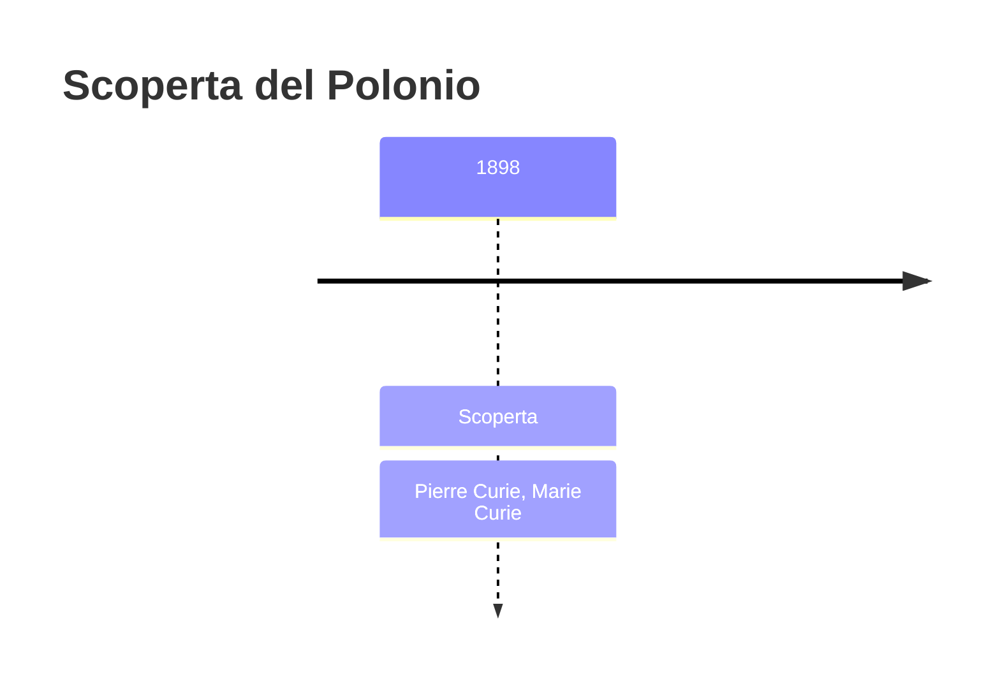
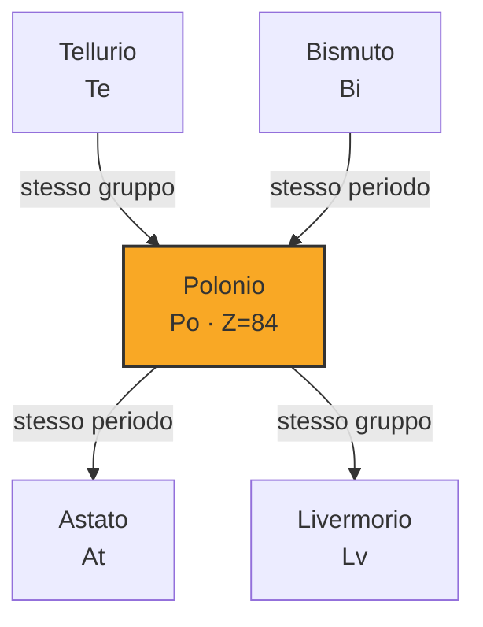

# Polonio (Po)

> [!abstract] 80° elemento scoperto — 1898
> 

## Cronologia della scoperta

## Storia della scoperta

## Posizione nella tavola periodica

## Caratteristiche

### Dati fisico-chimici

| Proprietà | Valore |
|---|---|
| Numero atomico | 84 |
| Massa atomica | 209,0 u |
| Categoria | Metallo post-transizione |
| Gruppo | 16 |
| Periodo | 6 |
| Blocco | p |
| Configurazione elettronica | [Xe] 4f¹⁴ 5d¹⁰ 6s² 6p⁴ |
| Punto di fusione | 253,9 °C |
| Punto di ebollizione | 961,9 °C |
| Densità | 9,196 g/cm³ |
| Stati di ossidazione | — |

## Struttura atomica

![[atomo-Polonio.svg]]

## Usi e presenza in natura

## Nella cronologia

← Precedente: [[Xenon]] (1898)
→ Successivo: [[Radio]] (1898)

Epoca: [[Spettroscopia e radioattività]] · Scopritore: [[Pierre Curie]], [[Marie Curie]]

## Fonti

