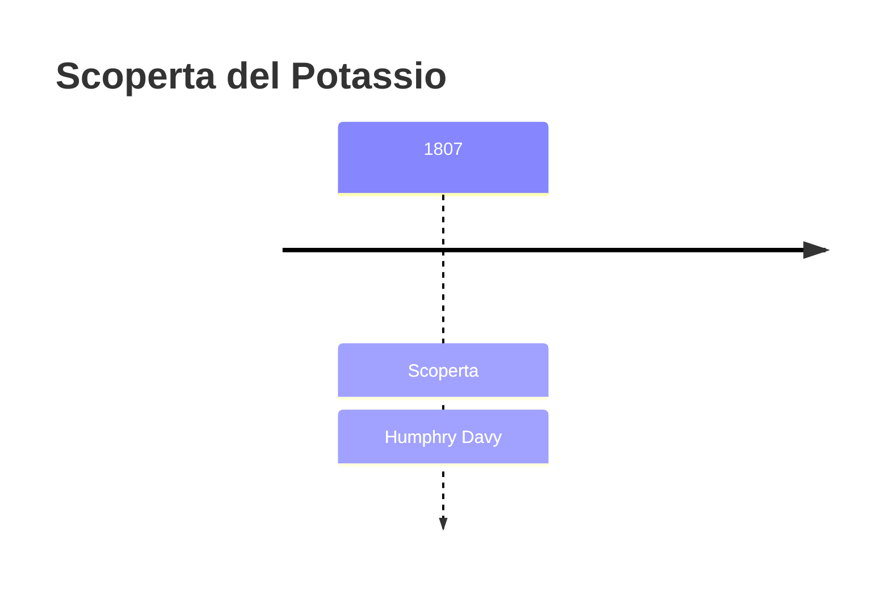
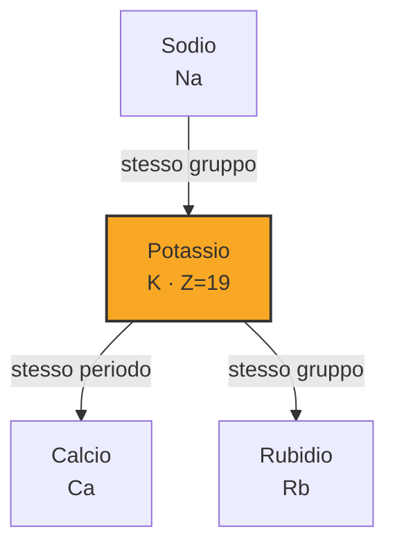

# Potassio (K)

> [!abstract] 49° elemento scoperto — 1807
> 

## Cronologia della scoperta

## Storia della scoperta

## Posizione nella tavola periodica

## Caratteristiche

### Dati fisico-chimici

| Proprietà | Valore |
|---|---|
| Numero atomico | 19 |
| Massa atomica | 39,09831 u |
| Categoria | Metallo alcalino |
| Gruppo | 1 |
| Periodo | 4 |
| Blocco | s |
| Configurazione elettronica | [Ar] 4s¹ |
| Punto di fusione | 63,6 °C |
| Punto di ebollizione | 758,9 °C |
| Densità | 0,862 g/cm³ |
| Stati di ossidazione | — |

## Struttura atomica

![[atomo-Potassio.svg]]

## Usi e presenza in natura

## Nella cronologia

← Precedente: [[Sodio]] (1807)
→ Successivo: [[Iodio]] (1811)

Epoca: [[L'età dell'elettrolisi]] · Scopritore: [[Humphry Davy]]

## Fonti

