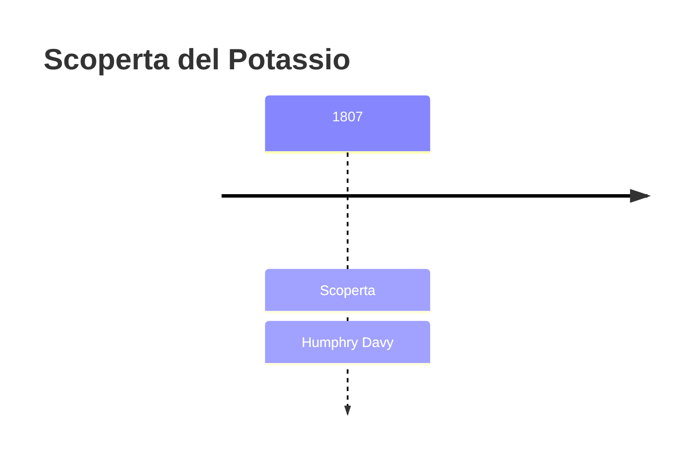
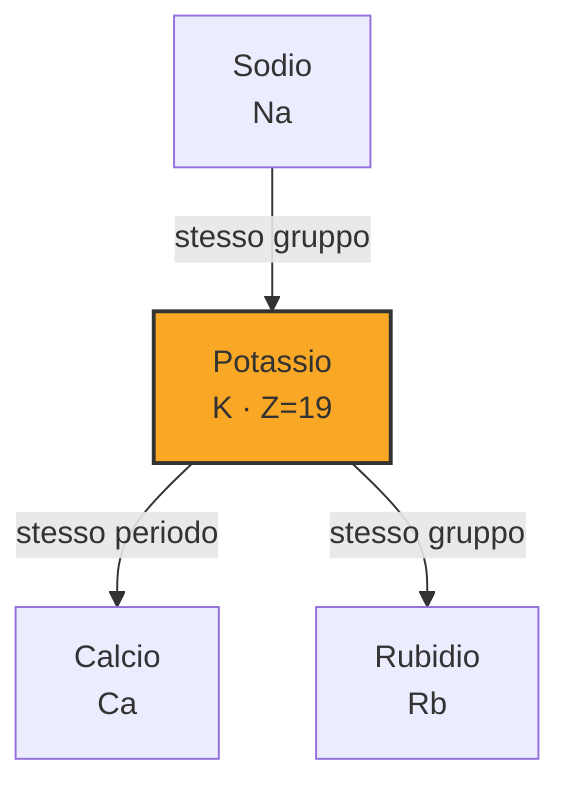
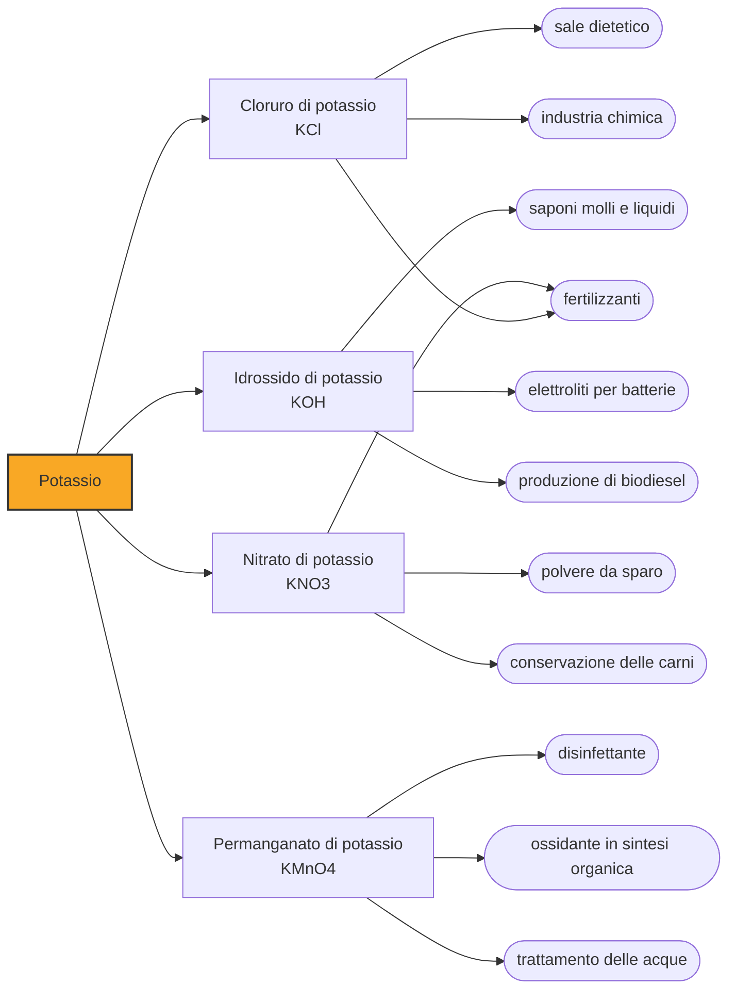

# Potassio (K)

> [!abstract] 49° elemento scoperto — 1807
> Il 6 ottobre 1807 un frammento di cenere di legna appena inumidito, attraversato dalla corrente, restituì globuli lucenti che prendevano fuoco da soli: era il primo metallo estratto dall'elettricità.

Il potassio è il metallo che si nascondeva nella cenere del focolare. Per millenni si sono lavate le ceneri di legna per ricavarne la potassa, ingrediente del sapone e del vetro, senza sospettare che dentro ci fosse un metallo tanto leggero da galleggiare sull'acqua e tanto avido da prendervi fuoco.

## Cronologia della scoperta

## Storia della scoperta

La potassa deve il nome al modo in cui si otteneva: si bruciava legna, si lavava la cenere con acqua, si faceva evaporare la soluzione in un recipiente finché sul fondo restava una crosta bianca. Il nome viene dal medio olandese potaschen, la cenere del pentolone, attestato già nel Quattrocento, e da lì è passato all'inglese potash, al francese potasse e all'italiano potassa. Era una delle materie prime più diffuse d'Europa, indispensabile a saponai, vetrai e tintori.

Potassa e soda formavano insieme la famiglia degli alcali fissi, e per i chimici del Settecento erano un problema irrisolto. Antoine Lavoisier le lasciò fuori dalla propria tavola delle sostanze semplici del 1789 con una motivazione esplicita: sono evidentemente sostanze composte, scrisse, anche se ignoriamo ancora di quali elementi siano fatte. Nessun reagente conosciuto riusciva a dimostrarlo.

Alla Royal Institution di Londra Humphry Davy attaccò il problema con la corrente. Le soluzioni acquose di potassa gli davano solo idrogeno e ossigeno; la potassa fusa a caldo produceva fiamme ma niente di raccoglibile; la potassa perfettamente secca non conduceva affatto. La soluzione fu un compromesso: un pezzetto lasciato pochi secondi all'aria, quel tanto che bastava perché l'umidità superficiale lo rendesse conduttore, appoggiato su un disco di platino collegato al polo negativo.

Il 6 ottobre 1807 la potassa cominciò a fondere ai due punti di contatto e sulla faccia inferiore comparvero piccoli globuli dalla lucentezza metallica, descritti da Davy come del tutto simili al mercurio: alcuni esplodevano bruciando appena formati, altri restavano lì e si coprivano di una pellicola bianca. Era il primo metallo della storia isolato per via elettrolitica, e Davy lo chiamò potassium dalla potassa che glielo aveva ceduto.

Pochi giorni dopo lo stesso apparato, puntato sulla soda caustica, gli diede un secondo metallo: il sodio arrivò dunque per secondo, e i due annunci furono presentati insieme alla Royal Society poche settimane dopo, nella conferenza bakeriana che rese Davy famoso in tutta Europa.

Il simbolo K non viene da nessuno dei due nomi che l'elemento porta in italiano e in inglese. Nei paesi di lingua germanica prevalse kalium, che Berzelius adottò nel 1814 riprendendo il kali proposto da Martin Heinrich Klaproth nel 1797 e risalente all'arabo al-qalyah, «cenere di pianta»: la stessa radice da cui viene la parola alcali.

## Posizione nella tavola periodica

## Caratteristiche

Il potassio metallico è bianco argenteo e così tenero da cedere sotto la lama di un coltello; fonde a 63,6 °C, poco più della temperatura di un tè caldo, e con 0,862 grammi per centimetro cubo è uno dei pochi metalli più leggeri dell'acqua. All'aria si copre di una patina opaca in pochi secondi, e in pochi minuti di uno strato biancastro di perossido.

La reazione con l'acqua è più violenta di quella del sodio: il calore sviluppato accende l'idrogeno che si libera, e la fiamma prende il colore lilla caratteristico dell'elemento. È la regola del gruppo 1, dove il potassio sta un gradino sotto il sodio: più il guscio esterno è lontano dal nucleo, più l'unico elettrone che lo occupa se ne va facilmente.

Nella pratica il potassio esiste in un modo solo, come ione K+ con carica positiva unitaria: è così in ogni minerale, in ogni concime e in ogni cellula. Lo stato −1, in cui l'atomo cattura un elettrone invece di cederlo, si ottiene soltanto in composti di sintesi, dove una molecola organica a gabbia sequestra lo ione positivo e lascia libero l'anione.

### Dati fisico-chimici

| Proprietà | Valore |
|---|---|
| Numero atomico | 19 |
| Massa atomica | 39,09831 u |
| Categoria | Metallo alcalino |
| Gruppo | 1 |
| Periodo | 4 |
| Blocco | s |
| Configurazione elettronica | [Ar] 4s¹ |
| Punto di fusione | 63,6 °C |
| Punto di ebollizione | 758,9 °C |
| Densità | 0,862 g/cm³ |
| Stati di ossidazione | -1, +1 |

## Struttura atomica

![[atomo-Potassio.svg]]

## Usi e presenza in natura

Quasi tutta la potassa estratta oggi finisce in agricoltura: il potassio è uno dei tre nutrienti principali delle piante insieme ad azoto e fosforo, ed è la K della sigla NPK stampata sui sacchi di concime. Nel 2025 le miniere del mondo ne hanno prodotto circa 49 milioni di tonnellate espresse in ossido di potassio, con Canada e Russia in testa, e il Servizio geologico degli Stati Uniti annota che per il potassio come nutriente non esistono sostituti.

Fuori dai campi l'idrossido di potassio serve a fare i saponi molli e liquidi, che il corrispondente sale di sodio non sa dare; il nitrato di potassio è il salnitro della polvere da sparo e un conservante delle carni; il cloruro di potassio si vende come sale dietetico a chi deve ridurre il sodio nell'alimentazione.

Nel corpo umano il potassio è lo ione dominante all'interno delle cellule, dove si trova la quasi totalità di quello presente in un organismo, e la concentrazione nel sangue è tenuta entro margini strettissimi, perché scostarsene in un senso o nell'altro altera il battito cardiaco. Un adulto ne contiene poco più di cento grammi e li ricava da frutta, verdura e legumi.

## Curiosità

*Per tradizione:* Edmund Davy, cugino di Humphry e suo assistente in laboratorio, raccontò che alla vista dei primi globuli il chimico si mise a ballare per la stanza, talmente fuori di sé che ci volle un po' prima che si calmasse abbastanza da riprendere l'esperimento.

Poco meno di un atomo di potassio ogni ottomila è potassio-40, un isotopo radioattivo con un tempo di dimezzamento di 1,25 miliardi di anni. È la principale sorgente di radioattività naturale del corpo umano — più del carbonio-14 — con circa 4.400 disintegrazioni al secondo in una persona di settanta chili, e rende leggermente radioattive le banane.

## Nella cronologia

← Precedente: [[Sodio]] (1807)
→ Successivo: [[Iodio]] (1811)

Epoca: [[L'età dell'elettrolisi]] · Scopritore: [[Humphry Davy]]

## Fonti

- [Potassium](https://en.wikipedia.org/wiki/Potassium) — consultata il 07/09/2026
- [Humphry Davy, On Some New Phenomena of Chemical Changes Produced by Electricity (Bakerian Lecture, Philosophical Transactions, 1808)](https://www.chemteam.info/Chem-History/Davy-Na&K-1808.html) — consultata il 07/09/2026
- [Antoine Lavoisier, Table of Simple Substances (Traité élémentaire de chimie, 1789)](https://web.lemoyne.edu/~giunta/lavtable.html) — consultata il 07/09/2026
- [Potash](https://en.wikipedia.org/wiki/Potash) — consultata il 08/09/2026
- [Potassium — Royal Society of Chemistry](https://periodic-table.rsc.org/element/19/potassium) — consultata il 08/09/2026
- [Potash — Mineral Commodity Summaries 2026, U.S. Geological Survey](https://pubs.usgs.gov/periodicals/mcs2026/mcs2026-potash.pdf) — consultata il 07/09/2026
