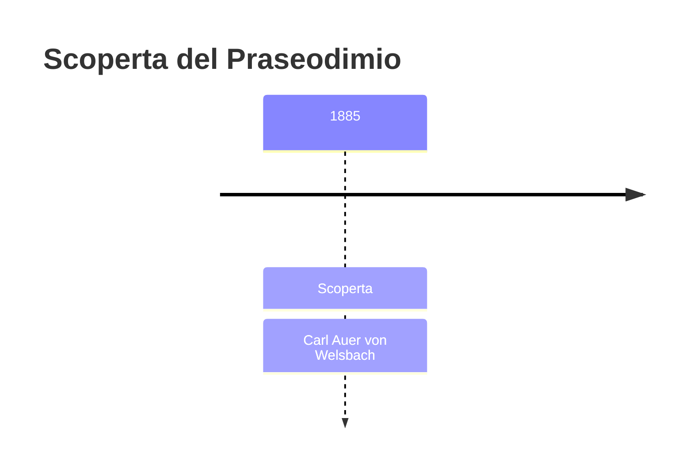
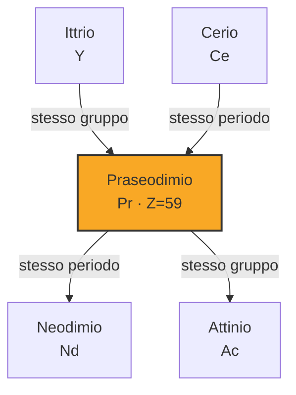

# Praseodimio (Pr)

> [!abstract] 73° elemento scoperto — 1885
> 

## Cronologia della scoperta

## Storia della scoperta

## Posizione nella tavola periodica

## Caratteristiche

### Dati fisico-chimici

| Proprietà | Valore |
|---|---|
| Numero atomico | 59 |
| Massa atomica | 140,907662 u |
| Categoria | Lantanide |
| Gruppo | 3 |
| Periodo | 6 |
| Blocco | f |
| Configurazione elettronica | [Xe] 4f³ 6s² |
| Punto di fusione | 934,9 °C |
| Punto di ebollizione | 3129,9 °C |
| Densità | 6,77 g/cm³ |
| Stati di ossidazione | — |

## Struttura atomica

![[atomo-Praseodimio.svg]]

## Usi e presenza in natura

## Nella cronologia

← Precedente: [[Gadolinio]] (1880)
→ Successivo: [[Germanio]] (1886)

Epoca: [[Spettroscopia e radioattività]] · Scopritore: [[Carl Auer von Welsbach]]

## Fonti

