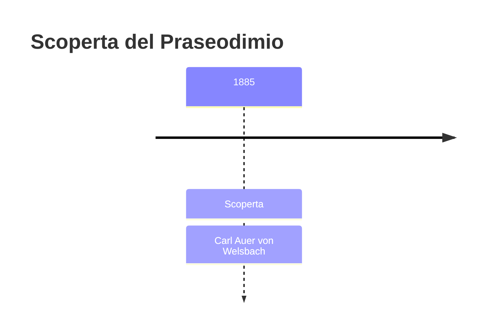
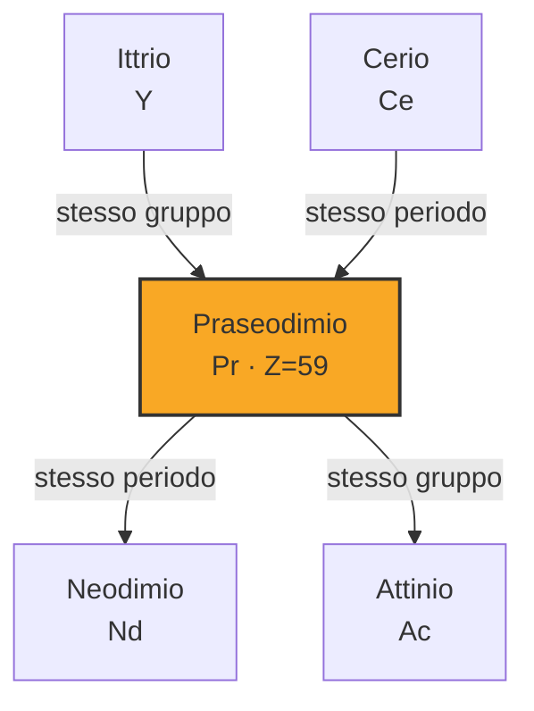
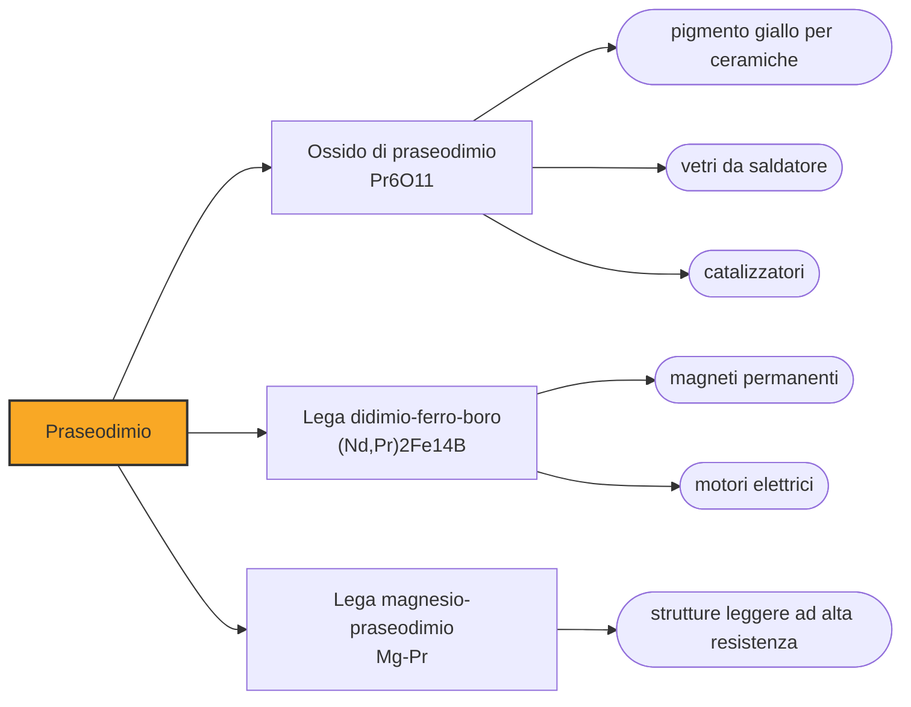

# Praseodimio (Pr)

> [!abstract] 73° elemento scoperto — 1885
> Il didimio era stato un elemento per quarantaquattro anni, con il suo simbolo e il suo posto nelle tavole. Nel 1885 un chimico viennese lo divise in due sali, uno verde e uno rosa.

Il praseodimio è il lantanide del verde: i suoi ioni in soluzione sono giallo-verdi, i vetri che lo contengono prendono sfumature dal verde al giallo, e il nome stesso significa «gemello verde». Oggi lavora quasi sempre in coppia con il neodimio, dentro i magneti e dentro le leghe da cui non si separa perché separarlo non conviene.

## Cronologia della scoperta

> [!info] Nota sulla cronologia
> Il praseodimio nasce dalla divisione del didimio, che Mosander aveva ricavato nel 1841 e che per quarantaquattro anni fu considerato un elemento: von Welsbach lo separò nel 1885 in praseodimio e neodimio per cristallizzazione frazionata del nitrato doppio di ammonio.

## Storia della scoperta

Nel 1841 Carl Gustaf Mosander aveva ricavato dalla ceria una terra che chiamò didimio, «gemello», perché seguiva il lantanio ovunque. Per oltre quarant'anni il didimio fu trattato come un elemento: aveva il simbolo Di, un peso atomico, un colore riconoscibile e perfino un impiego industriale nei vetri per i soffiatori.

Le prime crepe le aprì lo spettroscopio. Le righe del didimio non si comportavano come quelle di un elemento singolo: nel 1874 Per Teodor Cleve sostenne che ne contenesse almeno due, e nel 1879 Lecoq de Boisbaudran ne staccò il samario. Quello che restava continuava a chiamarsi didimio, ma il sospetto era ormai dichiarato.

Nel 1885, a Vienna, Carl Auer von Welsbach sottopose il didimio a cristallizzazioni frazionate ripetute del nitrato doppio di ammonio, e le portò avanti per mesi finché le frazioni non cominciarono a separarsi per colore: da una parte sali verdi, dall'altra sali rosa. Erano due elementi distinti, e li chiamò praseodimio, dal greco prasinos, «verde porro», e neodimio, «gemello nuovo». Il vecchio nome sopravvisse in entrambi, attaccato come un cognome di famiglia.

La sorte del didimio è uno dei casi in cui la tavola periodica ha dovuto cancellare una casella invece di riempirla. Non era un errore di misura né una rivendicazione avventata: era una sostanza reale, riproducibile e coerente, che però conteneva due elementi con proprietà quasi identiche. La chimica delle terre rare è piena di casi così, ed è per questo che è arrivata tardi.

Il metallo puro, come per tutti i lantanidi, arrivò molto dopo, e la produzione su scala industriale solo con le resine a scambio ionico degli anni Cinquanta. Per buona parte del Novecento il praseodimio è stato usato quasi esclusivamente in miscela con il neodimio, senza che nessuno si preoccupasse di dividerli.

## Posizione nella tavola periodica

## Caratteristiche

Il colore verde-giallo dei suoi composti dipende dalle transizioni degli elettroni del guscio f, che assorbono righe strette nel visibile: è lo stesso meccanismo che rende utili i vetri al didimio, i quali tagliano la riga gialla del sodio lasciando passare il resto. È un colore che cambia poco con l'ambiente chimico, perché quegli elettroni stanno schermati dai gusci esterni.

Il metallo è argenteo, tenero e malleabile, e all'aria si ossida formando uno strato verdastro che si sfoglia esponendo metallo fresco: per questo si conserva sotto olio o in atmosfera inerte. È paramagnetico a tutte le temperature sopra un kelvin, e a differenza di altri lantanidi non ha un ordinamento magnetico utile a temperatura ambiente.

Con nove parti per milione nella crosta terrestre il praseodimio è più comune del piombo. Esce dalle stesse lavorazioni delle altre terre rare e nella pratica industriale spesso non viene separato dal neodimio: la miscela dei due, chiamata didimio ancora oggi in metallurgia, si vende come tale e come tale entra nei magneti.

### Dati fisico-chimici

| Proprietà | Valore |
|---|---|
| Numero atomico | 59 |
| Massa atomica | 140,907662 u |
| Categoria | Lantanide |
| Gruppo | 3 |
| Periodo | 6 |
| Blocco | f |
| Configurazione elettronica | [Xe] 4f³ 6s² |
| Punto di fusione | 934,9 °C |
| Punto di ebollizione | 3129,9 °C |
| Densità | 6,77 g/cm³ |
| Stati di ossidazione | +3 |

## Struttura atomica

![[atomo-Praseodimio.svg]]

## Usi e presenza in natura

Il grosso del praseodimio finisce nei magneti permanenti insieme al neodimio: sostituendo una parte del neodimio si ottiene un magnete quasi altrettanto forte a un costo minore, e siccome i due arrivano già mescolati dalla miniera la sostituzione è naturale, oltre che conveniente per chi separa. È lo stesso mercato che tira il neodimio — motori elettrici, generatori eolici, altoparlanti — e il praseodimio ne segue le sorti senza comparire quasi mai nel nome del prodotto.

Nei vetri il praseodimio fa due mestieri opposti: nei filtri da saldatore e da soffiatore assorbe la riga gialla del sodio e l'infrarosso, proteggendo gli occhi e lasciando vedere il pezzo; nei vetri e negli smalti da decorazione dà un giallo intenso e stabile, il cosiddetto giallo di praseodimio, che è uno dei pigmenti ceramici più usati.

In lega con il magnesio dà metalli leggeri ad alta resistenza per l'aeronautica; drogato nelle fibre ottiche fa da amplificatore in una finestra diversa da quella dell'erbio; e nei cristalli per laser serve dove serve una emissione nel visibile invece che nell'infrarosso.

## Curiosità

Carl Auer von Welsbach, che divise il didimio, è lo stesso che inventò la reticella incandescente per le lampade a gas e il ferrocerio delle pietrine da accendino: un chimico che ha trasformato le terre rare da curiosità di laboratorio in prodotti industriali, e che sull'illuminazione ha costruito un'impresa.

In metallurgia la parola didimio non è mai andata in pensione: si chiama così la miscela di praseodimio e neodimio che esce dalla separazione delle terre rare, e la si compra e si vende con quel nome per farci leghe e magneti. Un elemento cancellato dalla tavola periodica nel 1885 sopravvive come nome commerciale di ciò che in realtà era: due elementi che nessuno ha interesse a dividere.

## Nella cronologia

← Precedente: [[Gadolinio]] (1880)
→ Successivo: [[Germanio]] (1886)

Epoca: [[Spettroscopia e radioattività]] · Scopritore: [[Carl Auer von Welsbach]]

## Fonti

- [Praseodymium](https://en.wikipedia.org/wiki/Praseodymium) — consultata il 09/09/2026
- [Praseodymium — Royal Society of Chemistry](https://periodic-table.rsc.org/element/59/praseodymium) — consultata il 09/09/2026
- [Didymium](https://en.wikipedia.org/wiki/Didymium) — consultata il 09/09/2026
