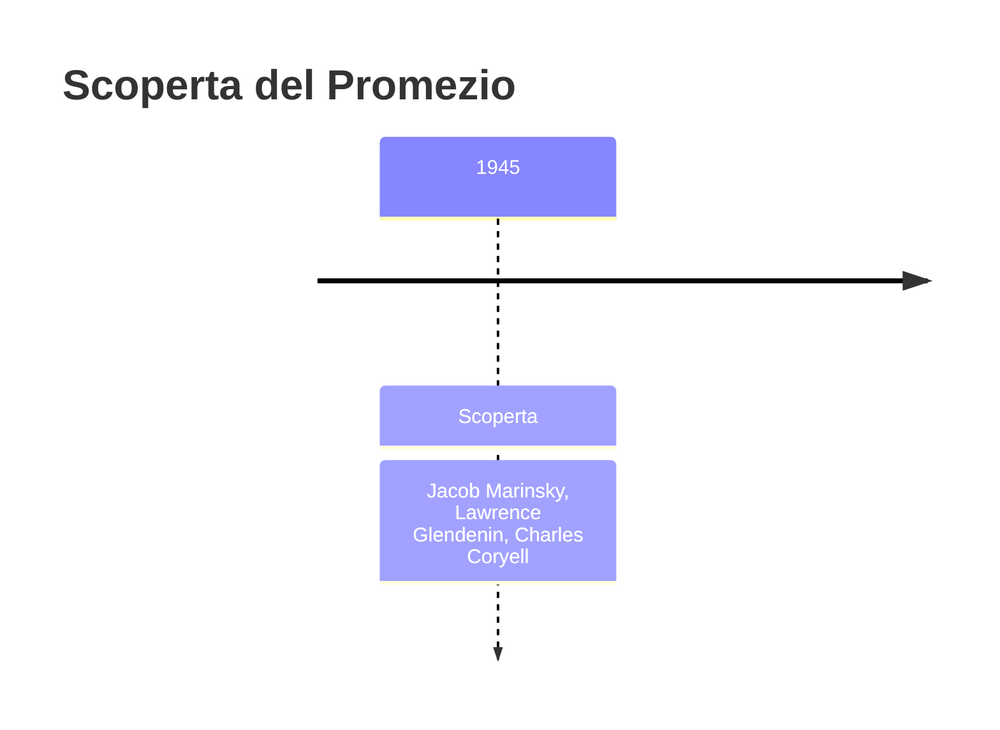
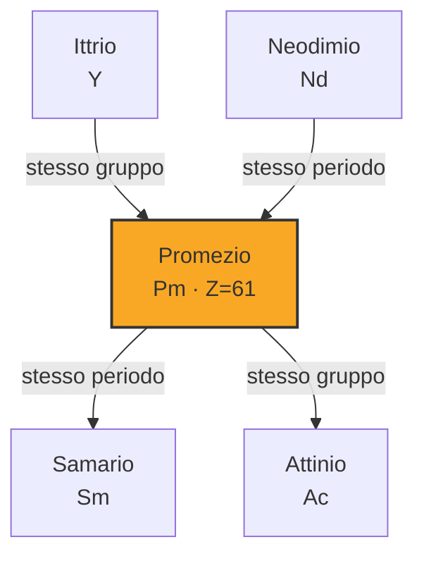

# Promezio (Pm)

> [!abstract] 96° elemento scoperto — 1945
> 

## Cronologia della scoperta

## Storia della scoperta

## Posizione nella tavola periodica

## Caratteristiche

### Dati fisico-chimici

| Proprietà | Valore |
|---|---|
| Numero atomico | 61 |
| Massa atomica | 145,0 u |
| Categoria | Lantanide |
| Gruppo | 3 |
| Periodo | 6 |
| Blocco | f |
| Configurazione elettronica | [Xe] 4f⁵ 6s² |
| Punto di fusione | 1041,9 °C |
| Punto di ebollizione | 2999,9 °C |
| Densità | 7,26 g/cm³ |
| Stati di ossidazione | — |

## Struttura atomica

![[atomo-Promezio.svg]]

## Usi e presenza in natura

## Nella cronologia

← Precedente: [[Curio]] (1944)
→ Successivo: [[Berkelio]] (1949)

Epoca: [[Era nucleare]] · Scopritori: [[Jacob Marinsky]], [[Lawrence Glendenin]], [[Charles Coryell]]

## Fonti

