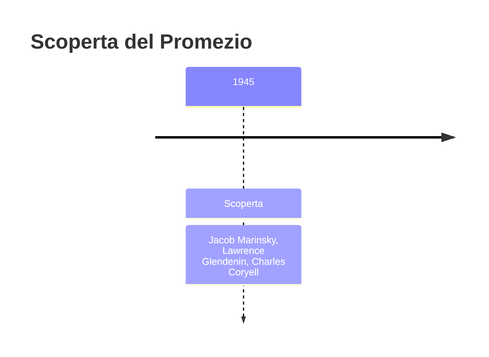
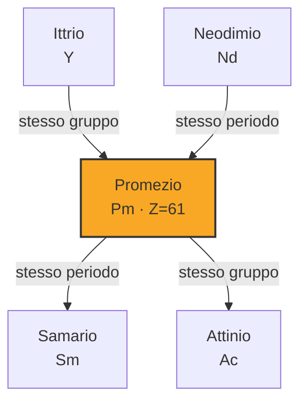
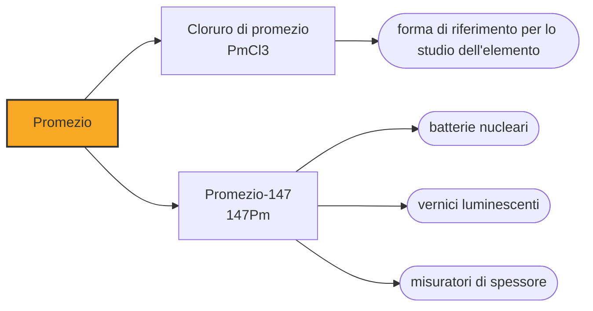

# Promezio (Pm)

> [!abstract] 96° elemento scoperto — 1945
> Fra il neodimio e il samario c'era un buco che nessuno riusciva a riempire. Fu riempito nel 1945 con materiale ricavato dalle scorie di un reattore, e il nome lo suggerì la moglie di uno degli scopritori.

Il promezio è l'unico lantanide senza isotopi stabili, e uno dei due soli elementi fra i primi ottantatré a non averne: in natura non esiste in quantità apprezzabili, e tutto quello che si usa viene dai reattori nucleari. È anche il solo elemento della sua famiglia che si trova più facilmente in un deposito di scorie che in una miniera.

## Cronologia della scoperta

> [!info] Nota sulla cronologia
> L'elemento 61 fu identificato nel 1945 fra i prodotti di fissione dei reattori del progetto Manhattan, con la cromatografia a scambio ionico; l'annuncio pubblico arrivò solo nel 1947, con la declassificazione. Le rivendicazioni precedenti — florenzio (1926) e illinio — si basavano su righe spettrali che si rivelarono del didimio.

## Storia della scoperta

Quando all'inizio del Novecento la serie delle terre rare fu completata, fra il neodimio e il samario restava una casella vuota. Doveva esserci qualcosa: il numero atomico non salta, e le regolarità della tavola periodica lo richiedevano. Ma nessuno riusciva a estrarlo dai minerali, per la ragione che si sarebbe capita solo dopo — in quei minerali non c'era.

Le rivendicazioni non mancarono. Nel 1926 gli italiani Luigi Rolla e Lorenzo Fernandes annunciarono il florenzio, dal nome di Firenze; nello stesso periodo un gruppo dell'Università dell'Illinois annunciò l'illinio. Entrambi gli annunci caddero per la stessa ragione: la riga spettrale su cui si basavano risultò identica a quella del didimio, cioè della miscela di praseodimio e neodimio che aveva già ingannato i chimici per quarant'anni. Cercare l'elemento 61 nei minerali delle terre rare era una caccia senza preda, ma nessuno poteva saperlo.

L'elemento arrivò da un'altra strada. Nel 1945, a Oak Ridge, Jacob Marinsky, Lawrence Glendenin e Charles Coryell stavano separando con la cromatografia a scambio ionico i prodotti della fissione dell'uranio nei reattori del progetto Manhattan. Fra le decine di nuclidi che uscivano dalle colonne ne identificarono uno che apparteneva alla casella 61: la fissione lo produceva in continuazione, e per trovarlo non serviva un minerale ma un reattore. Era la conferma del perché nessuno l'avesse mai estratto da una roccia.

Il nome lo propose Grace Mary Coryell, moglie di uno dei tre: Prometeo, il titano che rubò il fuoco agli dèi e lo diede agli uomini, pagandone il prezzo. La scelta era esplicita — l'elemento veniva dal fuoco nucleare, e con esso arrivava sia l'audacia sia il rischio di ciò che l'ingegno umano può fare.

La scoperta fu resa pubblica solo nel 1947, a guerra finita e con la declassificazione dei lavori del progetto: è uno dei diversi elementi di questa epoca annunciati con anni di ritardo rispetto alla scoperta, perché ottenuti dentro un programma militare segreto.

## Posizione nella tavola periodica

## Caratteristiche

Il promezio non ha isotopi stabili né a vita lunga: il più longevo, il promezio-145, arriva a diciassette anni, e quello che si usa, il promezio-147, a poco più di due anni e mezzo. Rispetto ai quattro miliardi e mezzo di anni della Terra, sono tempi nulli: qualunque promezio primordiale è scomparso da ere.

Tracce infinitesime esistono comunque, prodotte dalla fissione spontanea dell'uranio nei minerali: si stima che nell'intera crosta terrestre ce ne siano poche centinaia di grammi in ogni istante. È lo stesso meccanismo che tiene in vita l'astato e il francio, e la stessa quantità inutilizzabile.

Chimicamente è un lantanide come gli altri: sta nello stato +3, ha ioni di un rosa pallido, e la sua chimica si deduce per interpolazione fra quella del neodimio e quella del samario, i due vicini. Il sale di promezio brilla di una luce azzurrina per la propria radioattività, non per fluorescenza.

Il promezio commerciale si estrae dai prodotti di fissione del combustibile nucleare esausto, dove si forma in quantità dell'ordine di grammi per tonnellata di uranio irraggiato. È uno dei rari casi in cui un elemento della tavola periodica ha come giacimento principale un deposito di scorie.

### Dati fisico-chimici

| Proprietà | Valore |
|---|---|
| Numero atomico | 61 |
| Massa atomica | 145,0 u |
| Categoria | Lantanide |
| Gruppo | 3 |
| Periodo | 6 |
| Blocco | f |
| Configurazione elettronica | [Xe] 4f⁵ 6s² |
| Punto di fusione | 1041,9 °C |
| Punto di ebollizione | 2999,9 °C |
| Densità | 7,26 g/cm³ |
| Stati di ossidazione | +3 |

## Struttura atomica

![[atomo-Promezio.svg]]

## Usi e presenza in natura

L'impiego classico sono le batterie nucleari: le particelle beta emesse dal promezio-147 vengono convertite in corrente elettrica, e la batteria funziona per circa cinque anni senza manutenzione e senza risentire del freddo o del caldo. Sono state usate dove serviva una sorgente piccola e autonoma — pacemaker, strumenti in luoghi inaccessibili, dispositivi militari e spaziali — prima che le batterie chimiche moderne ne coprissero buona parte degli usi.

Il promezio ha sostituito il radio nelle vernici luminose degli strumenti quando la pericolosità del radio è diventata evidente: emette beta invece di alfa, e la radiazione resta dentro il quadrante. Serve inoltre nei misuratori di spessore, dove si misura quanta radiazione attraversa un materiale in produzione continua, dalla carta ai laminati metallici.

## Curiosità

Righe attribuite al promezio sono state osservate nello spettro di alcune stelle: come per il tecnezio, la presenza di un elemento a vita breve nell'atmosfera di una stella indica che lì viene prodotto in continuazione, ed è una delle prove dirette che la nucleosintesi stellare è un processo in corso e non finito.

Il promezio è uno dei pochi elementi il cui nome è stato scelto da qualcuno che non lavorava in laboratorio, e forse l'unico proposto da una persona che compare nella storia della chimica solo per quel suggerimento. Il riferimento a Prometeo, in un elemento nato dalle scorie della bomba, era tutt'altro che ingenuo.

## Nella cronologia

← Precedente: [[Curio]] (1944)
→ Successivo: [[Berkelio]] (1949)

Epoca: [[Era nucleare]] · Scopritori: [[Jacob Marinsky]], [[Lawrence Glendenin]], [[Charles Coryell]]

## Fonti

- [Promethium](https://en.wikipedia.org/wiki/Promethium) — consultata il 09/09/2026
- [Promethium — Royal Society of Chemistry](https://periodic-table.rsc.org/element/61/promethium) — consultata il 09/09/2026
- [Atomic battery](https://en.wikipedia.org/wiki/Atomic_battery) — consultata il 09/09/2026

---

> [!warning] Avvertenza
> Questo progetto è stato realizzato con l'assistenza di sistemi di
> intelligenza artificiale. I contenuti sono verificati sulle fonti citate,
> ma **possono contenere errori e imprecisioni**: prima di riutilizzarli,
> controlla la fonte.
