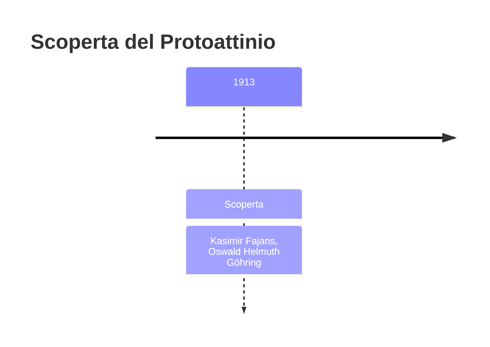
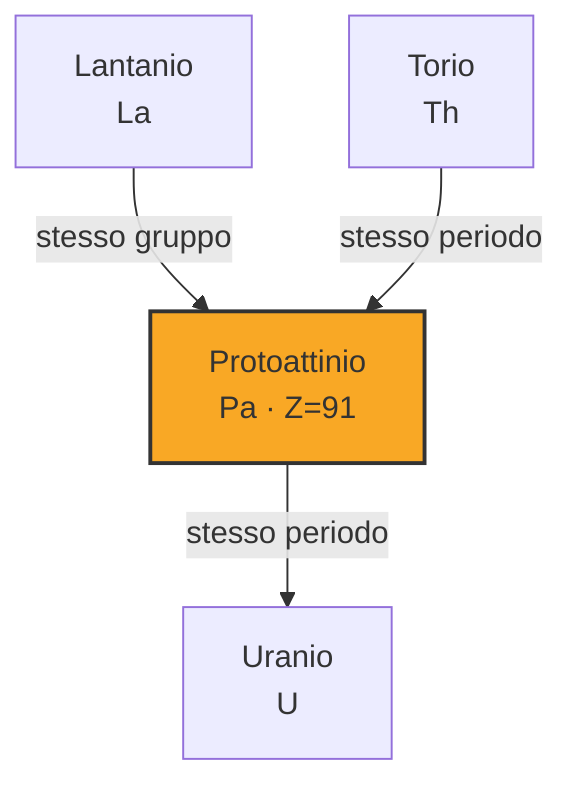
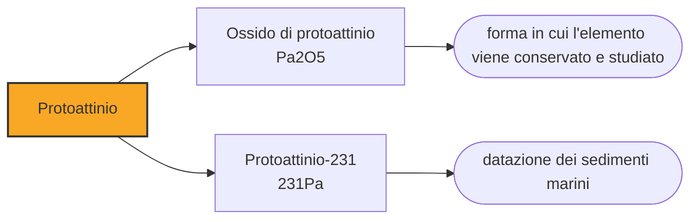

# Protoattinio (Pa)

> [!abstract] 86° elemento scoperto — 1913
> Il primo isotopo trovato durava un minuto e lo chiamarono brevio. Quattro anni dopo se ne trovò un altro che dura trentamila anni, e il nome dovette cambiare.

Il protoattinio è uno degli elementi naturali più rari e più cari che esistano: sta nei minerali di uranio in ragione di poche parti per milione, non ha alcun impiego pratico, ed è insieme tossico e fortemente radioattivo. La sua storia è quella di un elemento che è stato scoperto due volte, con due nomi diversi, perché le due volte si guardava un isotopo diverso.

## Cronologia della scoperta

> [!info] Nota sulla cronologia
> La cronologia adotta il 1913, anno in cui Fajans e Göhring individuarono l'isotopo a vita brevissima e lo chiamarono brevium. Le fonti che datano il protoattinio al 1917 o al 1918 si riferiscono invece alla seconda scoperta, quella dell'isotopo a vita lunga, che è l'elemento come lo si conosce oggi. Il nome attuale, proposto da Meitner, è stato fissato dalla IUPAC nel 1949.

## Storia della scoperta

All'inizio del Novecento la casella 91 della tavola periodica era vuota, e le catene di decadimento dicevano che qualcosa doveva starci: fra il torio e l'uranio mancava un anello. Cercarlo non significava analizzare un minerale, ma seguire ciò in cui una sostanza radioattiva si trasforma, misurando attività che calano nel tempo secondo curve diverse. Era un modo di fare chimica che dieci anni prima non esisteva, e in cui la quantità di materia in gioco poteva essere invisibile.

Nel 1913 Kasimir Fajans e Oswald Helmuth Göhring, studiando la catena dell'uranio-238, individuarono un nuovo nuclide con un'emivita di poco più di un minuto. Lo chiamarono brevium, «breve», proprio per questo. Era davvero l'elemento 91, ma in una forma che non si poteva né accumulare né studiare con calma.

Fra il 1917 e il 1918 Otto Hahn e Lise Meitner a Berlino, e indipendentemente Frederick Soddy e John Cranston a Glasgow, trovarono un secondo isotopo dello stesso elemento, con un'emivita di oltre trentamila anni. Era l'isotopo che rendeva l'elemento maneggiabile, ed era anche quello che genera l'attinio decadendo.

Fu Meitner a proporre il cambio di nome: non più brevio, ma protoattinio, cioè «prima dell'attinio», perché è da lì che l'attinio nasce. Il nome descrive una posizione in una catena di decadimento invece che una proprietà chimica o un luogo: è il segno di quanto la radioattività avesse cambiato il modo di pensare gli elementi. La IUPAC lo confermò nel 1949.

Per Lise Meitner il protoattinio fu il lavoro che la impose come fisica di primo piano, vent'anni prima di quello per cui è ricordata: nel 1938, in esilio, sarebbe stata lei a interpretare correttamente gli esperimenti di Hahn e a riconoscere che il nucleo di uranio si era spezzato. Il Nobel per quella scoperta andò a Hahn soltanto.

## Posizione nella tavola periodica

## Caratteristiche

L'isotopo a vita lunga, il protoattinio-231, ha un'emivita di circa trentaduemila anni e decade emettendo particelle alfa; è il capostipite del ramo che porta all'attinio nella catena dell'uranio-235. La sua attività specifica è abbastanza alta da richiedere manipolazione in cella schermata.

È un metallo argenteo, denso e lucente, che si ossida lentamente all'aria e che sotto i 1,4 kelvin diventa superconduttore. Nei composti sta prevalentemente nello stato +5, e la sua chimica in soluzione è notoriamente scomoda: idrolizza con facilità e si attacca alle pareti dei recipienti in quasi qualunque condizione, il che significa che una parte del campione sparisce dalla soluzione mentre la si studia. È una delle ragioni per cui è stato studiato molto meno dei suoi vicini di tavola.

Nella crosta terrestre sta in ragione di poche parti per trilione, e anche nei minerali di uranio più ricchi arriva a poche parti per milione. Non esiste un modo economico di produrlo, e ciò che se ne ha viene dal trattamento dei residui della lavorazione dell'uranio.

### Dati fisico-chimici

| Proprietà | Valore |
|---|---|
| Numero atomico | 91 |
| Massa atomica | 231,035882 u |
| Categoria | Attinide |
| Gruppo | 3 |
| Periodo | 7 |
| Blocco | f |
| Configurazione elettronica | [Rn] 5f² 6d¹ 7s² |
| Punto di fusione | 1567,9 °C |
| Punto di ebollizione | 4026,9 °C |
| Densità | 15,37 g/cm³ |
| Stati di ossidazione | +3, +4, +5 |

## Struttura atomica

![[atomo-Protoattinio.svg]]

## Usi e presenza in natura

La scorta mondiale di riferimento nacque in un colpo solo: nel 1961 l'autorità britannica per l'energia atomica trattò sessanta tonnellate di residui per ottenere centoventisette grammi di protoattinio-231 al 99,9 per cento, a un costo di circa mezzo milione di dollari dell'epoca. Per decenni quello è stato praticamente tutto il protoattinio disponibile nel mondo per la ricerca.

L'unico impiego che gli si riconosce è la datazione. Il protoattinio-231 e il torio-230 si formano entrambi dal decadimento dell'uranio disciolto nell'acqua di mare, ma precipitano nei sedimenti con velocità diverse: misurandone il rapporto si data uno strato fino a circa centosettantacinquemila anni fa, e si ricostruisce anche quanto rapidamente l'oceano rimescolava le proprie acque. È diventato uno degli strumenti con cui si studiano le variazioni della circolazione atlantica nelle ere glaciali.

Fuori dalla ricerca il protoattinio non ha usi, e non ne avrà: è raro, caro, difficile da maneggiare e non fa nulla che qualcos'altro non faccia meglio. È uno dei pochi elementi naturali della tavola periodica di cui si possa dire che esiste solo per completare il quadro.

## Curiosità

Il protoattinio è regolarmente elencato fra gli elementi naturali più cari, con prezzi che sono più un'indicazione teorica che un listino: non esiste un mercato, perché non esiste una domanda, e chi ne ha bisogno per un esperimento attinge a scorte istituzionali che si contano su una mano.

Kasimir Fajans, che trovò il brevio, è anche uno degli autori della legge dello spostamento radioattivo, che dice come cambia la posizione di un elemento nella tavola periodica quando emette una particella alfa o beta. È la regola che ha permesso di prevedere dove cercare gli anelli mancanti delle catene, protoattinio compreso.

## Nella cronologia

← Precedente: [[Lutezio]] (1907)
→ Successivo: [[Afnio]] (1923)

Epoca: [[Spettroscopia e radioattività]] · Scopritori: [[Kasimir Fajans]], [[Oswald Helmuth Göhring]]

## Fonti

- [Protactinium](https://en.wikipedia.org/wiki/Protactinium) — consultata il 09/09/2026
- [Protactinium — Royal Society of Chemistry](https://periodic-table.rsc.org/element/91/protactinium) — consultata il 09/09/2026
- [Lise Meitner](https://en.wikipedia.org/wiki/Lise_Meitner) — consultata il 09/09/2026
