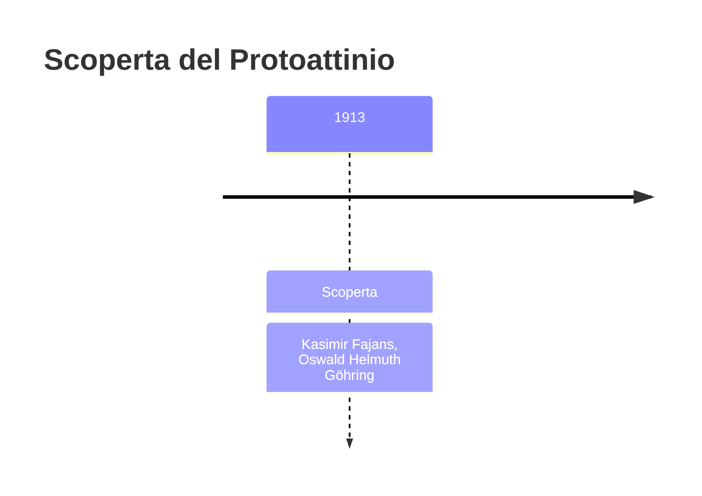
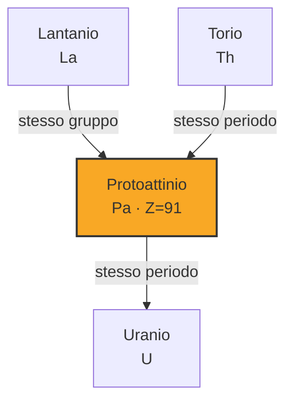

# Protoattinio (Pa)

> [!abstract] 86° elemento scoperto — 1913
> 

## Cronologia della scoperta

## Storia della scoperta

## Posizione nella tavola periodica

## Caratteristiche

### Dati fisico-chimici

| Proprietà | Valore |
|---|---|
| Numero atomico | 91 |
| Massa atomica | 231,035882 u |
| Categoria | Attinide |
| Gruppo | 3 |
| Periodo | 7 |
| Blocco | f |
| Configurazione elettronica | [Rn] 5f² 6d¹ 7s² |
| Punto di fusione | 1567,9 °C |
| Punto di ebollizione | 4026,9 °C |
| Densità | 15,37 g/cm³ |
| Stati di ossidazione | — |

## Struttura atomica

![[atomo-Protoattinio.svg]]

## Usi e presenza in natura

## Nella cronologia

← Precedente: [[Lutezio]] (1907)
→ Successivo: [[Afnio]] (1923)

Epoca: [[Spettroscopia e radioattività]] · Scopritori: [[Kasimir Fajans]], [[Oswald Helmuth Göhring]]

## Fonti

