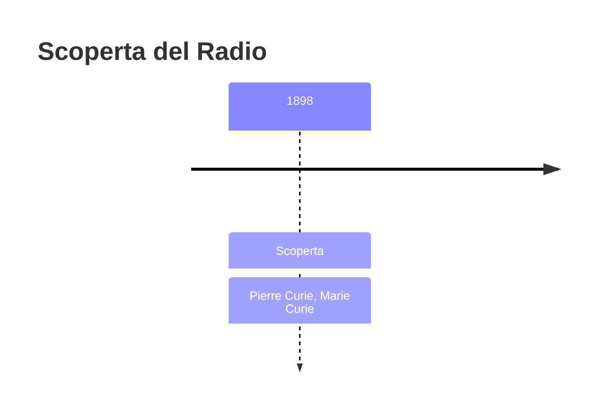
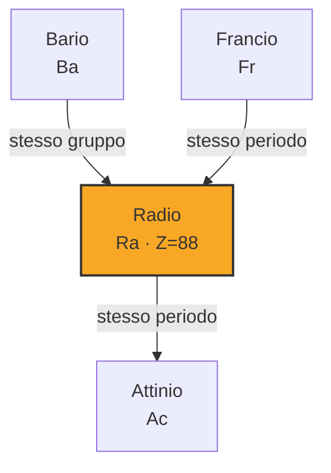

# Radio (Ra)

> [!abstract] 81° elemento scoperto — 1898
> 

## Cronologia della scoperta

## Storia della scoperta

## Posizione nella tavola periodica

## Caratteristiche

### Dati fisico-chimici

| Proprietà | Valore |
|---|---|
| Numero atomico | 88 |
| Massa atomica | 226,0 u |
| Categoria | Metallo alcalino terroso |
| Gruppo | 2 |
| Periodo | 7 |
| Blocco | s |
| Configurazione elettronica | [Rn] 7s² |
| Punto di fusione | 959,9 °C |
| Punto di ebollizione | 1736,9 °C |
| Densità | 5,5 g/cm³ |
| Stati di ossidazione | — |

## Struttura atomica

![[atomo-Radio.svg]]

## Usi e presenza in natura

## Nella cronologia

← Precedente: [[Polonio]] (1898)
→ Successivo: [[Attinio]] (1899)

Epoca: [[Spettroscopia e radioattività]] · Scopritori: [[Pierre Curie]], [[Marie Curie]]

## Fonti

