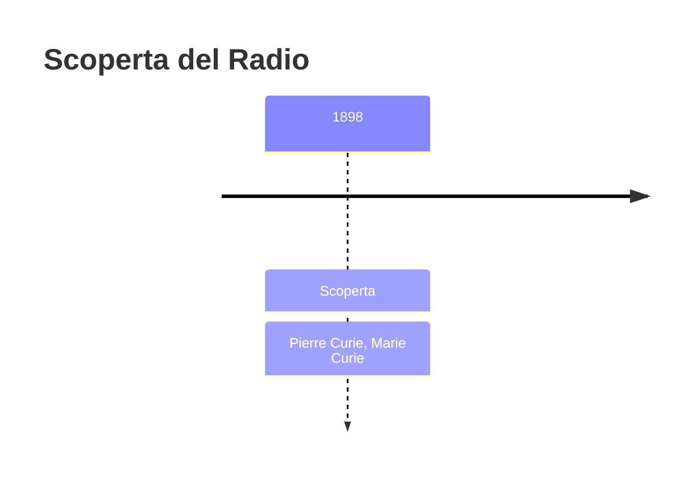
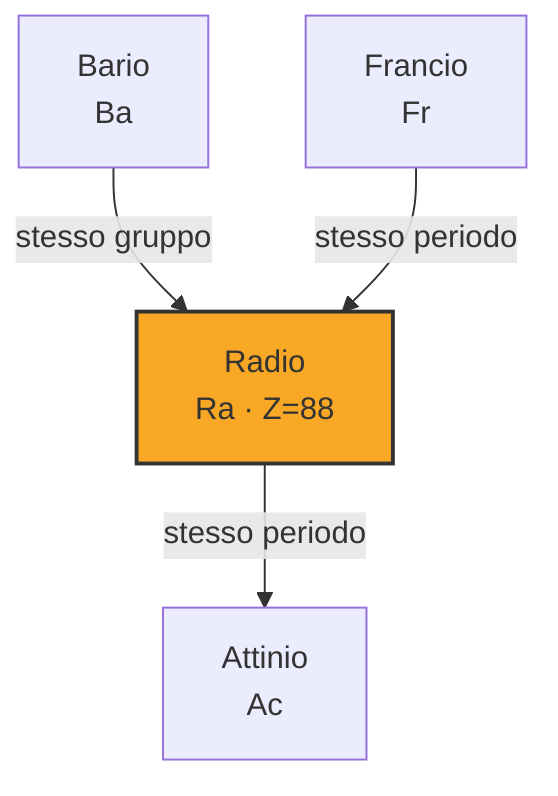
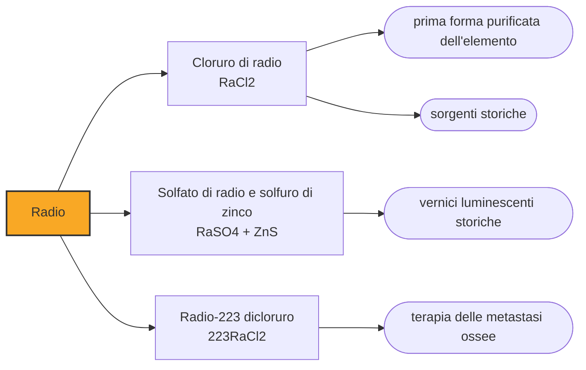

# Radio (Ra)

> [!abstract] 81° elemento scoperto — 1898
> Da una tonnellata di pechblenda si ricava un settimo di grammo di radio. I Curie ne lavorarono tonnellate in un capanno senza pavimento, e ci misero quattro anni per averne un decigrammo.

Il radio è l'elemento che ha reso visibile la radioattività: brilla al buio, scalda ciò che lo circonda, impressiona le lastre fotografiche attraverso il cartone. Per trent'anni è stato considerato una sostanza miracolosa e messo in creme, saponi e bevande; poi si è capito che cosa fa a chi lo ingerisce.

## Cronologia della scoperta

> [!info] Nota sulla cronologia
> Annunciato il 26 dicembre 1898, cinque mesi dopo il polonio e con lo stesso metodo radiometrico; la conferma che si trattasse di un elemento nuovo venne dalle righe spettrali carminio osservate da Eugène-Anatole Demarçay. Il metallo fu isolato nel 1910 da Marie Curie e André-Louis Debierne.

## Storia della scoperta

Individuato il polonio nel luglio del 1898, i Curie si accorsero che i conti ancora non tornavano: nella pechblenda restava altra attività non spiegata, associata alla frazione che conteneva bario. Continuarono a separare seguendo la radiazione, e il 21 dicembre annunciarono un secondo elemento nuovo.

La prova venne dallo spettroscopio di Eugène-Anatole Demarçay, che nei campioni trovò righe di un rosso carminio che non appartenevano al bario né a nulla di noto. Era la conferma che serviva: la radioattività diceva che c'era qualcosa, lo spettro diceva che quel qualcosa era un elemento.

Poi cominciò il lavoro vero. Una tonnellata di pechblenda contiene circa un settimo di grammo di radio, e per averne una quantità pesabile i Curie trattarono tonnellate di residui minerari provenienti da Jáchymov, in Boemia, in un capanno di legno del cortile della Scuola di fisica e chimica di Parigi. Marie mescolava a mano cariche da venti chili in caldaie da fonderia. Nel 1902 avevano un decigrammo di cloruro di radio puro.

Il metallo arrivò nel 1910, quando Marie Curie e André-Louis Debierne elettrolizzarono una soluzione di cloruro di radio su catodo di mercurio, ottenendo un amalgama che scaldarono in idrogeno per allontanare il mercurio. È una delle poche volte in cui l'elemento puro è stato prodotto dalla stessa persona che lo aveva scoperto.

Il radio cambiò la fisica prima ancora della chimica: era abbastanza attivo da permettere esperimenti che con l'uranio erano impossibili, e fu la sorgente con cui Rutherford e altri studiarono le particelle alfa, scoprirono il nucleo atomico e dimostrarono che un elemento può trasformarsi in un altro. Per vent'anni, chi voleva fare fisica nucleare aveva bisogno di radio.

## Posizione nella tavola periodica

## Caratteristiche

Il radio-226 ha un'emivita di 1600 anni e decade emettendo particelle alfa; il bagliore che gli si attribuisce non viene direttamente da lui, ma dalle sostanze fluorescenti che la radiazione eccita, a partire dall'azoto dell'aria e dal solfuro di zinco delle vernici. Un campione si mantiene inoltre più caldo dell'ambiente, per la sola energia che emette.

Chimicamente è l'ultimo dei metalli alcalino-terrosi e si comporta come tale: reagisce con l'acqua, forma sali simili a quelli del bario, e proprio questa somiglianza rende difficile separarlo e pericoloso ingerirlo, perché l'organismo lo scambia per calcio e lo deposita nelle ossa.

Decadendo, il radio produce radon, che è un gas e se ne va, e poi una serie di figli solidi a vita breve fino al piombo stabile. È questa catena, più del radio stesso, a determinare la dose che riceve chi gli sta vicino, ed è il motivo per cui una sorgente sigillata di radio diventa col tempo anche una sorgente di gas.

### Dati fisico-chimici

| Proprietà | Valore |
|---|---|
| Numero atomico | 88 |
| Massa atomica | 226,0 u |
| Categoria | Metallo alcalino terroso |
| Gruppo | 2 |
| Periodo | 7 |
| Blocco | s |
| Configurazione elettronica | [Rn] 7s² |
| Punto di fusione | 959,9 °C |
| Punto di ebollizione | 1736,9 °C |
| Densità | 5,5 g/cm³ |
| Stati di ossidazione | +2 |

## Struttura atomica

![[atomo-Radio.svg]]

## Usi e presenza in natura

Fra il 1910 e gli anni Trenta il radio entrò nelle vernici luminescenti di orologi, quadranti d'aereo, interruttori e strumenti: circa un microgrammo per pezzo, mescolato al solfuro di zinco. Era la soluzione al problema di leggere l'ora al buio, e i quadranti così dipinti hanno continuato a brillare per decenni.

A dipingerli erano giovani operaie, che per fare la punta al pennello lo portavano alle labbra, ingerendo radio a ogni cifra. Molte si ammalarono di necrosi della mandibola, anemia e tumori ossei, e cinque di loro fecero causa all'azienda nel 1927: il processo delle radium girls è uno dei fondamenti del diritto del lavoro sulle malattie professionali, e ha cambiato il modo in cui si regolano le sostanze pericolose.

In medicina il radio serviva a produrre radon per la radioterapia, e sorgenti sigillate in aghi e tubicini venivano applicate direttamente sui tumori: è l'antenato della brachiterapia. Quasi tutto questo è stato sostituito da isotopi artificiali più maneggevoli e meno longevi; resta un discendente moderno, il radio-223, approvato nel 2013, che sfrutta proprio la somiglianza chimica con il calcio per depositarsi nelle metastasi ossee e irradiarle dall'interno con particelle alfa a raggio cortissimo.

## Curiosità

Nei primi decenni del Novecento il radio fu venduto come tonico: acque «radioattive», creme di bellezza, dentifrici, cioccolato, e perfino un apparecchio domestico che serviva a rendere radioattiva l'acqua del rubinetto. Quasi nessuno di questi prodotti ne conteneva abbastanza da fare danni, perché il radio costava troppo per metterne davvero; qualcuno però sì, e uno di questi uccise nel 1932 un noto industriale americano che ne beveva bottiglie ogni giorno, con conseguenze che portarono a regolamentare il settore.

I quaderni di laboratorio dei Curie sono conservati alla Bibliothèque nationale de France in scatole schermate: sono ancora radioattivi e lo resteranno per millenni, e chi vuole consultarli deve firmare una liberatoria. La stessa cosa vale per i mobili e i vestiti del laboratorio di rue Lhomond.

## Nella cronologia

← Precedente: [[Polonio]] (1898)
→ Successivo: [[Attinio]] (1899)

Epoca: [[Spettroscopia e radioattività]] · Scopritori: [[Pierre Curie]], [[Marie Curie]]

## Fonti

- [Radium](https://en.wikipedia.org/wiki/Radium) — consultata il 09/09/2026
- [Radium — Royal Society of Chemistry](https://periodic-table.rsc.org/element/88/radium) — consultata il 09/09/2026
- [Radium Girls](https://en.wikipedia.org/wiki/Radium_Girls) — consultata il 09/09/2026

---

> [!warning] Avvertenza
> Questo progetto è stato realizzato con l'assistenza di sistemi di
> intelligenza artificiale. I contenuti sono verificati sulle fonti citate,
> ma **possono contenere errori e imprecisioni**: prima di riutilizzarli,
> controlla la fonte.
