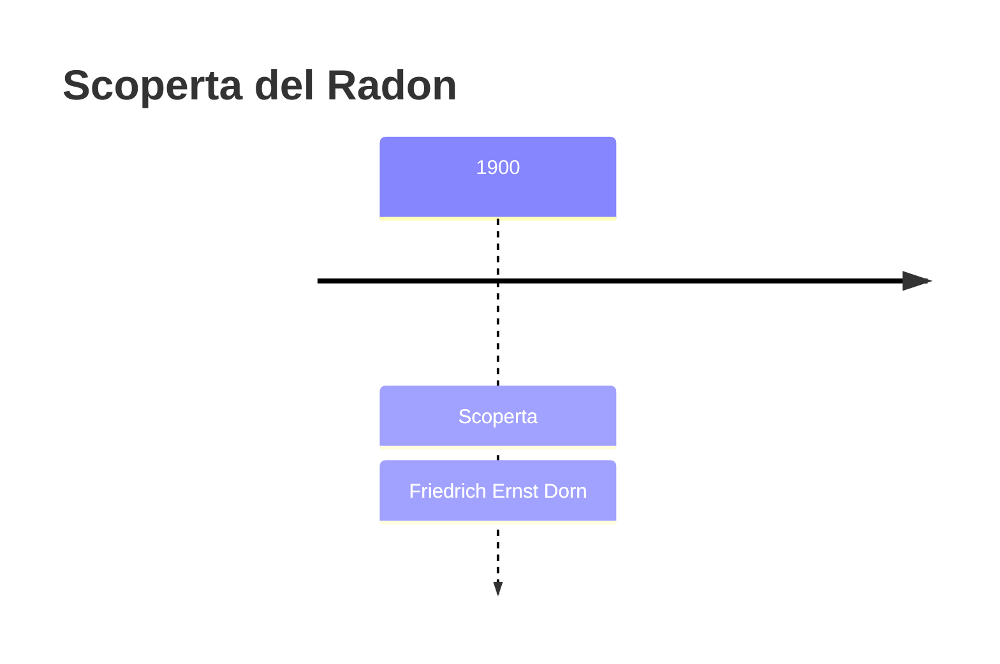
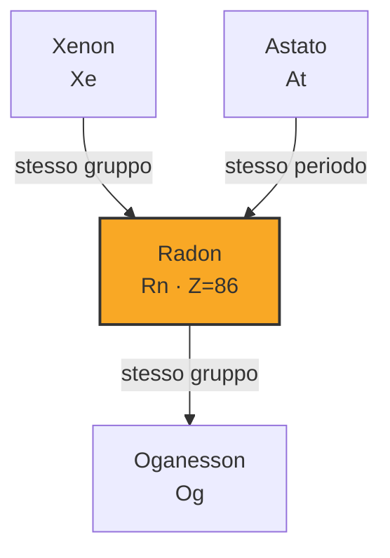
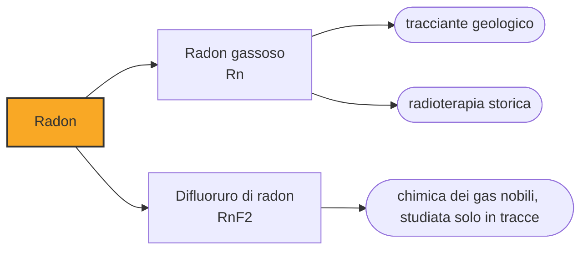

# Radon (Rn)

> [!abstract] 83° elemento scoperto — 1900
> È l'unico gas nobile radioattivo, esce dal terreno senza che nessuno lo veda, e in molti paesi è la seconda causa di tumore al polmone dopo il fumo.

Il radon è il più denso dei gas nobili e l'unico radioattivo: nasce dal decadimento dell'uranio e del torio nelle rocce, filtra attraverso il suolo e si accumula negli scantinati e nei piani bassi delle case. Non ha odore, colore né sapore, e la sua pericolosità è tutta in ciò che produce decadendo.

## Cronologia della scoperta

> [!info] Nota sulla cronologia
> Dorn descrisse nel 1900 il gas radioattivo emesso dai composti del radio, che chiamò «emanazione del radio», ed è quella la data adottata. Ramsay e Whytlaw-Gray ne isolarono e caratterizzarono il gas nel 1910, proponendo il nome niton; il nome radon fu adottato nel 1923.

## Storia della scoperta

Nel 1900 il fisico tedesco Friedrich Ernst Dorn osservò che i composti del radio emettevano un gas radioattivo, che chiamò emanazione del radio. Non era il primo a vedere qualcosa del genere — fenomeni simili erano stati notati con il torio e con l'attinio — ma fu il primo a studiarne sistematicamente il comportamento.

Per un decennio si parlò di tre emanazioni distinte, chiamate radon, thoron e actinon a seconda dell'elemento da cui uscivano. Si capì poi che erano tre isotopi dello stesso elemento, prodotti da tre catene di decadimento diverse, con emivite che vanno da pochi secondi a pochi giorni.

Nel 1910 William Ramsay e Robert Whytlaw-Gray, che ne avevano isolato una quantità sufficiente per misurarne la densità, proposero di chiamarlo niton, dal latino nitens, «splendente», per il bagliore che i suoi composti emettono al buio. Il nome radon, derivato dall'isotopo più stabile, si impose e fu adottato ufficialmente nel 1923.

Con il radon la colonna dei gas nobili era completa: elio, neon, argon, cripton, xenon e radon, sei elementi trovati in sedici anni, cinque dei quali da William Ramsay. L'ultimo arrivava però da una strada diversa da tutti gli altri: non dall'aria liquida, ma dalla radioattività, cioè dal campo di ricerca che stava per riscrivere la chimica dall'interno.

## Posizione nella tavola periodica

## Caratteristiche

L'isotopo più stabile, il radon-222, ha un'emivita di 3,8 giorni e discende dal radio-226, che a sua volta discende dall'uranio-238: ogni roccia che contiene uranio ne produce di continuo. Decadendo emette particelle alfa e si trasforma in una serie di isotopi solidi di polonio, piombo e bismuto, anch'essi radioattivi.

Il pericolo non è il gas in sé, che essendo nobile non si lega a nulla e viene in gran parte espirato, ma i suoi figli: sono solidi, si attaccano al pulviscolo dell'aria, vengono inalati e restano nei polmoni, dove continuano a emettere particelle alfa a contatto diretto con le cellule. Le agenzie sanitarie lo indicano come la seconda causa di tumore al polmone dopo il fumo di sigaretta, e come la prima fra chi non ha mai fumato; nei soli Stati Uniti gli si attribuiscono circa ventunmila morti l'anno.

È il più denso dei gas nobili — circa otto volte l'aria — ed è per questo che si accumula in basso, nei sotterranei e nei vespai. Liquefa a 211 kelvin, e come gli altri gas nobili pesanti forma qualche composto con il fluoro, che però nessuno studia volentieri, vista l'emivita.

La quantità di radon che entra in un edificio dipende dalla geologia del terreno — i graniti e i tufi vulcanici ne producono più delle rocce sedimentarie — e dal modo in cui l'edificio è costruito e ventilato. È la ragione per cui le mappe del rischio radon somigliano alle carte geologiche più che a quelle dell'inquinamento.

### Dati fisico-chimici

| Proprietà | Valore |
|---|---|
| Numero atomico | 86 |
| Massa atomica | 222,0 u |
| Categoria | Gas nobile |
| Gruppo | 18 |
| Periodo | 6 |
| Blocco | p |
| Configurazione elettronica | [Xe] 4f¹⁴ 5d¹⁰ 6s² 6p⁶ |
| Punto di fusione | -71,2 °C |
| Punto di ebollizione | -61,7 °C |
| Densità | 9,73 g/cm³ |
| Stati di ossidazione | 0, +2 |

## Struttura atomica

![[atomo-Radon.svg]]

## Usi e presenza in natura

L'impiego principale del radon, oggi, è essere misurato. Le agenzie sanitarie raccomandano di controllarne la concentrazione nelle abitazioni con rivelatori passivi lasciati in posa per mesi — sono scatolette economiche che registrano le tracce delle particelle alfa — e dove i valori superano le soglie si interviene con la ventilazione dei vespai e la depressurizzazione del suolo sotto la platea. Sono tecniche edilizie semplici, che abbattono la concentrazione di un ordine di grandezza e che in molti paesi sono obbligatorie nelle nuove costruzioni delle zone a rischio.

Nella prima metà del Novecento il radon veniva raccolto in capsule d'oro e usato in radioterapia per irradiare i tumori dall'interno, prima che sorgenti più maneggevoli lo sostituissero. Nello stesso periodo, e con molto meno fondamento, acque e terme «radioattive» venivano pubblicizzate come benefiche proprio per il loro contenuto di radon.

In geologia il radon serve da tracciante: la sua concentrazione nel suolo e nelle falde cambia quando le rocce si fratturano, e per questo viene monitorato nelle aree sismiche e sui vulcani. È un indicatore utile a ricostruire ciò che succede sottoterra, anche se l'idea di usarlo per prevedere i terremoti non ha finora prodotto un metodo affidabile.

## Curiosità

Il problema del radon domestico è emerso in modo clamoroso nel 1984, quando un tecnico di una centrale nucleare della Pennsylvania fece scattare i rivelatori di contaminazione entrando al lavoro, non uscendo. La sorgente non era la centrale: era casa sua, costruita su una formazione geologica ricca di uranio.

Il radon è l'unico elemento della tavola periodica che nella vita di tutti i giorni si incontra soltanto come rischio da misurare. Non serve a fare niente, non lo si compra, non lo si maneggia: esiste, esce dal terreno, e l'unica cosa che se ne fa è tenerlo fuori di casa.

## Nella cronologia

← Precedente: [[Attinio]] (1899)
→ Successivo: [[Europio]] (1901)

Epoca: [[Spettroscopia e radioattività]] · Scopritore: [[Friedrich Ernst Dorn]]

## Fonti

- [Radon](https://en.wikipedia.org/wiki/Radon) — consultata il 09/09/2026
- [Radon — Royal Society of Chemistry](https://periodic-table.rsc.org/element/86/radon) — consultata il 09/09/2026
- [Health Risk of Radon — US Environmental Protection Agency](https://www.epa.gov/radon/health-risk-radon) — consultata il 09/09/2026

---

> [!warning] Avvertenza
> Questo progetto è stato realizzato con l'assistenza di sistemi di
> intelligenza artificiale. I contenuti sono verificati sulle fonti citate,
> ma **possono contenere errori e imprecisioni**: prima di riutilizzarli,
> controlla la fonte.
