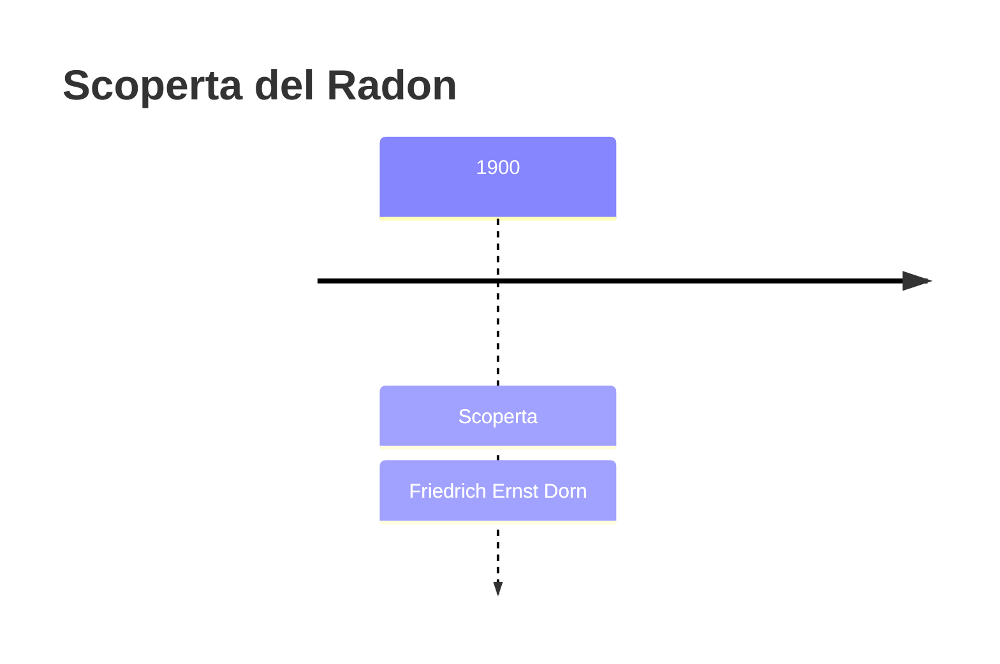
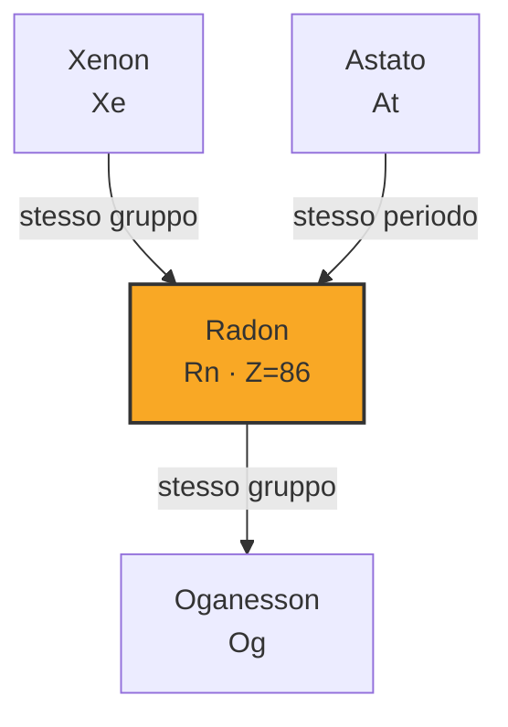

# Radon (Rn)

> [!abstract] 83° elemento scoperto — 1900
> 

## Cronologia della scoperta

## Storia della scoperta

## Posizione nella tavola periodica

## Caratteristiche

### Dati fisico-chimici

| Proprietà | Valore |
|---|---|
| Numero atomico | 86 |
| Massa atomica | 222,0 u |
| Categoria | Gas nobile |
| Gruppo | 18 |
| Periodo | 6 |
| Blocco | p |
| Configurazione elettronica | [Xe] 4f¹⁴ 5d¹⁰ 6s² 6p⁶ |
| Punto di fusione | -71,2 °C |
| Punto di ebollizione | -61,7 °C |
| Densità | 9,73 g/cm³ |
| Stati di ossidazione | — |

## Struttura atomica

![[atomo-Radon.svg]]

## Usi e presenza in natura

## Nella cronologia

← Precedente: [[Attinio]] (1899)
→ Successivo: [[Europio]] (1901)

Epoca: [[Spettroscopia e radioattività]] · Scopritore: [[Friedrich Ernst Dorn]]

## Fonti

