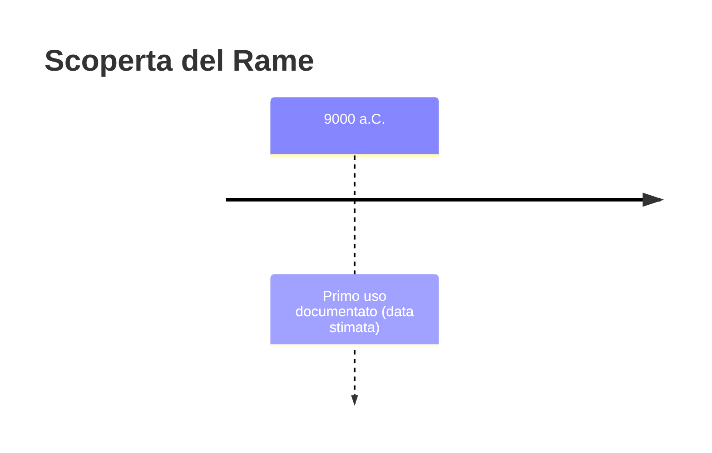
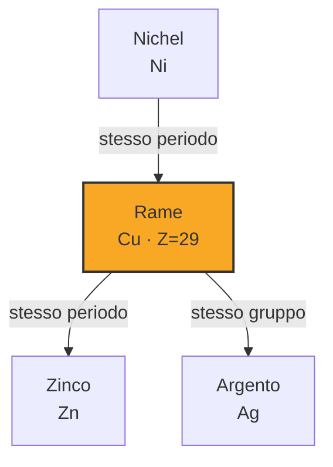
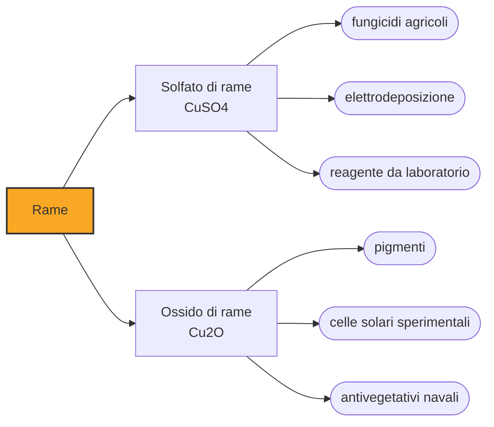

# Rame (Cu)

> [!abstract] 3° elemento scoperto — 9000 a.C.
> Nessuno ha scoperto il rame; l'umanità ci è arrivata per tentativi, in continenti diversi, senza lasciare un nome da ricordare.

Il rame è il primo metallo che l'uomo ha imparato a riconoscere e a lavorare, tanto presto che nessuna scoperta va attribuita a nessuno: non c'era ancora la chimica per definirlo elemento, solo un metallo rossastro più malleabile della pietra.

## Cronologia della scoperta

> [!info] Nota sulla cronologia
> Non esiste un momento della scoperta: il rame entra nella storia umana per accumulo di gesti ripetuti in luoghi diversi, non per un singolo istante da datare.

## Storia della scoperta

Prima che qualcuno imparasse a estrarlo dal minerale, il rame si trovava già pronto in natura, allo stato nativo: pepite e filoni di metallo puro affiorano in superficie in alcune regioni del Vicino Oriente, dell'Anatolia e più tardi delle Americhe. Un oggetto trovato nella grotta di Shanidar, nel Kurdistan iracheno, un piccolo pendaglio ricavato da un frammento di rame non lavorato, risale a circa 12.000 anni fa: è la prova più antica che l'uomo abbia raccolto e trattato questo metallo, prima ancora di saperlo estrarre o fondere.

Il passo successivo non richiede fuoco, solo pazienza: martellare a freddo il metallo nativo, e talvolta ricuocerlo per renderlo di nuovo malleabile dopo l'incrudimento, per dargli forma di punteruolo o di piccolo oggetto da taglio. È la tecnica documentata al sito neolitico di Çayönü Tepesi, nell'Anatolia sud-orientale, alla fine del IX millennio a.C.: gli archeologi la chiamano "premetallurgia", perché precede di millenni la vera fusione del minerale e lavora soltanto il rame che si trova già puro in natura.

Il rame diventa davvero un metallo "prodotto", e non solo raccolto, soltanto quando l'uomo impara a estrarlo dal minerale con il calore: un salto tecnico enorme rispetto al semplice martellamento, perché richiede di riconoscere un minerale, non un metallo già bello e pronto, e di controllare un fuoco abbastanza caldo da farlo fondere. Le prime tracce sicure di questa vera metallurgia si datano al V millennio a.C., in siti della Serbia e dell'Iran, con la diffusione della tecnica nel Vicino Oriente testimoniata anche a Tell Magzaliya, in Mesopotamia, e a Çatal Hüyük, in Anatolia. Da lì la metallurgia del rame si diffonde e innesca quella che gli archeologi chiamano età del rame, il periodo di passaggio fra la pietra e il bronzo.

La svolta successiva arriva quando qualcuno, forse per caso, mescola il rame fuso con lo stagno: nasce il bronzo, più duro e più adatto alle armi e agli attrezzi da taglio del rame puro. È una scoperta così importante da dare il nome a un'intera epoca, l'età del bronzo, che segna in gran parte del mondo antico il passaggio definitivo oltre la sola lavorazione della pietra.

In Italia le prime tracce dell'uso del rame arrivano più tardi rispetto al Vicino Oriente, a partire da circa 6.000 anni fa, quando la metallurgia si diffonde verso ovest lungo le rotte commerciali del Mediterraneo e dei valichi alpini, portando con sé sia il metallo sia le tecniche per lavorarlo.

> [!warning] Questione aperta
> Le fonti divergono su cosa contare come "inizio", e la differenza non è solo di data ma di tecnica. Il ciondolo di rame nativo della grotta di Shanidar, in Kurdistan, risale a circa 12.000 anni fa, ma è un minerale raccolto e appena sbozzato, non lavorato con metodo. La lavorazione vera e propria del rame nativo per ricottura e forgiatura a freddo, quella documentata al sito neolitico di Çayönü Tepesi in Anatolia sud-orientale, si colloca alla fine del IX millennio a.C.: è la "premetallurgia", ed è la fase a cui si riferisce la data convenzionale usata qui. La metallurgia vera, cioè la fusione del minerale con il fuoco, è tutt'altra cosa e arriva molto dopo: le prime tracce sicure risalgono al V millennio a.C., in Serbia e in Iran, con siti come Tell Magzaliya e Çatal Hüyük a testimoniare la diffusione della fusione nel Vicino Oriente fra l'8000 e il 6500 a.C. secondo alcune cronologie. Confondere premetallurgia e metallurgia sarebbe un errore: qui si parla della prima.

## Posizione nella tavola periodica

## Caratteristiche

Il rame è un metallo tenero, malleabile e duttile, capace di essere battuto in fogli sottili o tirato in filo senza spezzarsi: proprio questa lavorabilità, unita a un punto di fusione relativamente basso per un metallo, ne fece il primo scelto dall'uomo. Appena esposta, la sua superficie ha una tipica tonalità rosata-arancione, che si opacizza in un bruno più scuro a contatto con l'aria e vira al verde acqua quando si forma la patina di ossidazione nel tempo.

Fra i metalli comuni, il rame è uno dei migliori conduttori sia di elettricità sia di calore, secondo solo all'argento. È questa proprietà, più che l'estetica, a renderlo insostituibile in tutta l'elettrotecnica moderna: fili, avvolgimenti di motori, circuiti stampati.

Chimicamente il rame appartiene al gruppo dei metalli di transizione e mostra soprattutto due stati di ossidazione, +1 e +2, che danno luogo a composti di colori diversi: i sali rameici, i più comuni, tendono all'azzurro e al verde, come nel solfato di rame o nella patina che ricopre le statue e i tetti esposti alle intemperie per decenni.

### Dati fisico-chimici

| Proprietà | Valore |
|---|---|
| Numero atomico | 29 |
| Massa atomica | 63,5463 u |
| Categoria | Metallo di transizione |
| Gruppo | 11 |
| Periodo | 4 |
| Blocco | d |
| Configurazione elettronica | [Ar] 3d¹⁰ 4s¹ |
| Punto di fusione | 1084,6 °C |
| Punto di ebollizione | 2561,9 °C |
| Densità | 8,96 g/cm³ |
| Stati di ossidazione | +1, +2, +3, +4 |

## Struttura atomica

![[atomo-Rame.svg]]

## Usi e presenza in natura

Da millenni il rame si usa in lega più che puro: con lo stagno dà il bronzo, con lo zinco l'ottone, entrambi più duri e resistenti del metallo originario e da sempre impiegati in utensili, monete, strumenti musicali e componenti meccaniche.

Oggi la maggior parte del rame estratto nel mondo finisce in cavi elettrici, impianti idraulici e componenti elettronici, dove la sua conducibilità è insostituibile; una quota rilevante serve anche all'edilizia, per tetti e grondaie che nel tempo si ricoprono della caratteristica patina verde.

Il rame si trova in natura sia come metallo nativo sia, più spesso, combinato in minerali come la calcopirite e la malachite; i più grandi giacimenti sfruttati oggi si trovano in Cile, Perù e Stati Uniti, dove enormi miniere a cielo aperto ne estraggono milioni di tonnellate ogni anno.

## Curiosità

Il rame è anche un oligoelemento essenziale per il corpo umano: entra in enzimi legati al metabolismo dell'ossigeno, ed è per questo che il sangue di alcuni molluschi e crostacei, che usano una proteina a base di rame al posto dell'emoglobina, è azzurro invece che rosso.

*Per tradizione:* Il nome latino "cuprum", da cui deriva il simbolo Cu, viene da "aes cyprium", cioè "metallo di Cipro": l'isola fu per secoli una delle principali fonti di rame del mondo antico, tanto che il metallo stesso prese il nome dal luogo.

## Nella cronologia

← Precedente: [[Carbonio]] (26000 a.C.)
→ Successivo: [[Piombo]] (7000 a.C.)

Epoca: [[Antichità]]

## Fonti

- [Copper](https://en.wikipedia.org/wiki/Copper) — consultata il 05/09/2026
- [Il rame, diecimila anni di utilizzi diversi](https://www.meccanicanews.com/2022/10/26/il-rame-diecimila-anni-di-utilizzi-diversi/) — consultata il 05/09/2026
- [Archeometallurgia del Rame](https://www.campanologia.it/contenuto/pagine/02-ARS/ARS-C01-Archeologia-Fusoria/ARS-C01-09-Archeometallurgia-Rame.htm) — consultata il 05/09/2026

---

> [!warning] Avvertenza
> Questo progetto è stato realizzato con l'assistenza di sistemi di
> intelligenza artificiale. I contenuti sono verificati sulle fonti citate,
> ma **possono contenere errori e imprecisioni**: prima di riutilizzarli,
> controlla la fonte.
