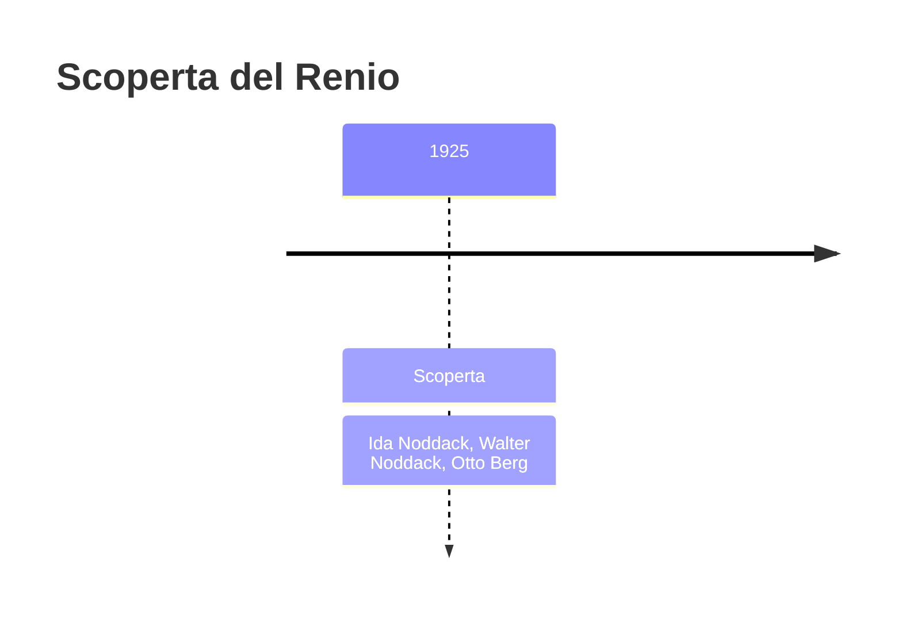
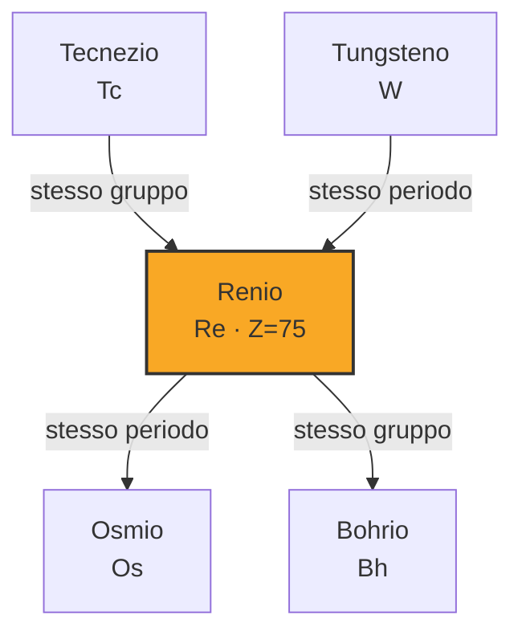

# Renio (Re)

> [!abstract] 88° elemento scoperto — 1925
> 

## Cronologia della scoperta

## Storia della scoperta

## Posizione nella tavola periodica

## Caratteristiche

### Dati fisico-chimici

| Proprietà | Valore |
|---|---|
| Numero atomico | 75 |
| Massa atomica | 186,2071 u |
| Categoria | Metallo di transizione |
| Gruppo | 7 |
| Periodo | 6 |
| Blocco | d |
| Configurazione elettronica | [Xe] 4f¹⁴ 5d⁵ 6s² |
| Punto di fusione | 3185,9 °C |
| Punto di ebollizione | 5595,9 °C |
| Densità | 21,02 g/cm³ |
| Stati di ossidazione | — |

## Struttura atomica

![[atomo-Renio.svg]]

## Usi e presenza in natura

## Nella cronologia

← Precedente: [[Afnio]] (1923)
→ Successivo: [[Tecnezio]] (1937)

Epoca: [[Spettroscopia e radioattività]] · Scopritori: [[Ida Noddack]], [[Walter Noddack]], [[Otto Berg]]

## Fonti

