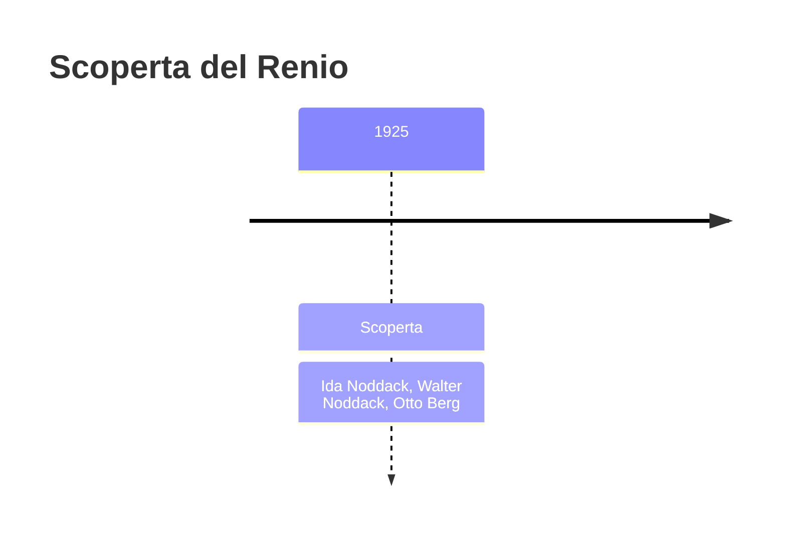
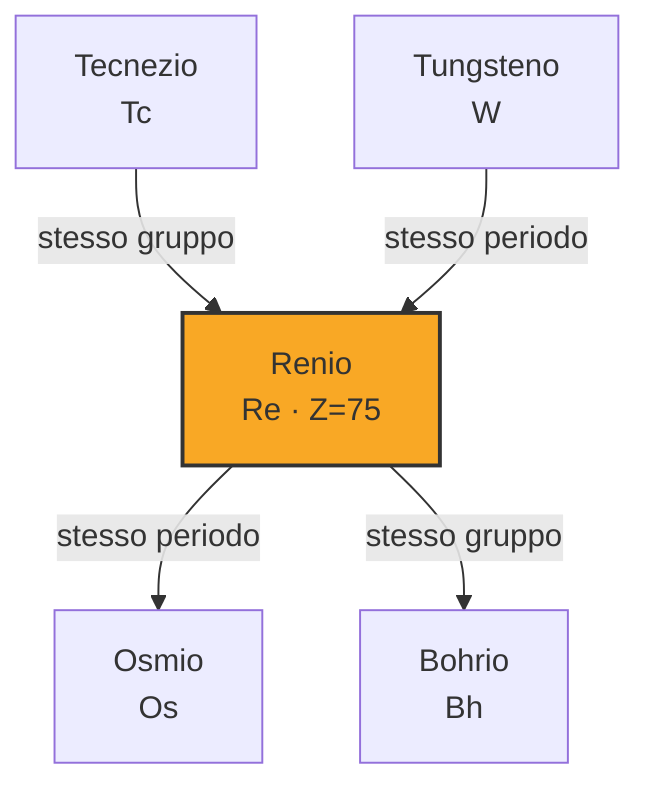
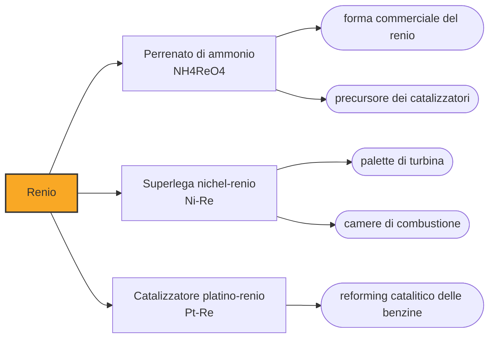

# Renio (Re)

> [!abstract] 88° elemento scoperto — 1925
> Per estrarne un grammo ne lavorarono seicentosessanta chili. È l'ultimo elemento stabile della tavola periodica a essere stato trovato, e a trovarlo fu una coppia di chimici che aveva sbagliato l'altra metà dell'annuncio.

Il renio è uno degli elementi più rari della crosta terrestre e uno dei più refrattari: fra i metalli, solo il tungsteno fonde più in alto, e in quanto a temperatura di ebollizione se la gioca con lui in testa alla classifica. Quasi tutto quello che si produce finisce nelle palette delle turbine dei motori aeronautici.

## Cronologia della scoperta

> [!info] Nota sulla cronologia
> Ultimo elemento stabile scoperto. Walter Noddack, Ida Tacke e Otto Berg lo annunciarono nel 1925 insieme all'elemento 43, che chiamarono masurio e che si rivelò un errore. Nel 1928 ne estrassero un grammo lavorando 660 chilogrammi di molibdenite. Nel 1908 Masataka Ogawa aveva probabilmente osservato lo stesso elemento, attribuendolo però alla casella 43 con il nome di nipponium.

## Storia della scoperta

Negli anni Venti restavano vuote poche caselle nella tavola periodica, e due erano la 43 e la 75, sotto il manganese. I coniugi Walter Noddack e Ida Tacke, con Otto Berg, si misero a cercarle entrambe con la spettroscopia a raggi X, che identifica un elemento dal numero atomico e permette di riconoscerlo anche in tracce minime.

Nel 1925 annunciarono di aver trovato entrambi: l'elemento 75, che chiamarono renio dal Reno, e l'elemento 43, che chiamarono masurio dalla Masuria. Il primo annuncio era giusto, il secondo no: nessuno riuscì a ripetere l'osservazione del masurio, e la casella 43 restò vuota per altri dodici anni.

Dimostrare il renio richiese di produrne abbastanza da poterlo pesare, e l'impresa durò tre anni: nel 1928 i Noddack estrassero un grammo di elemento lavorando seicentosessanta chilogrammi di molibdenite. È il tipo di rapporto — sei quintali per un grammo — che spiega perché il renio sia stato l'ultimo elemento stabile a farsi trovare.

Ida Noddack ha lasciato un segno anche fuori da questa storia. Nel 1934, commentando gli esperimenti di Enrico Fermi sull'irraggiamento dell'uranio con neutroni, scrisse che prima di concludere di aver prodotto elementi più pesanti bisognava considerare un'altra possibilità: che i nuclei colpiti si fossero spezzati in frammenti più leggeri. Era la fissione nucleare, descritta con quattro anni di anticipo su Hahn, Strassmann e Meitner, e nessuno le diede retta — nemmeno lei la sviluppò oltre l'osservazione.

Con il renio la tavola periodica degli elementi stabili era finita: tutto ciò che sarebbe arrivato dopo — il tecnezio, il francio, i transuranici — o è radioattivo o è artificiale. Il 1925 chiude quindi una storia lunga tre secoli, cominciata con il fosforo di Brand e proseguita attraverso l'analisi chimica, lo spettroscopio e i raggi X.

## Posizione nella tavola periodica

## Caratteristiche

Il renio fonde a 3186 gradi ed è secondo solo al tungsteno; bolle a temperature che nella tavola periodica hanno pochissimi rivali, e la sua densità è superata solo da platino, iridio e osmio. A differenza del tungsteno, però, resta duttile anche dopo essere stato scaldato e raffreddato, e non diventa fragile: è una combinazione che nessun altro metallo offre.

Ha una chimica insolitamente ricca, con stati di ossidazione che vanno dal -1 al +7; i più comuni sono il +4 e il +7, e il perrenato, l'anione con renio a +7, è la forma in cui l'elemento viene di solito maneggiato e commerciato. Resiste bene alla corrosione ma si scioglie in acido nitrico.

Nella crosta terrestre è a meno di una parte per miliardo, il che ne fa uno degli elementi stabili più rari in assoluto. Non ha minerali propri: si concentra nella molibdenite, il solfuro di molibdeno, da cui si recupera nei fumi della tostatura, e la produzione mondiale si misura in poche decine di tonnellate l'anno.

### Dati fisico-chimici

| Proprietà | Valore |
|---|---|
| Numero atomico | 75 |
| Massa atomica | 186,2071 u |
| Categoria | Metallo di transizione |
| Gruppo | 7 |
| Periodo | 6 |
| Blocco | d |
| Configurazione elettronica | [Xe] 4f¹⁴ 5d⁵ 6s² |
| Punto di fusione | 3185,9 °C |
| Punto di ebollizione | 5595,9 °C |
| Densità | 21,02 g/cm³ |
| Stati di ossidazione | -1, +1, +2, +3, +4, +5, +6, +7 |

## Struttura atomica

![[atomo-Renio.svg]]

## Usi e presenza in natura

Circa i tre quarti del renio prodotto finisce nelle superleghe a base di nichel delle turbine a gas. Qualche punto percentuale migliora la resistenza allo scorrimento viscoso alle alte temperature, cioè impedisce alla paletta di allungarsi lentamente sotto la propria forza centrifuga quando è arroventata. Una turbina che può girare più calda consuma meno carburante a parità di spinta, e il renio è quello che permette di alzare l'asticella di qualche decina di gradi: sono decine di gradi che valgono miliardi in consumi di flotta.

Il secondo impiego è la catalisi: i catalizzatori platino-renio del reforming catalitico trasformano le frazioni leggere del petrolio in benzine ad alto numero di ottano, e sono stati per decenni uno dei processi centrali delle raffinerie. Il renio serve a mantenere attivo il platino più a lungo.

Il resto va in termocoppie per temperature altissime, in filamenti per spettrometri di massa e in contatti elettrici. Il prezzo segue la domanda aeronautica e ha toccato punte di oltre diecimila dollari al chilogrammo fra il 2008 e il 2009, quando la produzione non teneva il passo con la costruzione di nuovi motori.

## Curiosità

Il masurio dei Noddack non esisteva, ma per un decennio comparve nelle tavole periodiche di mezza Europa. Quando nel 1937 l'elemento 43 fu davvero ottenuto, a Palermo e per via artificiale, gli fu dato un altro nome: tecnezio, «artificiale», e la Masuria uscì dalla tavola periodica come vi era entrata, per annuncio.

Nel 1908 il giapponese Masataka Ogawa aveva annunciato un elemento nuovo che chiamò nipponium, credendo fosse il 43. Analisi successive delle sue lastre hanno mostrato che aveva in mano l'elemento 75, cioè il renio, con diciassette anni di anticipo: aveva trovato la cosa giusta e l'aveva messa nella casella sbagliata.

## Nella cronologia

← Precedente: [[Afnio]] (1923)
→ Successivo: [[Tecnezio]] (1937)

Epoca: [[Spettroscopia e radioattività]] · Scopritori: [[Ida Noddack]], [[Walter Noddack]], [[Otto Berg]]

## Fonti

- [Rhenium](https://en.wikipedia.org/wiki/Rhenium) — consultata il 09/09/2026
- [Rhenium — Royal Society of Chemistry](https://periodic-table.rsc.org/element/75/rhenium) — consultata il 09/09/2026
- [Ida Noddack](https://en.wikipedia.org/wiki/Ida_Noddack) — consultata il 09/09/2026
