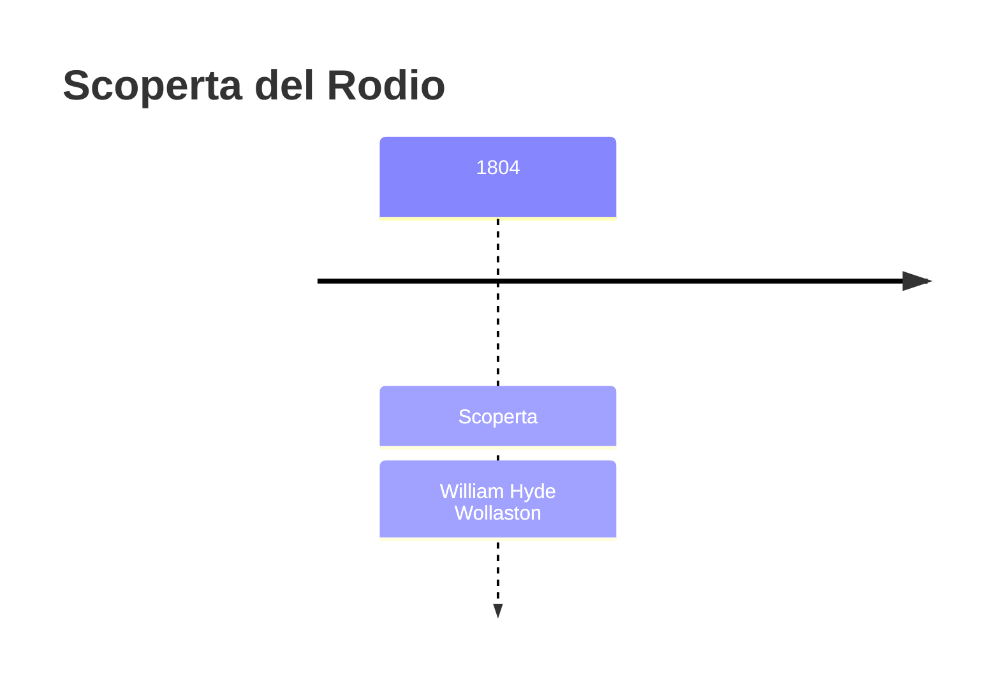
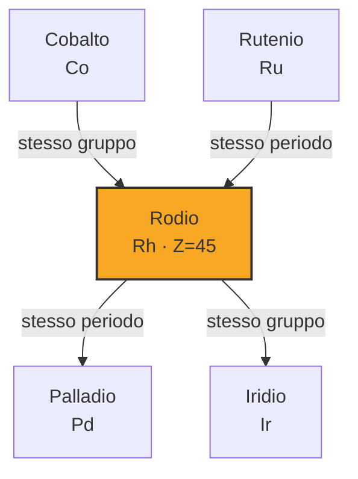

# Rodio (Rh)

> [!abstract] 47° elemento scoperto — 1804
> 

## Cronologia della scoperta

## Storia della scoperta

## Posizione nella tavola periodica

## Caratteristiche

### Dati fisico-chimici

| Proprietà | Valore |
|---|---|
| Numero atomico | 45 |
| Massa atomica | 102,905502 u |
| Categoria | Metallo di transizione |
| Gruppo | 9 |
| Periodo | 5 |
| Blocco | d |
| Configurazione elettronica | [Kr] 4d⁸ 5s¹ |
| Punto di fusione | 1963,9 °C |
| Punto di ebollizione | 3694,9 °C |
| Densità | 12,41 g/cm³ |
| Stati di ossidazione | — |

## Struttura atomica

![[atomo-Rodio.svg]]

## Usi e presenza in natura

## Nella cronologia

← Precedente: [[Iridio]] (1803)
→ Successivo: [[Sodio]] (1807)

Epoca: [[L'età dell'elettrolisi]] · Scopritore: [[William Hyde Wollaston]]

## Fonti

