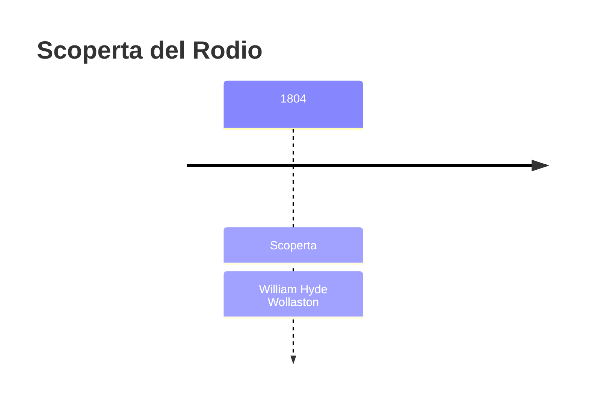
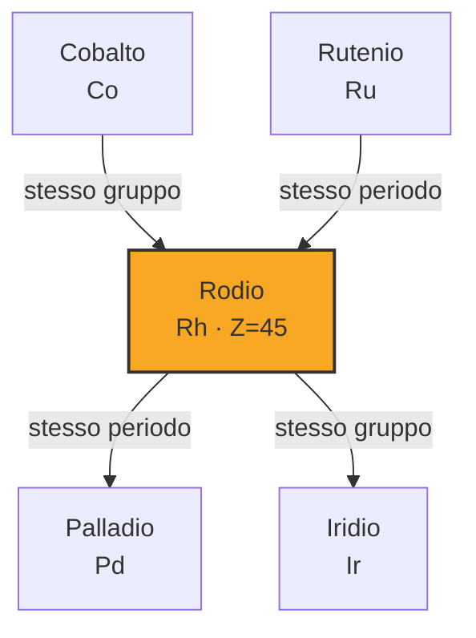
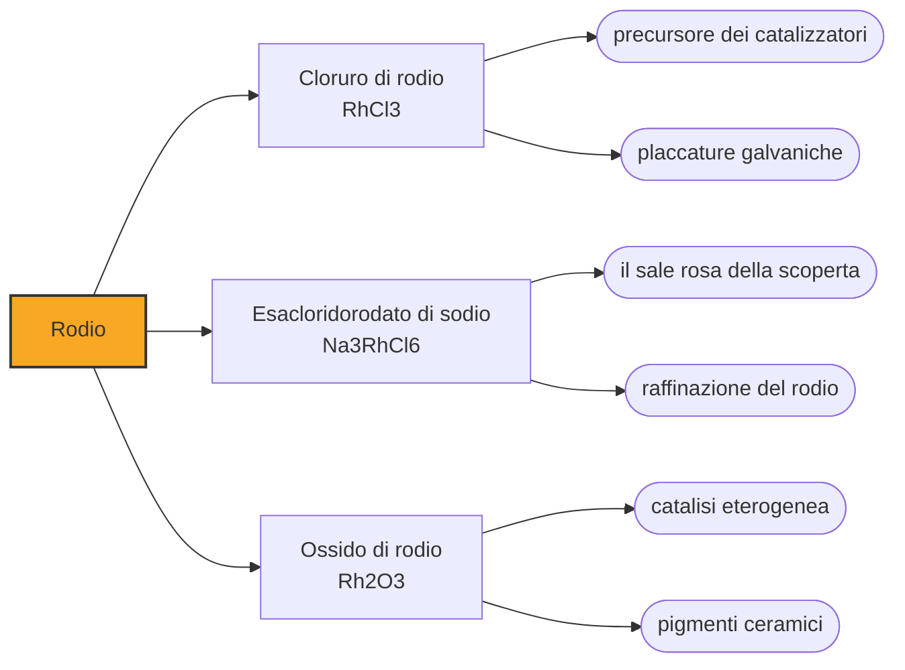

# Rodio (Rh)

> [!abstract] 47° elemento scoperto — 1804
> Tolto il platino e tolto il palladio, sul fondo restava una soluzione di un rosso intenso. Wollaston ne ricavò dei cristalli color rosa, e da quel colore trasse il nome di un metallo nuovo.

Il rodio è un metallo duro, bianco e molto riflettente, che all'aria non forma ossido nemmeno se scaldato. Della sestina del platino è quello che ha avuto la sorte più singolare: praticamente senza impieghi per un secolo e mezzo, è oggi il metallo su cui si regge il funzionamento delle marmitte catalitiche delle automobili.

## Cronologia della scoperta

## Storia della scoperta

La platina greggia che arrivava in Europa dalla Colombia e dal Perù non era platino puro: era un miscuglio di granelli in cui, senza che nessuno lo sapesse, stavano insieme sei metalli distinti. I chimici del Settecento che tentavano di scioglierla si imbattevano sempre negli stessi due fastidi, una polvere nera che non andava in soluzione e colori inattesi nei sali, e li archiviavano come impurità del minerale. Furono proprio quei due fastidi a diventare quattro elementi.

Nel 1800 William Hyde Wollaston e Smithson Tennant si erano messi in società per raffinare e vendere platino, comprando una grossa partita di quel minerale sudamericano. Il grezzo veniva attaccato con acqua regia, e la divisione dei compiti seguì la divisione della materia: Tennant si prese il residuo nero che non si scioglieva, Wollaston la soluzione. La soluzione rese per prima.

Dopo aver fatto precipitare il platino come cloroplatinato d'ammonio e averne cavato il palladio, nel 1803 Wollaston tornò su ciò che avanzava. Aggiungendo zinco fece cadere insieme rame, piombo, palladio e rodio; sciolse via rame e piombo con acido nitrico diluito; ridisciolse il resto in acqua regia e, aggiunto cloruro di sodio ed evaporata la soluzione, ottenne cristalli di un rosso rosato. Una seconda aggiunta di zinco liberò infine il metallo.

Il nome venne dal greco rhodon, rosa, ed è il colore del sale, non quello del metallo: il rodio puro è bianco argenteo, mentre a essere rosa erano i suoi cloruri sul banco di laboratorio. È una piccola ironia lessicale che l'elemento porti addosso, come nome proprio, il colore di un composto che quasi nessuno vede.

Wollaston presentò il rodio alla Royal Society in una memoria del 1804 dedicata a un nuovo metallo trovato nella platina greggia, dove accennò anche al lavoro sul palladio senza però dichiararsi. Lo avrebbe fatto l'anno dopo, chiudendo la polemica che l'annuncio anonimo del palladio aveva scatenato.

Mentre Wollaston lavorava sulla soluzione, Tennant stava cavando dal residuo insolubile altri due elementi, l'osmio e l'iridio, e li annunciava nel giugno del 1804. In tre anni la stessa partita di minerale, comprata in due e divisa secondo ciò che l'acqua regia scioglieva e ciò che non scioglieva, aveva fruttato quattro caselle della tavola periodica.

## Posizione nella tavola periodica

## Caratteristiche

Il rodio fonde a 1964 °C, quasi duecento gradi più in alto del platino, ed è molto meno denso: 12,4 grammi per centimetro cubo contro 21,5. All'aria non forma ossido nemmeno scaldato, e il poco ossigeno che assorbe al punto di fusione lo restituisce solidificando.

Gli acidi non lo attaccano: è del tutto insolubile in acido nitrico e si scioglie a stento perfino in acqua regia, la miscela che ha ragione dell'oro. È una resistenza che i raffinatori sfruttano ancora oggi, perché è esattamente ciò che permette di separarlo dal platino.

Il rodio appartiene al gruppo 9, ma la sua configurazione elettronica è anomala per quella colonna: nello stato fondamentale ha un solo elettrone nell'orbitale s più esterno invece dei due attesi, un'irregolarità che nel quinto periodo condivide con niobio, molibdeno e rutenio, e che nel palladio arriva a lasciare l'orbitale s del tutto vuoto. Nei composti compare in stati di ossidazione che vanno da -3 a +7, ma il +3 domina largamente su tutti gli altri.

La sua rarità non è un modo di dire: la Royal Society of Chemistry lo dà come il più raro dei metalli non radioattivi, e nella crosta terrestre la sua concentrazione sta sotto la parte per miliardo. Non ha miniere proprie e si ricava come sottoprodotto della raffinazione del rame e del nichel.

### Dati fisico-chimici

| Proprietà | Valore |
|---|---|
| Numero atomico | 45 |
| Massa atomica | 102,905502 u |
| Categoria | Metallo di transizione |
| Gruppo | 9 |
| Periodo | 5 |
| Blocco | d |
| Configurazione elettronica | [Kr] 4d⁸ 5s¹ |
| Punto di fusione | 1963,9 °C |
| Punto di ebollizione | 3694,9 °C |
| Densità | 12,41 g/cm³ |
| Stati di ossidazione | -3, -1, 0, +1, +2, +3, +4, +5, +6, +7 |

## Struttura atomica

![[atomo-Rodio.svg]]

## Usi e presenza in natura

Per oltre un secolo e mezzo dalla scoperta il rodio ebbe applicazioni marginali: termocoppie platino-rodio per misurare temperature fino a 1800 °C, placcature decorative. Il mercato nacque nel 1976, quando la Volvo introdusse il convertitore catalitico a tre vie: platino e palladio ossidavano i gas incombusti, ma per ridurre gli ossidi di azoto serviva il rodio. Oggi quel solo impiego assorbe circa l'ottanta per cento di una produzione mondiale che si aggira sulle trenta tonnellate l'anno.

Fuori dall'automobile il rodio catalizza l'idroformilazione, la reazione che dagli alcheni ricava aldeidi su scala industriale, dove ha soppiantato i più economici catalizzatori al cobalto; entra nella produzione dell'acido nitrico e dell'acido acetico; riveste specchi e strumenti ottici, ed entra nelle filiere in lega platino-rodio da cui si tira la fibra di vetro; e come materiale per contatti elettrici mette insieme bassa resistenza e resistenza alla corrosione.

## Curiosità

Il prezzo del rodio è il più instabile fra quelli dei metalli preziosi. Le rilevazioni dello USGS danno una media annua di 20.254 dollari l'oncia troy nel 2021 e di 4.600 dollari nel 2024; nello stesso arco di tempo il palladio è sceso da 2.419 a 980 dollari e il platino ha perso poco più di cento dollari.

Buona parte dell'oro bianco e dell'argento da gioielleria in commercio porta una placcatura di rodio spessa pochi micrometri, che ne mantiene il bianco e impedisce all'argento di annerire: uno dei metalli più cari del mercato si porta al dito senza vederlo.

## Nella cronologia

← Precedente: [[Iridio]] (1803)
→ Successivo: [[Sodio]] (1807)

Epoca: [[L'età dell'elettrolisi]] · Scopritore: [[William Hyde Wollaston]]

## Fonti

- [Two men, two centuries, four metals](https://www.chemistryworld.com/features/two-men-two-centuries-four-metals/3004876.article) — consultata il 07/09/2026
- [Rhodium](https://en.wikipedia.org/wiki/Rhodium) — consultata il 07/09/2026
- [Rhodium — Royal Society of Chemistry](https://periodic-table.rsc.org/element/45/rhodium) — consultata il 07/09/2026
- [USGS Mineral Commodity Summaries 2025 — Platinum-Group Metals](https://pubs.usgs.gov/periodicals/mcs2025/mcs2025-platinum-group.pdf) — consultata il 07/09/2026
