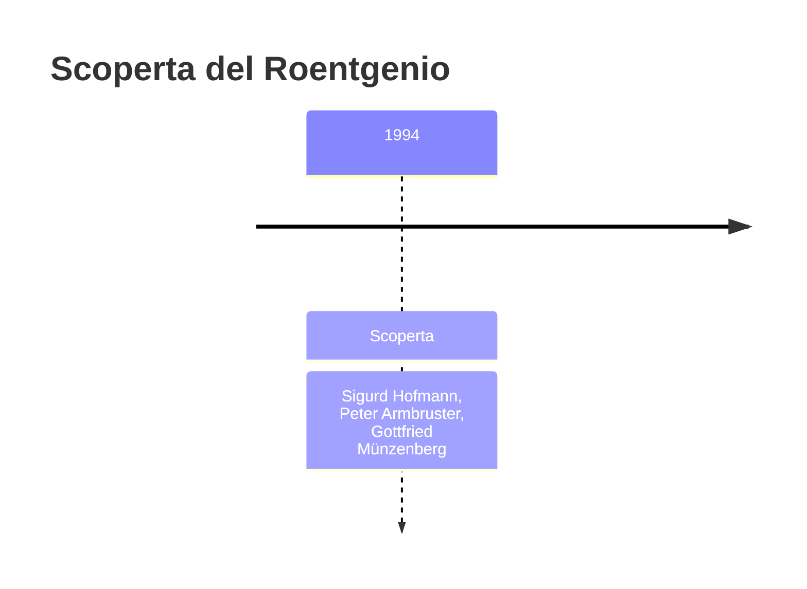
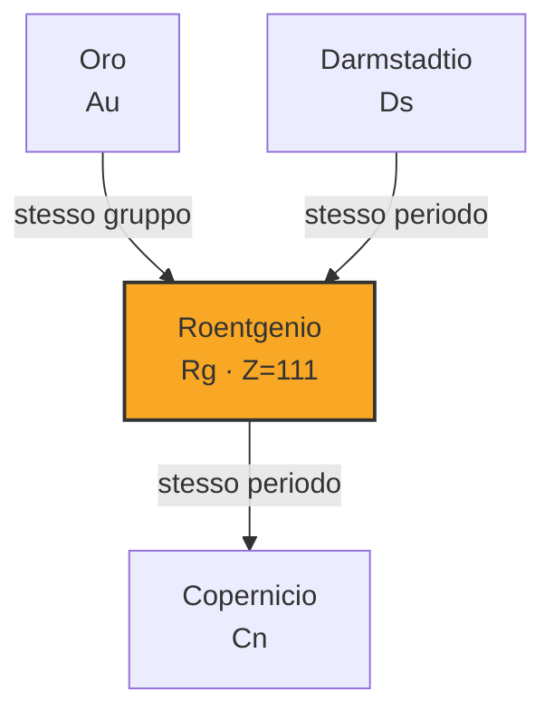
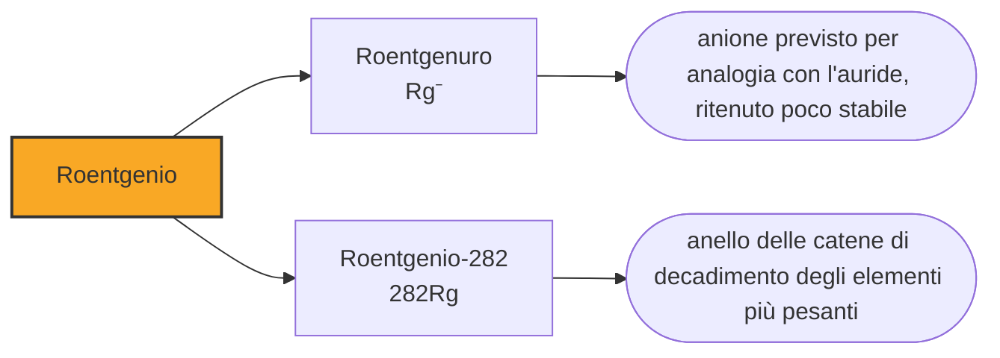

# Roentgenio (Rg)

> [!abstract] 111° elemento scoperto — 1994
> Per dieci anni la casella 111 si è chiamata unununio, che in latino maccheronico vuol dire soltanto «uno-uno-uno». Era un segnaposto, e serviva a non dare un nome a un elemento prima di essere sicuri che esistesse.

Il roentgenio è intitolato a chi ha scoperto i raggi X, cioè a uno dei pochi risultati scientifici che hanno cambiato la vita quotidiana di chiunque. L'elemento in sé è l'opposto: ne esistono in tutto una manciata di atomi, nessuno ne ha mai misurato una proprietà chimica, e non ne uscirà mai nulla di utile.

## Cronologia della scoperta

> [!info] Nota sulla cronologia
> La data adottata è quella della sintesi, l'8 dicembre 1994, ma il riconoscimento IUPAC è del 2003: le prove del 1994 furono giudicate insufficienti nel 2001 e l'esperimento dovette essere ripetuto. La cronologia di riferimento comprimeva gli scopritori in «Hofmann et al.»: l'articolo del 1995 ha gli stessi tredici autori di quello sul darmstadtio, e qui restano i tre nomi che le fonti isolano. Il nome è ufficiale dal primo novembre 2004.

## Storia della scoperta

L'8 dicembre 1994, quattro settimane dopo il darmstadtio, il gruppo di Sigurd Hofmann al GSI ottenne tre nuclei dell'elemento 111 bombardando bismuto-209 con ioni di nichel-64. Era la stessa reazione che Dubna aveva provato nel 1986 senza vedere nulla: la differenza stava nella sensibilità dell'apparato e nella pazienza con cui la si applicava.

Tre atomi non bastarono. Nel 2001 la commissione internazionale giudicò le prove insufficienti a dichiarare la scoperta, e il gruppo dovette rifare l'esperimento: nel 2002 ne raccolse altri tre. Solo allora, nel 2003, la IUPAC riconobbe la scoperta al GSI. È una scansione che dice molto su come funzionano le regole in questo campo: il criterio non è aver visto, ma aver visto abbastanza da poter essere smentiti.

Nel frattempo l'elemento aveva un nome provvisorio, unununium, con il simbolo Uuu. La IUPAC aveva introdotto nel 1979 una nomenclatura sistematica che traduce in latino le cifre del numero atomico — un-un-un per il 111 — proprio per evitare che laboratori rivali battezzassero elementi non ancora confermati, come era successo per trent'anni con la guerra dei transfermi. È una regola nata da un conflitto.

Nel 2004 il GSI propose roentgenium, e la IUPAC lo ufficializzò il primo novembre di quell'anno. Wilhelm Conrad Röntgen aveva scoperto i raggi X nel 1895 a Würzburg, quasi per caso, notando che uno schermo fluorescente si illuminava mentre lui lavorava con un tubo coperto di cartone nero; ricevette il primo premio Nobel per la fisica mai assegnato, nel 1901, e rifiutò di brevettare la scoperta perché la riteneva di tutti.

## Posizione nella tavola periodica

## Caratteristiche

Del roentgenio non si è misurata alcuna proprietà, e i valori di questa nota sono calcoli. Sta nel gruppo 11, sotto rame, argento e oro, e le previsioni ne fanno un metallo nobile: lo stato di ossidazione più stabile dovrebbe essere il +3, accompagnato da un +5 e da un +1 meno saldi.

La previsione più curiosa riguarda lo stato negativo. L'oro è uno dei rarissimi metalli capaci di comportarsi da anione, formando composti in cui vale meno uno: esiste l'auride di cesio, un sale in cui l'oro fa la parte del cloro. Ci si è chiesti se il roentgenio possa fare altrettanto, e i calcoli dicono di no o quasi: la sua affinità per l'elettrone in più è circa i due terzi di quella dell'oro, troppo poco perché i roentgenuri siano stabili.

C'è una ragione per cui il gruppo 11 è interessante proprio all'ultima casella. L'oro deve il proprio colore agli effetti relativistici: gli elettroni più interni di un atomo così pesante si muovono tanto in fretta da alterare le energie degli orbitali, e la luce assorbita si sposta verso il blu. Nel roentgenio quegli effetti sono molto più forti, perché il nucleo ha trentadue cariche in più, e i modelli prevedono di conseguenza un elemento che dall'oro si discosta più di quanto l'oro si discosti dall'argento.

Si conoscono nove isotopi del roentgenio. Il più longevo fra quelli confermati è il roentgenio-282, che arriva a un minuto e quaranta; di un roentgenio-286, non ancora confermato, si stima un'emivita di quasi undici minuti, che ne farebbe uno dei nuclei superpesanti più durevoli conosciuti. Gli isotopi ottenuti sparando nichel sul bismuto, come quelli del 1994, durano millesimi di secondo.

L'unica cosa che del roentgenio si misura davvero è il modo in cui muore. Ogni atomo prodotto emette una particella alfa, diventa meitnerio, poi bohrio, e la sequenza scende lungo la tavola fino a un nucleo già catalogato. Le energie e gli intervalli di quella scala sono il ritratto dell'elemento: non dicono di che colore sia né come reagisca, ma bastano a distinguerlo da qualunque altra cosa esista.

### Dati fisico-chimici

| Proprietà | Valore |
|---|---|
| Numero atomico | 111 |
| Massa atomica | 282,0 u |
| Categoria | Metallo di transizione |
| Gruppo | 11 |
| Periodo | 7 |
| Blocco | d |
| Configurazione elettronica | [Rn] 5f¹⁴ 6d¹⁰ 7s¹ |
| Punto di fusione | dato non disponibile |
| Punto di ebollizione | dato non disponibile |
| Densità | 28,7 g/cm³ |
| Stati di ossidazione | -1, +3, +5 |

## Struttura atomica

![[atomo-Roentgenio.svg]]

## Usi e presenza in natura

Il roentgenio non ha usi: non esiste in natura, se ne sono prodotti in tutto pochi atomi e non se ne produrranno mai abbastanza per farne qualcosa. Serve a verificare le previsioni teoriche sul gruppo 11, e per ora nemmeno a quello, perché le verifiche non si sono ancora potute fare.

Ciò che questa casella ha davvero prodotto è un precedente. Il caso del roentgenio ha contribuito a fissare lo standard con cui si valutano oggi le rivendicazioni di elementi nuovi: catene di decadimento agganciate a nuclei noti, statistica sufficiente, e ripetizione indipendente dell'esperimento. Tutti gli elementi scoperti dopo hanno dovuto superare la stessa soglia.

## Curiosità

Röntgen chiamò i suoi raggi «X» perché non sapeva che cosa fossero, e il nome provvisorio gli è rimasto per sempre in inglese e in italiano; in tedesco si chiamano invece raggi Röntgen. L'elemento 111 ha attraversato la stessa vicenda al contrario: ha avuto per anni un nome provvisorio, unununio, ed è finito per prendere quello dell'uomo che aveva reso permanente un provvisorio.

Fra il primo atomo di darmstadtio e il primo di roentgenio passò meno di un mese. Lo stesso apparato, la stessa squadra, lo stesso bersaglio di piombo o bismuto e un proiettile appena più pesante: bastava cambiare il fascio e ricominciare. In quel novembre e dicembre del 1994 la tavola periodica si allungò di due caselle nello stesso corridoio.

## Nella cronologia

← Precedente: [[Darmstadtio]] (1994)
→ Successivo: [[Copernicio]] (1996)

Epoca: [[Era nucleare]] · Scopritori: [[Sigurd Hofmann]], [[Peter Armbruster]], [[Gottfried Münzenberg]]

## Fonti

- [Roentgenium](https://en.wikipedia.org/wiki/Roentgenium) — consultata il 10/09/2026
- [Roentgenium — Royal Society of Chemistry](https://periodic-table.rsc.org/element/111/roentgenium) — consultata il 10/09/2026
- [Wilhelm Röntgen](https://en.wikipedia.org/wiki/Wilhelm_R%C3%B6ntgen) — consultata il 10/09/2026

---

> [!warning] Avvertenza
> Questo progetto è stato realizzato con l'assistenza di sistemi di
> intelligenza artificiale. I contenuti sono verificati sulle fonti citate,
> ma **possono contenere errori e imprecisioni**: prima di riutilizzarli,
> controlla la fonte.
