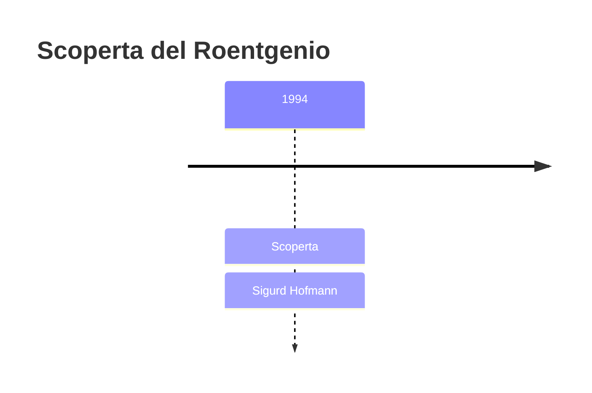
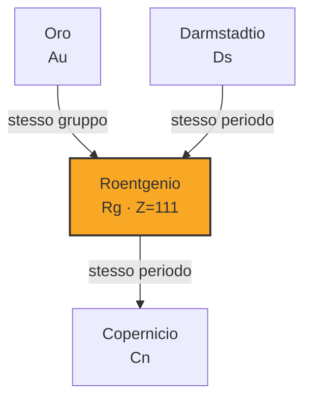

# Roentgenio (Rg)

> [!abstract] 111° elemento scoperto — 1994
> 

## Cronologia della scoperta

## Storia della scoperta

## Posizione nella tavola periodica

## Caratteristiche

### Dati fisico-chimici

| Proprietà | Valore |
|---|---|
| Numero atomico | 111 |
| Massa atomica | 282,0 u |
| Categoria | Metallo di transizione |
| Gruppo | 11 |
| Periodo | 7 |
| Blocco | d |
| Configurazione elettronica | *[Rn] 5f¹⁴ 6d¹⁰ 7s¹ |
| Punto di fusione | dato non disponibile |
| Punto di ebollizione | dato non disponibile |
| Densità | 28,7 g/cm³ |
| Stati di ossidazione | — |

## Struttura atomica

![[atomo-Roentgenio.svg]]

## Usi e presenza in natura

## Nella cronologia

← Precedente: [[Darmstadtio]] (1994)
→ Successivo: [[Copernicio]] (1996)

Epoca: [[Era nucleare]] · Scopritore: [[Sigurd Hofmann]]

## Fonti

