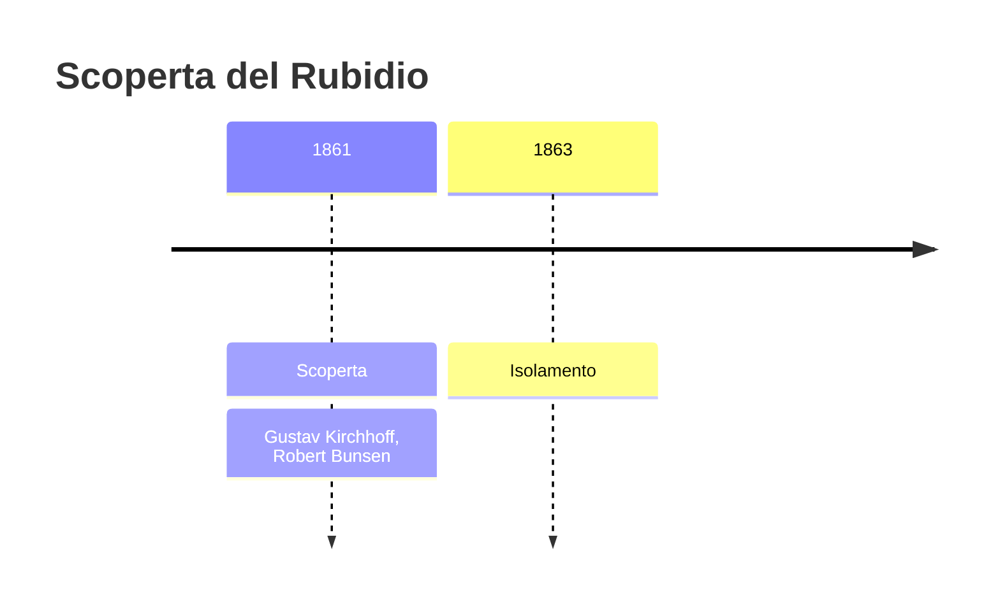
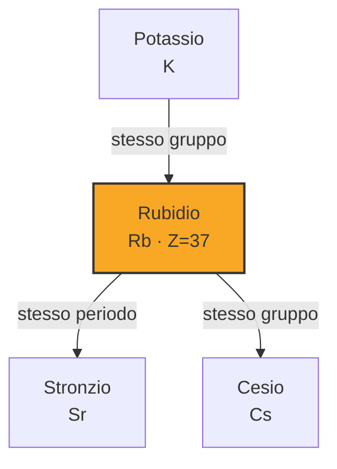
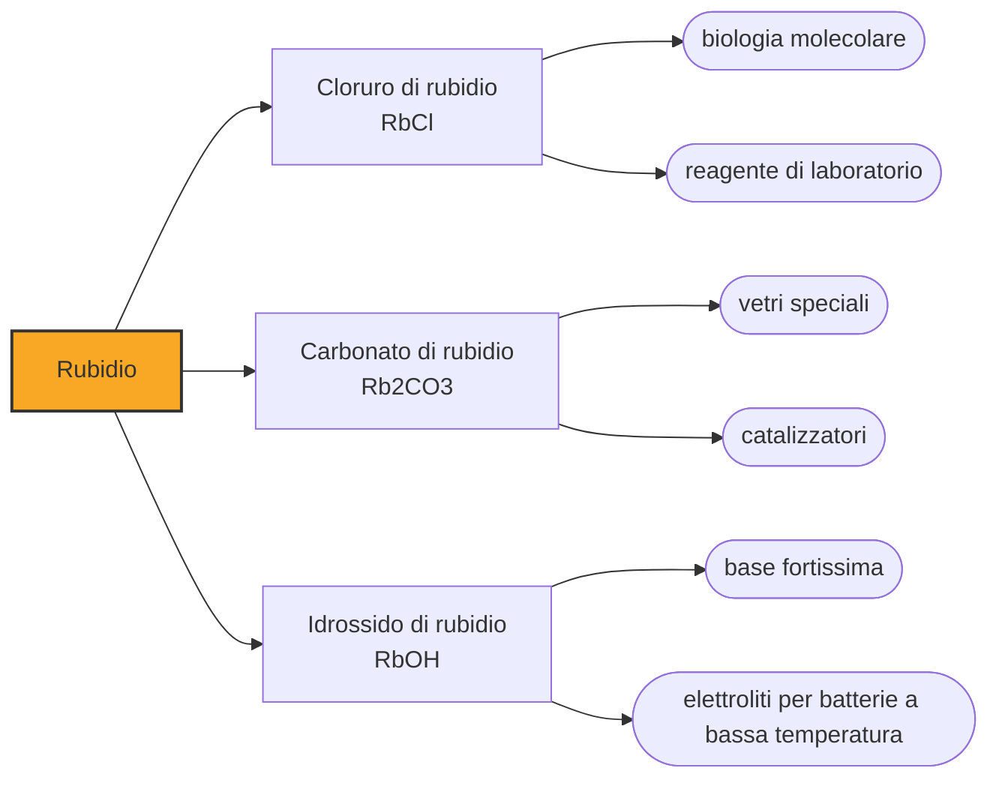

# Rubidio (Rb)

> [!abstract] 62° elemento scoperto — 1861
> Il secondo elemento trovato con lo spettroscopio arrivò pochi mesi dopo il primo, dagli stessi due uomini e dallo stesso strumento. Stavolta le righe erano rosse.

Il rubidio è un metallo alcalino tenero e argenteo che fonde a 39 gradi, poco sopra la temperatura del corpo umano. È più comune del rame nella crosta terrestre, non ha giacimenti propri, ed è uno dei pochi elementi il cui isotopo principale è insieme stabilissimo e utile: serve a datare le rocce e a tenere l'ora.

## Cronologia della scoperta

> [!info] Nota sulla cronologia
> Secondo elemento scoperto per via spettroscopica, pochi mesi dopo il cesio e dagli stessi Bunsen e Kirchhoff. Il primo metallo, impuro, lo ottenne Bunsen riducendo il tartrato carbonizzato; il rubidio puro arrivò più tardi, per mano di George de Hevesy.

## Storia della scoperta

Nel 1861, l'anno dopo il cesio, Robert Bunsen e Gustav Kirchhoff puntarono lo spettroscopio su un campione di lepidolite, una mica di litio che veniva dalla Sassonia. Nello spettro comparvero due righe rosso scuro che non appartenevano a nessun elemento conosciuto, e i due riconobbero un secondo metallo alcalino nuovo, parente stretto di quello trovato l'anno prima.

Il nome venne dal latino rubidus, «rosso cupo», per il colore delle righe: la stessa logica con cui avevano battezzato il cesio, che di righe ne aveva due azzurre. È una convenzione che con lo spettroscopio diventa quasi una regola — il tallio dal verde, l'indio dall'indaco — e che lega il nome dell'elemento non a un luogo o a un mito, ma al colore della sua luce.

Ottenere il metallo fu, come per il cesio, la parte difficile. Bunsen arrivò a una prima riduzione scaldando il tartrato di rubidio carbonizzato, ma il campione era impuro e si incendiava con facilità; il rubidio davvero puro arrivò molto più tardi, per mano di George de Hevesy, lo stesso chimico che trent'anni dopo avrebbe scoperto l'afnio.

Cesio e rubidio completavano la colonna dei metalli alcalini, e lo facevano nel momento giusto: pochi anni dopo Dmitrij Mendeleev avrebbe costruito la tavola periodica proprio sulle regolarità di famiglie come questa, dove le proprietà cambiano in modo prevedibile scendendo lungo la colonna. Due elementi trovati per il colore della loro luce si rivelarono le tessere che mancavano a un disegno più grande.

## Posizione nella tavola periodica

## Caratteristiche

È uno dei metalli più reattivi che esistano: si ossida immediatamente all'aria, reagisce in modo esplosivo con l'acqua liberando idrogeno e idrossido, e va conservato sotto vuoto o in atmosfera inerte. Come il cesio, fonde a una temperatura che si raggiunge in una giornata d'estate, e come il cesio è tenero abbastanza da tagliarsi con un coltello.

Poco più di un quarto del rubidio naturale è rubidio-87, che è radioattivo: decade a stronzio-87 con un'emivita di quarantotto miliardi di anni, più di tre volte l'età dell'universo. Un decadimento così lento non lo rende pericoloso — è un nuclide primordiale, presente da quando la Terra si è formata, e la sua attività è confrontabile con quella del potassio che mangiamo tutti i giorni — ma lo rende prezioso a chi deve misurare tempi geologici.

Con la sua abbondanza il rubidio è il ventitreesimo elemento della crosta terrestre, più comune dello zinco e del rame. Non forma però minerali propri: si sostituisce al potassio nei reticoli delle miche e dei feldspati, e si ricava come sottoprodotto della lavorazione della lepidolite e dei sali di potassio.

Chimicamente non riserva sorprese: cede l'unico elettrone esterno e resta ione Rb⁺ in tutti i suoi composti, che sono quasi tutti solubili e quasi tutti incolori. È questa monotonia a renderlo intercambiabile con il potassio nei minerali e negli organismi, ed è la ragione per cui non si trova mai concentrato da qualche parte: sta ovunque ci sia potassio, in proporzione di qualche parte su mille.

### Dati fisico-chimici

| Proprietà | Valore |
|---|---|
| Numero atomico | 37 |
| Massa atomica | 85,46783 u |
| Categoria | Metallo alcalino |
| Gruppo | 1 |
| Periodo | 5 |
| Blocco | s |
| Configurazione elettronica | [Kr] 5s¹ |
| Punto di fusione | 39,3 °C |
| Punto di ebollizione | 687,9 °C |
| Densità | 1,532 g/cm³ |
| Stati di ossidazione | +1 |

## Struttura atomica

![[atomo-Rubidio.svg]]

## Usi e presenza in natura

La datazione rubidio-stronzio sfrutta proprio quel decadimento lentissimo: misurando quanto stronzio-87 si è accumulato in un minerale rispetto al rubidio-87 che gli resta, si calcola quando il minerale ha cristallizzato. È uno dei metodi con cui si datano le rocce più antiche della Terra e i meteoriti, cioè con cui si è stabilita l'età del sistema solare.

Gli orologi atomici al rubidio sono meno precisi di quelli al cesio ma molto più piccoli ed economici, e per questo stanno dentro i satelliti di navigazione, i ripetitori delle reti di telecomunicazione e gli strumenti di misura da laboratorio: dove serve un riferimento di tempo stabile che stia in una scatola.

Il resto degli impieghi vive di quella facilità a cedere elettroni: fotocellule, catodi e vetri speciali. In laboratorio il rubidio è inoltre l'atomo preferito dell'ottica quantistica, perché le sue transizioni cadono a lunghezze d'onda che i laser a semiconduttore raggiungono senza fatica e perché una cella di vapore di rubidio si prepara con mezzi ordinari: è il motivo per cui compare in mezzo mondo negli esperimenti sugli atomi freddi, sui sensori inerziali e sui magnetometri.

## Curiosità

Nel 1995 il primo condensato di Bose-Einstein mai ottenuto fu un gas di duemila atomi di rubidio-87 raffreddati a meno di un milionesimo di grado sopra lo zero assoluto, dove gli atomi smettono di comportarsi come particelle distinte e si muovono tutti insieme come se fossero uno solo. Settant'anni prima quello stato della materia era stato previsto sulla carta, senza speranza di vederlo.

Il corpo umano tratta il rubidio come se fosse potassio e lo distribuisce nelle cellule allo stesso modo: un adulto ne contiene qualche centinaio di milligrammi, presi con il cibo e senza alcun ruolo biologico noto. È uno dei diversi elementi che abitiamo senza saperlo e senza che servano a niente.

## Nella cronologia

← Precedente: [[Cesio]] (1860)
→ Successivo: [[Tallio]] (1861)

Epoca: [[Spettroscopia e radioattività]] · Scopritori: [[Gustav Kirchhoff]], [[Robert Bunsen]]

## Fonti

- [Rubidium](https://en.wikipedia.org/wiki/Rubidium) — consultata il 09/09/2026
- [Rubidium — Royal Society of Chemistry](https://periodic-table.rsc.org/element/37/rubidium) — consultata il 09/09/2026
- [Bose–Einstein condensate](https://en.wikipedia.org/wiki/Bose%E2%80%93Einstein_condensate) — consultata il 09/09/2026
