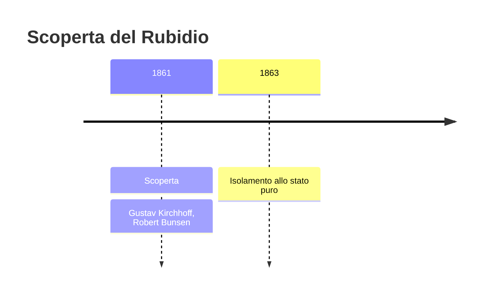
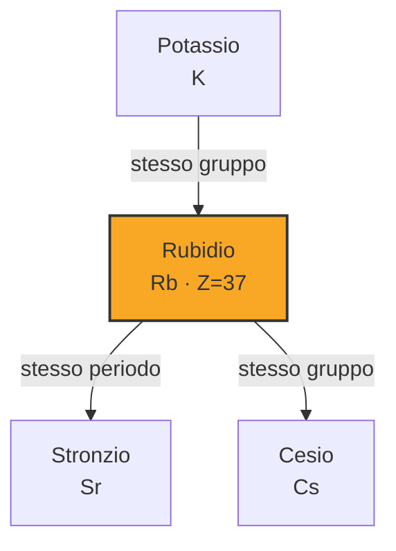

# Rubidio (Rb)

> [!abstract] 62° elemento scoperto — 1861
> 

## Cronologia della scoperta

## Storia della scoperta

## Posizione nella tavola periodica

## Caratteristiche

### Dati fisico-chimici

| Proprietà | Valore |
|---|---|
| Numero atomico | 37 |
| Massa atomica | 85,46783 u |
| Categoria | Metallo alcalino |
| Gruppo | 1 |
| Periodo | 5 |
| Blocco | s |
| Configurazione elettronica | [Kr] 5s¹ |
| Punto di fusione | 39,3 °C |
| Punto di ebollizione | 687,9 °C |
| Densità | 1,532 g/cm³ |
| Stati di ossidazione | — |

## Struttura atomica

![[atomo-Rubidio.svg]]

## Usi e presenza in natura

## Nella cronologia

← Precedente: [[Cesio]] (1860)
→ Successivo: [[Tallio]] (1861)

Epoca: [[Spettroscopia e radioattività]] · Scopritore: [[Gustav Kirchhoff]], [[Robert Bunsen]]

## Fonti

