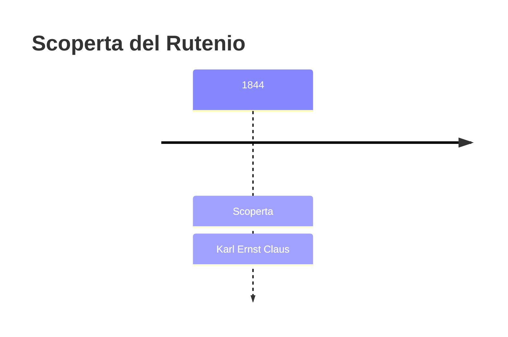
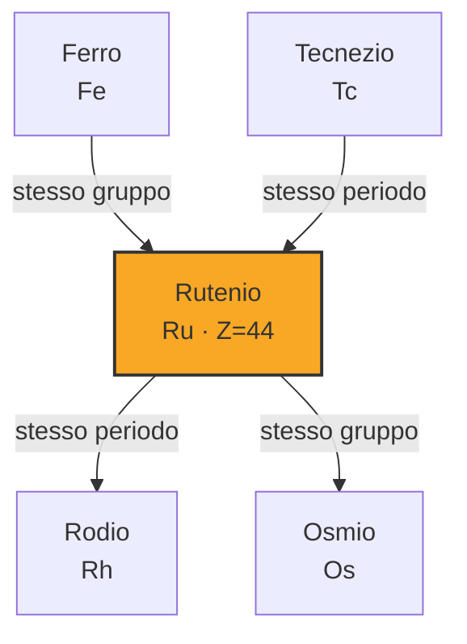
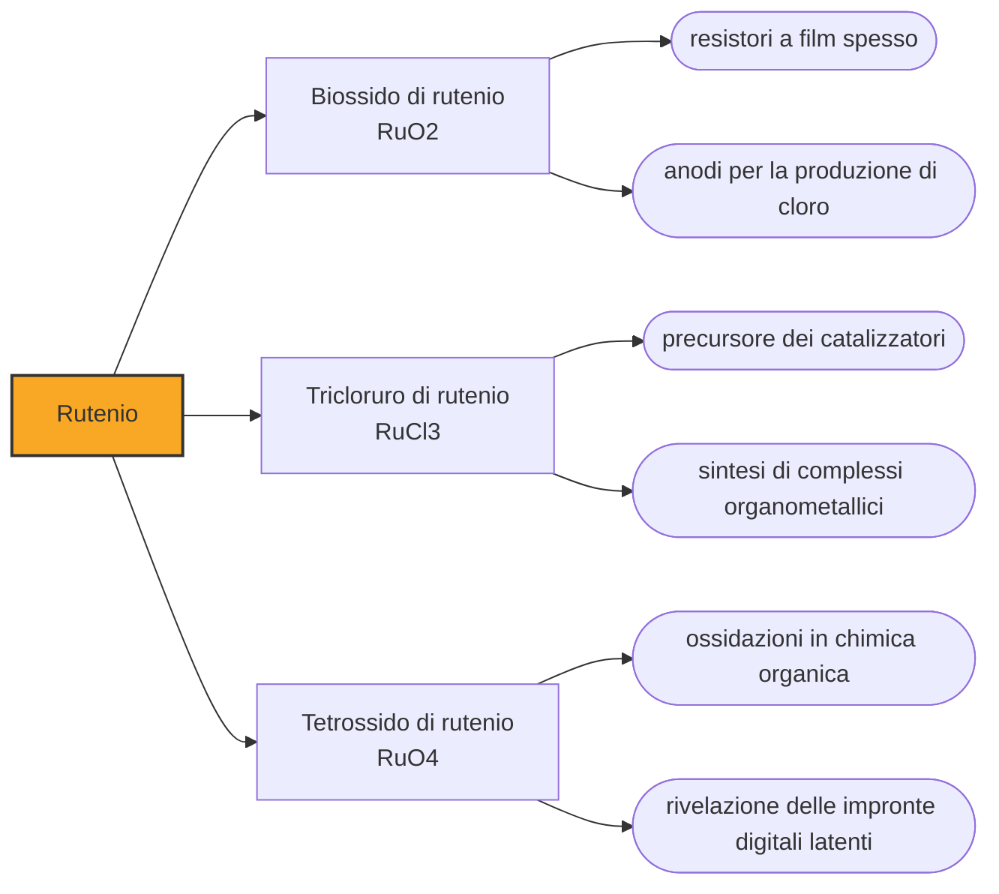

# Rutenio (Ru)

> [!abstract] 60° elemento scoperto — 1844
> Due chimici annunciarono di averlo scoperto, e tutti e due ritirarono l'annuncio. Un terzo, quarant'anni dopo, ne isolò sei grammi e gli lasciò il nome che uno dei due aveva già scelto.

Il rutenio è l'ultimo arrivato dei sei metalli del gruppo del platino e il meno costoso fra quelli che il mercato quota: nel 2024 valeva un decimo del rodio. Duro, fragile, quasi inattaccabile dagli acidi, oggi vive per lo più dentro l'elettronica, in film sottili che nessuno vede.

## Cronologia della scoperta

> [!info] Nota sulla cronologia
> Due rivendicazioni precedenti — il «vestio» di Jędrzej Śniadecki, annunciato nel 1808, e il «ruthenium» di Gottfried Osann, del 1827 — furono ritirate dagli stessi autori. Claus isolò e caratterizzò l'elemento a Kazan nel 1844, conservando il nome scelto da Osann.

## Storia della scoperta

La prima rivendicazione è del chimico polacco Jędrzej Śniadecki. Nel 1807, esaminando minerali di platino sudamericano, ritenne di avere isolato un metallo nuovo e lo chiamò vestio, dall'asteroide Vesta scoperto poco prima; l'annuncio uscì l'anno seguente. Nessuno riuscì a confermare il risultato ripetendo l'esperimento, e Śniadecki finì per ritirare lui stesso la rivendicazione. Se avesse davvero avuto in mano il rutenio non è mai stato accertato.

Nel 1827 gli stessi residui lasciati dalla platina degli Urali dopo l'attacco con acqua regia finirono sotto esame due volte, a Dorpat da Gottfried Osann e a Stoccolma da Jöns Jacob Berzelius. Berzelius non vi trovò metalli insoliti; Osann credette di trovarne addirittura tre e li chiamò pluranio, polinio e rutenio, quest'ultimo perché i campioni venivano dalla Russia. Ne nacque una lunga controversia fra i due, e poiché Osann non riuscì a ripetere l'isolamento finì per rinunciare alle proprie rivendicazioni. Nemmeno di questa si può dire che fosse una scoperta.

Il rutenio come elemento arriva nel 1844, per mano di Karl Ernst Claus, chimico russo di origine tedesco-baltica che insegnava all'università di Kazan. Claus lavorò sui residui della coniazione dei rubli di platino, cioè sulla frazione della platina greggia che l'acqua regia non scioglie, la stessa da cui l'osmio era uscito quarant'anni prima a Londra. Dimostrò che nei preparati di Osann c'era davvero un metallo nuovo in piccola quantità, e ne ottenne sei grammi puri.

Il nome lo lasciò a Osann, che nel frattempo vi aveva rinunciato: rutenio, da Ruthenia, il nome latino delle terre russe. Claus scrisse di aver battezzato così il nuovo corpo in onore della propria patria, e di averne pieno diritto perché Osann alla sua parola aveva ormai rinunciato e in chimica quella parola non esisteva ancora. Con quel gesto inaugurò una consuetudine che dura tuttora: intitolare un elemento a un paese.

Con il rutenio il gruppo del platino era completo. Quattro dei sei — palladio, rodio, osmio e iridio — erano usciti fra il 1802 e il 1804 da una sola partita di minerale comprata a Londra da Wollaston e Tennant; il platino era noto ai chimici europei da un secolo abbondante; il sesto è arrivato quarant'anni dopo da un residuo degli Urali, in un laboratorio sul Volga.

## Posizione nella tavola periodica

## Caratteristiche

Il rutenio è un metallo bianco argenteo, duro e fragile, che fonde a 2334 °C e ha una densità di 12,45 grammi per centimetro cubo, quasi identica a quella del rodio. A freddo non lo attaccano né gli acidi né l'acqua regia; ossida invece rapidamente ad alta temperatura, e in presenza di alcali e ossidanti forti passa in soluzione.

La sua configurazione elettronica è un'eccezione alla regola con cui gli orbitali si riempiono: nello stato fondamentale il rutenio ha sette elettroni nel guscio d e uno solo nell'orbitale s più esterno, invece dei due che ci si aspetterebbe. La stessa irregolarità la mostrano il niobio, il molibdeno e il rodio, suoi vicini di periodo, e il palladio la porta all'estremo: il suo orbitale s esterno resta del tutto vuoto.

Gli stati di ossidazione noti vanno da -2 a +8, tanti quanti quelli dell'osmio, il congenere più pesante: i due si somigliano anche nel comportamento del composto estremo. Il tetrossido di rutenio, come quello di osmio, è volatile, ossidante fortissimo e tossico, e va maneggiato con le stesse precauzioni.

In natura è raro anche per gli standard del gruppo del platino: si trova a volte non combinato, ma più spesso disperso insieme agli altri cinque nei solfuri di nichel e rame, e si recupera dai residui della loro raffinazione. La produzione mondiale si aggira sulle trenta tonnellate l'anno.

### Dati fisico-chimici

| Proprietà | Valore |
|---|---|
| Numero atomico | 44 |
| Massa atomica | 101,072 u |
| Categoria | Metallo di transizione |
| Gruppo | 8 |
| Periodo | 5 |
| Blocco | d |
| Configurazione elettronica | [Kr] 4d⁷ 5s¹ |
| Punto di fusione | 2333,9 °C |
| Punto di ebollizione | 4149,9 °C |
| Densità | 12,45 g/cm³ |
| Stati di ossidazione | -2, -1, 0, +1, +2, +3, +4, +5, +6, +7, +8 |

## Struttura atomica

![[atomo-Rutenio.svg]]

## Usi e presenza in natura

Metà del rutenio consumato nel mondo va in due impieghi elettronici. Il primo sono i resistori a film spesso, dove il biossido di rutenio e i rutenati di piombo e bismuto formano l'elemento resistivo di componenti presenti in qualunque scheda. Il secondo sono i contatti elettrici: un film sottilissimo di rutenio, deposto per via galvanica o per sputtering, indurisce le leghe di platino e palladio e dà la stessa durata di un rivestimento al rodio a un costo molto minore.

In catalisi il rutenio è il metallo della metatesi delle olefine, la reazione che ricombina gli scheletri carboniosi e che con i catalizzatori di Robert Grubbs è entrata nella produzione industriale, valendo anche per questo il Nobel per la chimica del 2005. Gli anodi a ossidi misti che lo contengono producono cloro per elettrolisi e proteggono dalla corrosione le strutture interrate e sommerse. Lo USGS dà il prezzo medio del rutenio nel 2024 a 440 dollari l'oncia troy, contro i 4.600 del rodio e i 4.800 dell'iridio.

## Curiosità

Il tetrossido di rutenio ha un impiego che da un metallo prezioso non ci si aspetta: reagendo con i grassi lasciati dalla pelle rivela le impronte digitali latenti, depositandovi sopra biossido di rutenio bruno-nero. È la stessa chimica per cui il composto gemello dell'osmio colora le membrane cellulari.

Dal 1944 il pennino della Parker 51, una delle stilografiche più vendute della storia, era una punta d'oro a quattordici carati rivestita di una lega composta per il 96,2 per cento di rutenio e per il 3,8 di iridio: per questo si chiamava pennino «RU».

## Nella cronologia

← Precedente: [[Erbio]] (1843)
→ Successivo: [[Cesio]] (1860)

Epoca: [[L'età dell'elettrolisi]] · Scopritore: [[Karl Ernst Claus]]

## Fonti

- [Ruthenium](https://en.wikipedia.org/wiki/Ruthenium) — consultata il 07/09/2026
- [Ruthenium — Royal Society of Chemistry](https://periodic-table.rsc.org/element/44/ruthenium) — consultata il 07/09/2026
- [USGS Mineral Commodity Summaries 2025 — Platinum-Group Metals](https://pubs.usgs.gov/periodicals/mcs2025/mcs2025-platinum-group.pdf) — consultata il 07/09/2026
- [Two men, two centuries, four metals](https://www.chemistryworld.com/features/two-men-two-centuries-four-metals/3004876.article) — consultata il 07/09/2026
