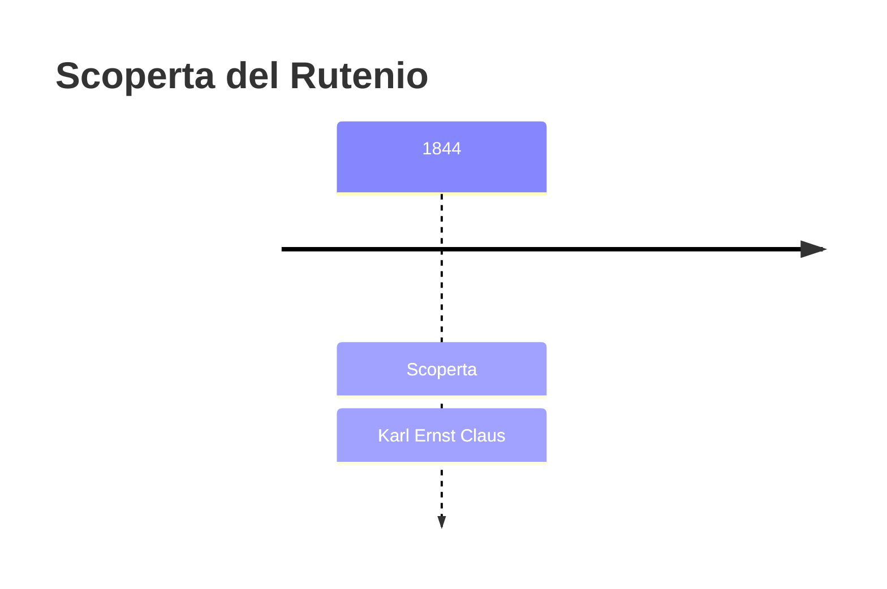
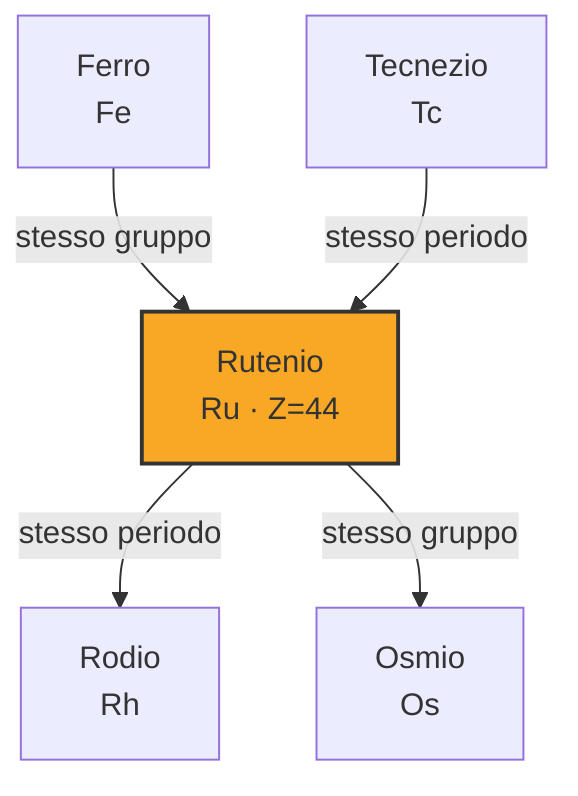

# Rutenio (Ru)

> [!abstract] 60° elemento scoperto — 1844
> 

## Cronologia della scoperta

## Storia della scoperta

## Posizione nella tavola periodica

## Caratteristiche

### Dati fisico-chimici

| Proprietà | Valore |
|---|---|
| Numero atomico | 44 |
| Massa atomica | 101,072 u |
| Categoria | Metallo di transizione |
| Gruppo | 8 |
| Periodo | 5 |
| Blocco | d |
| Configurazione elettronica | [Kr] 4d⁷ 5s¹ |
| Punto di fusione | 2333,9 °C |
| Punto di ebollizione | 4149,9 °C |
| Densità | 12,45 g/cm³ |
| Stati di ossidazione | — |

## Struttura atomica

![[atomo-Rutenio.svg]]

## Usi e presenza in natura

## Nella cronologia

← Precedente: [[Erbio]] (1843)
→ Successivo: [[Cesio]] (1860)

Epoca: [[L'età dell'elettrolisi]] · Scopritore: [[Karl Ernst Claus]]

## Fonti

