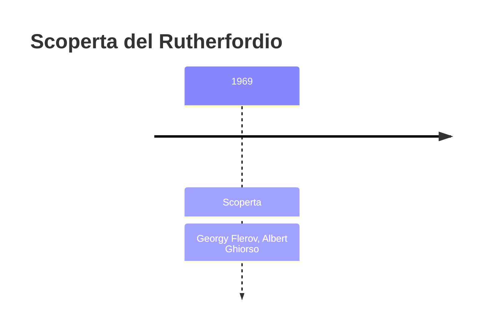
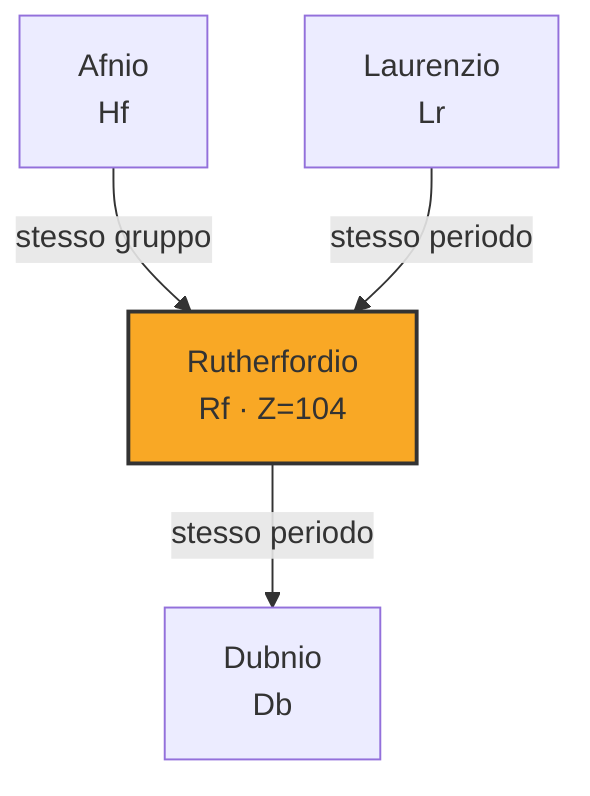

# Rutherfordio (Rf)

> [!abstract] 104° elemento scoperto — 1969
> 

## Cronologia della scoperta

## Storia della scoperta

## Posizione nella tavola periodica

## Caratteristiche

### Dati fisico-chimici

| Proprietà | Valore |
|---|---|
| Numero atomico | 104 |
| Massa atomica | 267,0 u |
| Categoria | Metallo di transizione |
| Gruppo | 4 |
| Periodo | 7 |
| Blocco | d |
| Configurazione elettronica | [Rn] 5f¹⁴ 6d² 7s² |
| Punto di fusione | 2126,9 °C |
| Punto di ebollizione | 5526,9 °C |
| Densità | 23,2 g/cm³ |
| Stati di ossidazione | — |

## Struttura atomica

![[atomo-Rutherfordio.svg]]

## Usi e presenza in natura

## Nella cronologia

← Precedente: [[Laurenzio]] (1961)
→ Successivo: [[Dubnio]] (1970)

Epoca: [[Era nucleare]] · Scopritori: [[Georgy Flerov]], [[Albert Ghiorso]]

## Fonti

