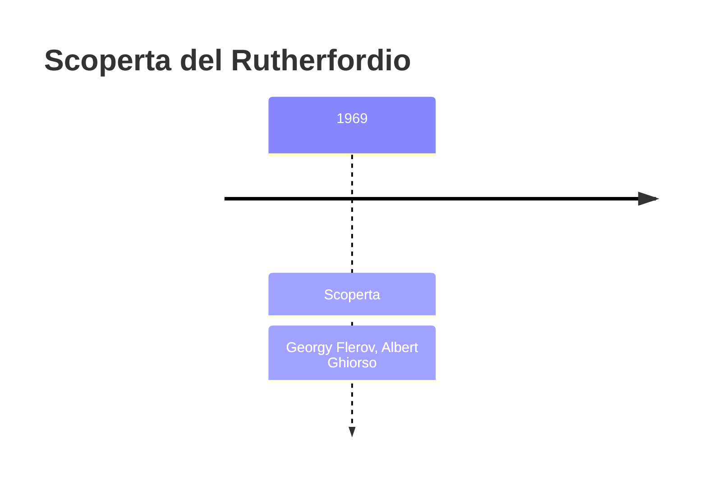
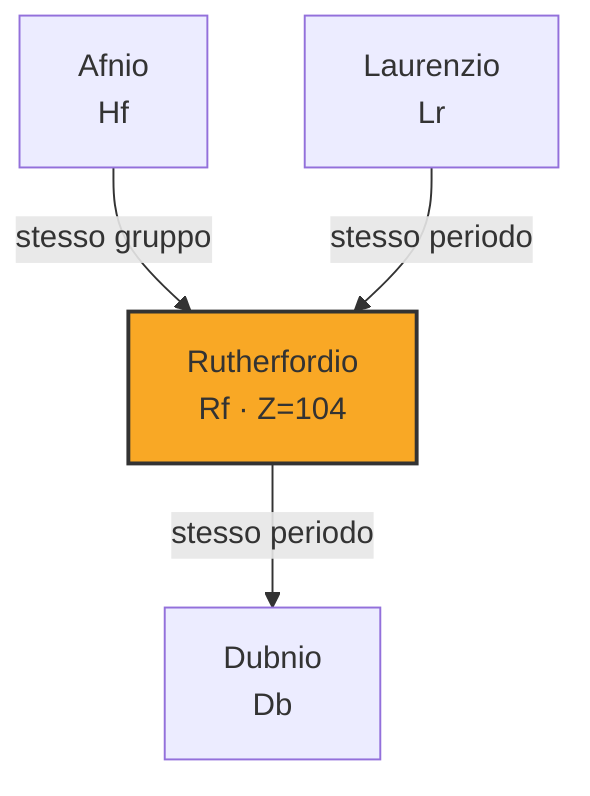
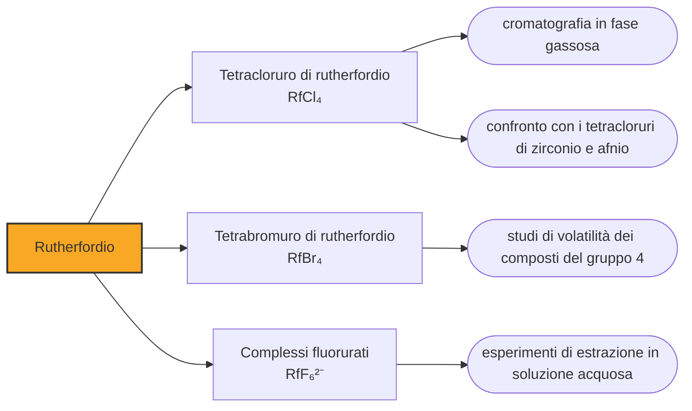

# Rutherfordio (Rf)

> [!abstract] 104° elemento scoperto — 1969
> Per quasi trent'anni la casella 104 ha avuto due nomi diversi a seconda del paese in cui si guardava la tavola periodica. Non era un capriccio: era una questione di chi l'avesse riempita.

Il rutherfordio è il primo elemento oltre gli attinidi, e la sua scoperta poneva una domanda che riguardava tutta la tavola periodica: le colonne continuano a funzionare anche quassù? Se il 104 si fosse comportato da elemento del gruppo 4, come il titanio, lo zirconio e l'afnio sopra di lui, allora la tavola reggeva anche dove nessuno l'aveva mai messa alla prova.

## Cronologia della scoperta

> [!info] Nota sulla cronologia
> Credito condiviso. La cronologia di riferimento comprime le due squadre in «Flerov et al.» e «Ghiorso et al.»: qui restano i due capi, perché la commissione congiunta ha riconosciuto nel 1993 che le prove di Dubna e quelle di Berkeley si equivalevano, e le fonti non isolano un elenco simmetrico di nomi per le due parti. Dubna rivendicò l'elemento nel 1964 proponendo il nome kurchatovium; Berkeley lo produsse nel 1969 con catene di decadimento verificabili e propose rutherfordium. Il nome attuale è fissato dalla IUPAC nel 1997, dopo una proposta del 1994 che assegnava alla casella il nome dubnium.

## Storia della scoperta

Il primo annuncio venne da Dubna nel 1964: plutonio-242 bombardato con ioni di neon-22, e un'attività di fissione spontanea che il gruppo attribuì a un isotopo dell'elemento 104. I sovietici proposero di chiamarlo kurchatovium, simbolo Ku, in onore di Igor' Kurčatov, il fisico che aveva diretto il programma nucleare dell'Unione Sovietica ed era morto nel 1960.

Il metodo era però il punto debole della rivendicazione. Quando un nucleo si spezza per fissione spontanea lascia due frammenti qualsiasi, e da quei frammenti non si risale al numero atomico del nucleo di partenza: si sa che qualcosa si è rotto, non che cosa. Riconoscere un elemento nuovo richiede invece una catena di decadimenti alfa che finisca su nuclei già noti, perché è quella catena a dire quante cariche aveva il capostipite. L'isotopo dichiarato dai sovietici, del resto, non è mai stato ritrovato da nessuno.

Nel 1969 Berkeley bombardò californio-249 con ioni di carbonio-12 e carbonio-13 e ottenne due isotopi, il rutherfordio-257 e il rutherfordio-259, riconosciuti proprio per la via che mancava ai sovietici: le alfa emesse erano correlate con quelle dei nuclei figli, tutti già identificati. Il gruppo di Albert Ghiorso propose il nome rutherfordium, in onore di Ernest Rutherford.

Da quel momento e per un quarto di secolo esistettero due tavole periodiche. Nei manuali sovietici la casella 104 portava il kurchatovio, in quelli occidentali il rutherfordio, e le riviste scientifiche scrivevano «elemento 104» per non prendere posizione. La contesa si estese alle caselle successive e prese il nome di guerra dei transfermi, perché riguardava tutti gli elementi oltre il fermio.

La commissione congiunta incaricata di decidere concluse nel 1993 che il merito andava diviso: le prove del 1969 di Berkeley e quelle prodotte a Dubna negli stessi anni si equivalevano abbastanza da non permettere un vincitore. Sui nomi servì ancora tempo. Una proposta della IUPAC del 1994 assegnava alla casella 104 il nome dubnium, e fu respinta con durezza dai chimici americani; la sistemazione definitiva arrivò nel 1997, quando il 104 divenne rutherfordio, il 105 dubnio e il 106 seaborgio.

Vale la pena chiedersi perché due laboratori si siano scontrati per trent'anni su un nome. Per un istituto che vive di finanziamenti pubblici, aver scoperto un elemento è la prova più leggibile che il denaro sia stato speso bene: non richiede spiegazioni, entra nei manuali scolastici e ci resta per sempre. La guerra dei transfermi è stata una disputa scientifica, ma anche un capitolo della guerra fredda combattuto con i mezzi della nomenclatura chimica.

## Posizione nella tavola periodica

## Caratteristiche

La chimica ha dato la risposta che si sperava. Il rutherfordio forma un tetracloruro volatile che si comporta come quelli dello zirconio e dell'afnio, e negli esperimenti di cromatografia in fase gassosa — l'unica tecnica applicabile a un elemento che dura pochi secondi — si deposita dove ci si aspetta di trovare un elemento del gruppo 4. Lo stato di ossidazione dominante è il +4, come per tutti i suoi omologhi.

Non era affatto scontato. I primi calcoli che tenevano conto degli effetti relativistici prevedevano per il rutherfordio una configurazione elettronica con elettroni in un orbitale 7p, che ne avrebbe fatto un elemento simile al piombo invece che all'afnio: sarebbe stata la prima colonna della tavola periodica a spezzarsi. Calcoli migliori e poi gli esperimenti hanno mostrato che non succede, e che quassù la relatività deforma le proprietà senza stravolgere le famiglie.

Sotto la superficie, però, gli scarti ci sono, e il più netto riguarda i fluoruri. In soluzione lo zirconio e l'afnio legano sette o otto ioni fluoruro attorno a sé, mentre il rutherfordio si ferma a sei: si comporta cioè come uno ione più piccolo di quanto la sua posizione in colonna lascerebbe prevedere. Lo stato +3, che i modelli gli attribuiscono come possibile ma meno stabile del +4, non è invece mai stato osservato.

Si conoscono una quindicina di isotopi del rutherfordio, e nessuno arriva all'ora. Il più longevo è il rutherfordio-267, che dura circa tre quarti d'ora ma si produce in pochissimi atomi; gli esperimenti di chimica si fanno su isotopi molto più brevi, che durano da qualche secondo a poco più di un minuto, e vanno quindi progettati in modo che ogni passaggio stia dentro quel tempo.

### Dati fisico-chimici

| Proprietà | Valore |
|---|---|
| Numero atomico | 104 |
| Massa atomica | 267,0 u |
| Categoria | Metallo di transizione |
| Gruppo | 4 |
| Periodo | 7 |
| Blocco | d |
| Configurazione elettronica | [Rn] 5f¹⁴ 6d² 7s² |
| Punto di fusione | 2126,9 °C |
| Punto di ebollizione | 5526,9 °C |
| Densità | 23,2 g/cm³ |
| Stati di ossidazione | +4 |

## Struttura atomica

![[atomo-Rutherfordio.svg]]

## Usi e presenza in natura

Non esiste alcun uso del rutherfordio e non ne esisterà: se ne producono singoli atomi, che scompaiono nel giro di secondi. Tutto quello che se ne fa è verificare che si comporti come la tavola periodica dice, oppure scoprire in quali dettagli non lo faccia.

È una verifica che vale più di quanto sembri. La tavola periodica è una legge empirica, ricavata da elementi che stanno tutti sotto il numero atomico cento, e non c'è nulla che garantisca che continui a valere oltre. Ogni esperimento sui transattinidi misura fin dove arriva quella legge, e il rutherfordio è il primo punto della verifica: se avesse fallito lui, l'intera riga sarebbe stata da riscrivere.

## Curiosità

Ernest Rutherford scoprì il nucleo atomico, spiegò il decadimento radioattivo come trasmutazione di un elemento in un altro e realizzò nel 1919 la prima trasmutazione artificiale, trasformando azoto in ossigeno. Ricevette il premio Nobel per la chimica nel 1908, cosa che a un fisico come lui parve una beffa. L'elemento che porta il suo nome esiste solo perché la trasmutazione che aveva dimostrato è diventata un mestiere.

Il kurchatovio non è mai stato riconosciuto, ma è comparso per decenni nei manuali scolastici sovietici e nelle tavole appese nelle aule di mezzo mondo, e chi ha studiato chimica in quei paesi prima degli anni Novanta l'ha imparato così. È uno dei rari casi in cui una decisione di nomenclatura ha costretto a correggere la memoria di intere generazioni di studenti.

## Nella cronologia

← Precedente: [[Laurenzio]] (1961)
→ Successivo: [[Dubnio]] (1970)

Epoca: [[Era nucleare]] · Scopritori: [[Georgy Flerov]], [[Albert Ghiorso]]

## Fonti

- [Rutherfordium](https://en.wikipedia.org/wiki/Rutherfordium) — consultata il 09/09/2026
- [Rutherfordium — Royal Society of Chemistry](https://periodic-table.rsc.org/element/104/rutherfordium) — consultata il 09/09/2026
- [Transfermium Wars](https://en.wikipedia.org/wiki/Transfermium_Wars) — consultata il 09/09/2026
