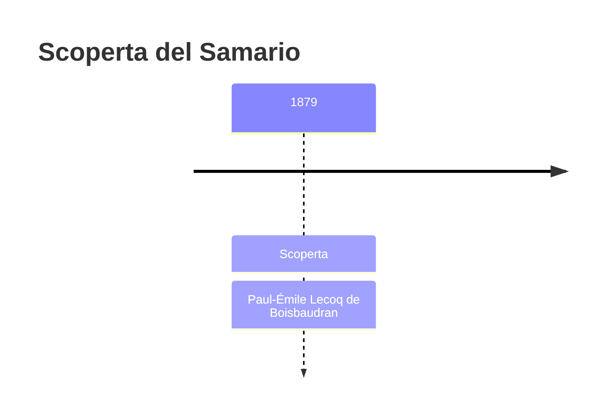
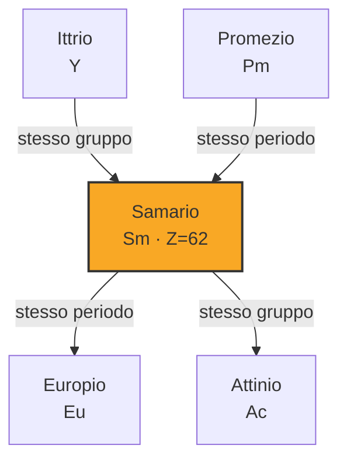
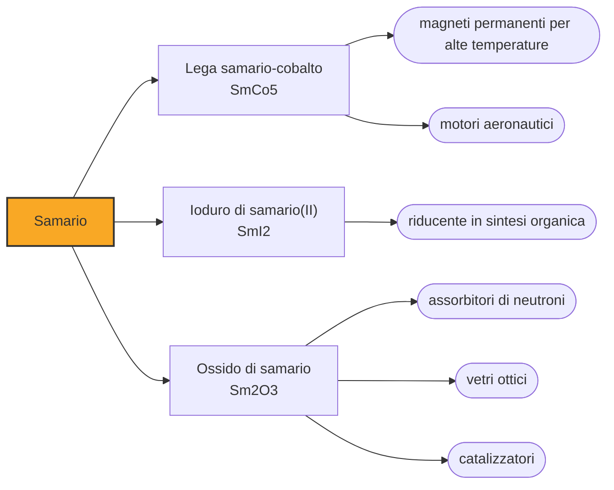

# Samario (Sm)

> [!abstract] 70° elemento scoperto — 1879
> È il primo elemento della tavola periodica a portare, per interposto minerale, il nome di una persona: un ufficiale minerario russo che non era né chimico né scopritore di nulla.

Il samario è il lantanide dei magneti che non temono il caldo: le leghe con il cobalto restano magnetiche oltre i settecento gradi, dove i più potenti magneti al neodimio si sono già smagnetizzati da un pezzo. È anche uno dei pochi elementi che assorbono neutroni abbastanza bene da avere un ruolo nel controllo dei reattori.

## Cronologia della scoperta

## Storia della scoperta

Negli anni Quaranta dell'Ottocento negli Urali si trovò un minerale nero e pesante che fu chiamato samarskite in onore di Vasilij Samarskij-Bychovec, l'ufficiale che dirigeva il corpo minerario russo e che aveva concesso ai mineralogisti tedeschi di studiarne i campioni. Il nome, dato al minerale, sarebbe poi passato all'elemento.

Nel 1879, a Parigi, Paul-Émile Lecoq de Boisbaudran — lo stesso che quattro anni prima aveva trovato il gallio — esaminò allo spettroscopio il didimio ricavato dalla samarskite e vi individuò righe di assorbimento nuove. Ne separò l'ossido e lo chiamò samaria, dal minerale.

Con il samario, per la prima volta, un elemento chimico porta il nome di una persona. La cosa avviene per due passaggi — il minerale intitolato a Samarskij, l'elemento intitolato al minerale — e forse per questo passò senza le discussioni che avrebbero accompagnato più tardi il gadolinio, il curio o l'einsteinio. Samarskij, per parte sua, non fece mai ricerca chimica: aveva soltanto autorizzato l'invio dei campioni.

Come per tutta la famiglia, il campione puro arrivò decenni dopo: l'ossido di samario puro fu prodotto solo nel 1901 da Eugène-Anatole Demarçay, e il metallo nel 1903 da Wilhelm Muthmann. Nel frattempo la samaria di Lecoq de Boisbaudran si era rivelata contenere anche l'europio, che Demarçay ne separò proprio in quegli anni.

## Posizione nella tavola periodica

## Caratteristiche

La lega di samario e cobalto è il magnete permanente della tenuta termica: magnetizza meno del neodimio-ferro-boro, ma non perde le proprie proprietà quando la temperatura sale, e resiste alla corrosione senza bisogno di rivestimenti. Dove il calore è un problema — motori aeronautici, sensori vicini a un motore, apparati militari — è ancora la scelta obbligata.

Oltre allo stato +3 comune a tutti i lantanidi, il samario forma composti nello stato +2, e i suoi ioni bivalenti in soluzione hanno un colore rosso sangue inconfondibile. Lo ioduro di samario(II) è per questo un reagente riducente molto usato in sintesi organica, dove la sua forza si legge letteralmente dal colore della soluzione, che si scarica man mano che reagisce.

Il samario-149 cattura i neutroni termici con una sezione d'urto di circa 41.000 barn, alta abbastanza da renderlo un veleno neutronico: nei reattori si forma come prodotto di fissione e frena la reazione, e nelle barre di controllo lo si usa apposta. È un caso in cui la stessa proprietà è un problema quando arriva da sola e uno strumento quando la si mette dove serve.

Con sette parti per milione nella crosta terrestre il samario è il quarantesimo elemento per abbondanza, più comune dello stagno. Come tutti i lantanidi si ricava da monazite e bastnäsite e non ha giacimenti propri, e il suo prezzo dipende più dalla domanda degli altri membri della famiglia che dalla propria: quando il mondo compra neodimio per i magneti, il samario esce dalla stessa lavorazione che lo voglia o no.

### Dati fisico-chimici

| Proprietà | Valore |
|---|---|
| Numero atomico | 62 |
| Massa atomica | 150,362 u |
| Categoria | Lantanide |
| Gruppo | 3 |
| Periodo | 6 |
| Blocco | f |
| Configurazione elettronica | [Xe] 4f⁶ 6s² |
| Punto di fusione | 1071,9 °C |
| Punto di ebollizione | 1899,9 °C |
| Densità | 7,52 g/cm³ |
| Stati di ossidazione | +2, +3 |

## Struttura atomica

![[atomo-Samario.svg]]

## Usi e presenza in natura

L'impiego principale sono i magneti permanenti samario-cobalto, nati negli anni Sessanta e rimasti insuperati per stabilità termica: reggono oltre i settecento gradi, non si smagnetizzano con i campi esterni e non hanno bisogno di rivestimenti protettivi perché non si corrodono. Stanno nei motori e nei generatori aeronautici, nelle guide d'onda dei radar, nei sensori che lavorano accanto a un motore caldo e in tutti gli apparati dove una smagnetizzazione costerebbe molto più del magnete. Il neodimio li ha sostituiti ovunque conti la forza; dove conta la temperatura, no.

Il samario-153, legato a una molecola che si fissa sulle ossa, si usa in medicina nucleare per alleviare il dolore delle metastasi ossee irradiandole dall'interno; in chimica lo ioduro di samario(II) è uno dei riducenti più versatili della sintesi organica moderna, capace di reazioni che con altri reagenti non riuscirebbero.

Il samario-147 decade in neodimio-143 con un'emivita di oltre cento miliardi di anni, e su questo si basa la datazione samario-neodimio, uno dei metodi con cui si stabilisce l'età delle rocce più antiche e dei meteoriti. È lo stesso principio della datazione rubidio-stronzio, applicato a una coppia che resiste meglio ai processi geologici.

## Curiosità

Eugène-Anatole Demarçay, che purificò il samario e separò l'europio, era anche l'uomo cui i coniugi Curie mandavano i campioni per l'analisi spettroscopica: fu lui a confermare, dalle righe, che nel materiale ricavato dalla pechblenda c'era davvero un elemento nuovo, cioè il radio.

Nei reattori nucleari l'accumulo di samario-149 dopo uno spegnimento è un fenomeno che gli operatori devono conoscere: l'isotopo si forma dal decadimento dei prodotti di fissione e resta lì, assorbendo neutroni, finché non viene bruciato dal flusso della successiva ripartenza. È uno dei modi in cui un reattore ricorda quello che gli è successo il giorno prima.

## Nella cronologia

← Precedente: [[Scandio]] (1879)
→ Successivo: [[Tulio]] (1879)

Epoca: [[Spettroscopia e radioattività]] · Scopritore: [[Paul-Émile Lecoq de Boisbaudran]]

## Fonti

- [Samarium](https://en.wikipedia.org/wiki/Samarium) — consultata il 09/09/2026
- [Samarium — Royal Society of Chemistry](https://periodic-table.rsc.org/element/62/samarium) — consultata il 09/09/2026
- [Samarium–neodymium dating](https://en.wikipedia.org/wiki/Samarium%E2%80%93neodymium_dating) — consultata il 09/09/2026
