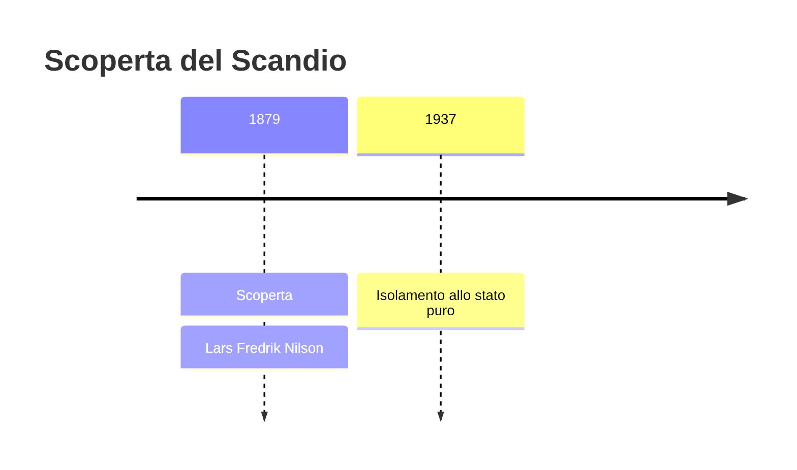
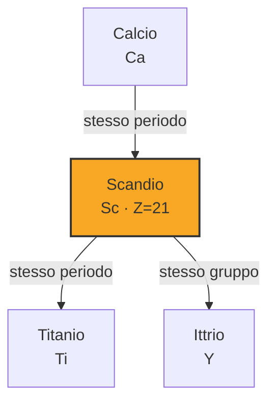

# Scandio (Sc)

> [!abstract] 69° elemento scoperto — 1879
> 

## Cronologia della scoperta

## Storia della scoperta

## Posizione nella tavola periodica

## Caratteristiche

### Dati fisico-chimici

| Proprietà | Valore |
|---|---|
| Numero atomico | 21 |
| Massa atomica | 44,9559085 u |
| Categoria | Metallo di transizione |
| Gruppo | 3 |
| Periodo | 4 |
| Blocco | d |
| Configurazione elettronica | [Ar] 3d¹ 4s² |
| Punto di fusione | 1540,9 °C |
| Punto di ebollizione | 2835,9 °C |
| Densità | 2,985 g/cm³ |
| Stati di ossidazione | — |

## Struttura atomica

![[atomo-Scandio.svg]]

## Usi e presenza in natura

## Nella cronologia

← Precedente: [[Itterbio]] (1878)
→ Successivo: [[Samario]] (1879)

Epoca: [[Spettroscopia e radioattività]] · Scopritore: [[Lars Fredrik Nilson]]

## Fonti

