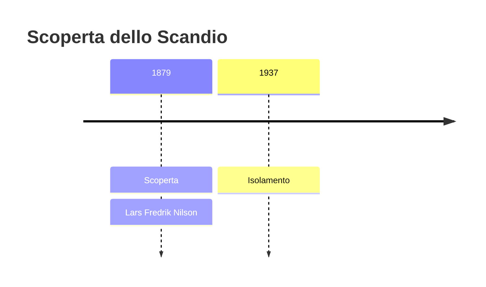
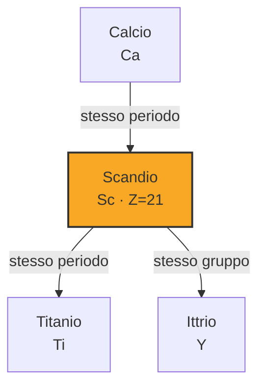
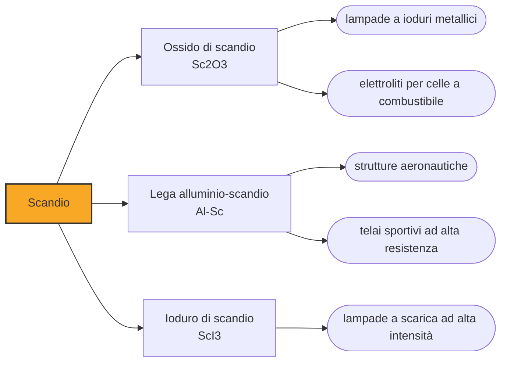

# Scandio (Sc)

> [!abstract] 69° elemento scoperto — 1879
> Il secondo elemento previsto da Mendeleev fu trovato in Svezia da chi non lo stava cercando, e a riconoscerlo come l'eka-boro fu un collega che lavorava nella stanza accanto.

Lo scandio è un metallo leggero e argenteo che sta nella crosta terrestre quanto il cobalto, e che nonostante questo si produce a ritmo di poche decine di tonnellate l'anno: non perché sia scarso, ma perché non si concentra da nessuna parte. È l'elemento che dimostra meglio di ogni altro quanto poco la parola «raro» dica sulla quantità.

## Cronologia della scoperta

## Storia della scoperta

Nel 1869 Mendeleev aveva lasciato una casella vuota sotto il boro e aveva descritto l'elemento che avrebbe dovuto occuparla, l'eka-boro, indicandone la massa atomica fra 40 e 48 e il comportamento chimico. Era una delle tre previsioni su cui la sua tavola si giocava la credibilità.

Nel 1879, a Uppsala, Lars Fredrik Nilson stava lavorando su euxenite e gadolinite per ricavarne itterbio, uno dei nuovi elementi delle terre rare. Nel corso delle separazioni si accorse che il materiale conteneva una terra ulteriore, più leggera di tutte quelle note, e la inseguì attraverso decine di cristallizzazioni: alla fine ne aveva due grammi di ossido puro, ricavati da una decina di chilogrammi di minerale. La chiamò scandia, dalla Scandinavia, e ne pubblicò le proprietà.

Nilson non collegò la sua terra alla previsione. Fu Per Teodor Cleve, che lavorava nella stessa università, a fare il confronto fra le proprietà misurate e quelle previste, a riconoscere l'eka-boro e a scriverne a Mendeleev. La corrispondenza era stretta come lo era stata per il gallio quattro anni prima.

Con lo scandio, e poi con il germanio nel 1886, la tavola periodica smise di essere una proposta e diventò lo strumento con cui la chimica si orientava. Tre elementi descritti prima di esistere e trovati dove erano attesi, con le proprietà annunciate, sono il tipo di prova che nessun ordinamento arbitrario avrebbe potuto produrre.

Il metallo, come per tutte le terre rare, arrivò molto dopo: fu prodotto per la prima volta nel 1937 per elettrolisi di una miscela eutettica di cloruri di potassio, litio e scandio a settecento-ottocento gradi, e il primo mezzo chilogrammo di scandio puro al novantanove per cento è del 1960.

## Posizione nella tavola periodica

## Caratteristiche

Nella crosta terrestre lo scandio è a una ventina di parti per milione, quanto il cobalto e più del piombo, ma non forma quasi mai minerali propri: si sparpaglia in tracce dentro i reticoli di centinaia di minerali diversi, senza concentrarsi in nessuno. Le uniche fonti concentrate note sono poche e piccole, e il grosso della produzione arriva come sottoprodotto della lavorazione dell'uranio, del titanio e delle terre rare.

Chimicamente si comporta come un lantanide leggero: cede tre elettroni, forma ioni Sc³⁺ incolori e composti simili a quelli dell'ittrio e dell'alluminio. È questa parentela a farlo classificare fra le terre rare pur essendo il primo metallo di transizione della tavola, e a farlo trovare quasi sempre nei minerali delle terre rare.

È leggero — poco più denso dell'alluminio — e fonde a 1541 gradi, quattro volte più in alto: la combinazione di leggerezza e refrattarietà è quello che lo rende interessante in metallurgia. All'aria si opacizza assumendo una sfumatura rosata o giallastra, e reagisce lentamente con l'acqua.

### Dati fisico-chimici

| Proprietà | Valore |
|---|---|
| Numero atomico | 21 |
| Massa atomica | 44,9559085 u |
| Categoria | Metallo di transizione |
| Gruppo | 3 |
| Periodo | 4 |
| Blocco | d |
| Configurazione elettronica | [Ar] 3d¹ 4s² |
| Punto di fusione | 1540,9 °C |
| Punto di ebollizione | 2835,9 °C |
| Densità | 2,985 g/cm³ |
| Stati di ossidazione | +3 |

## Struttura atomica

![[atomo-Scandio.svg]]

## Usi e presenza in natura

Bastano frazioni di punto percentuale di scandio in una lega di alluminio per impedire la crescita dei grani cristallini durante la saldatura e la solidificazione: se ne ottengono leghe più resistenti e, soprattutto, saldabili senza perdere resistenza nella zona della saldatura, che è il punto debole di quasi tutte le leghe leggere. Se ne fanno strutture aeronautiche, telai di biciclette da competizione e mazze da baseball, ed è l'impiego che tiene alto il prezzo e che assorbe ogni anno quel poco che si produce.

L'ossido di scandio nelle lampade a ioduri metallici dà una luce vicina a quella del giorno, e per anni ha illuminato stadi e studi televisivi; negli Stati Uniti questo impiego da solo ne consuma una ventina di chilogrammi l'anno. La zirconia drogata allo scandio è invece l'elettrolita delle celle a combustibile a ossidi solidi più efficienti, dove conduce ioni ossigeno meglio di qualunque alternativa.

La produzione mondiale si aggira sulle quindici-venti tonnellate l'anno di ossido: per confronto, di rame se ne estraggono venti milioni di tonnellate. È un mercato talmente piccolo che l'apertura di un singolo impianto può cambiarne il prezzo, e questo scoraggia chi vorrebbe progettare prodotti che ne dipendono.

## Curiosità

L'unico minerale in cui lo scandio sia l'elemento dominante è la thortveitite, trovata in Norvegia all'inizio del Novecento, ed è talmente rara che i giacimenti conosciuti al mondo si contano sulle dita. Per decenni è stata l'unica fonte concentrata dell'elemento, in quantità che si misuravano in chilogrammi: chi voleva studiare lo scandio doveva prima trovare qualcuno disposto a cedergliene un campione.

Nel Sole e in certe stelle lo scandio è relativamente più abbondante che sulla Terra, e le sue righe spettrali sono usate per classificarne le atmosfere. È uno dei casi in cui la composizione del cosmo e quella della crosta terrestre raccontano storie diverse: quello che qui è disperso, altrove è ordinario.

## Nella cronologia

← Precedente: [[Itterbio]] (1878)
→ Successivo: [[Samario]] (1879)

Epoca: [[Spettroscopia e radioattività]] · Scopritore: [[Lars Fredrik Nilson]]

## Fonti

- [Scandium](https://en.wikipedia.org/wiki/Scandium) — consultata il 09/09/2026
- [Scandium — Royal Society of Chemistry](https://periodic-table.rsc.org/element/21/scandium) — consultata il 09/09/2026
- [Mendeleev's predicted elements](https://en.wikipedia.org/wiki/Mendeleev%27s_predicted_elements) — consultata il 09/09/2026
