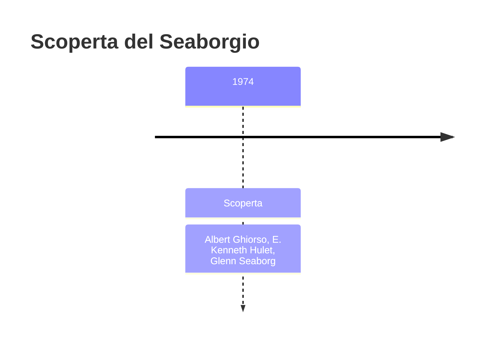
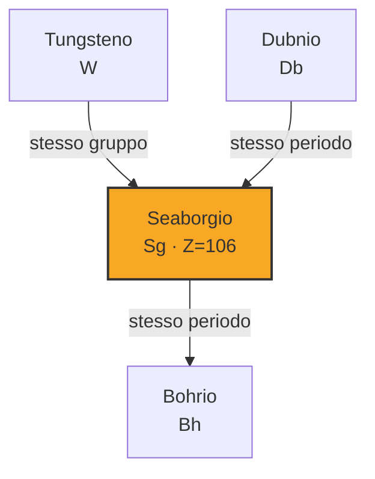

# Seaborgio (Sg)

> [!abstract] 106° elemento scoperto — 1974
> 

## Cronologia della scoperta

## Storia della scoperta

## Posizione nella tavola periodica

## Caratteristiche

### Dati fisico-chimici

| Proprietà | Valore |
|---|---|
| Numero atomico | 106 |
| Massa atomica | 269,0 u |
| Categoria | Metallo di transizione |
| Gruppo | 6 |
| Periodo | 7 |
| Blocco | d |
| Configurazione elettronica | *[Rn] 5f¹⁴ 6d⁴ 7s² |
| Punto di fusione | dato non disponibile |
| Punto di ebollizione | dato non disponibile |
| Densità | 35,0 g/cm³ |
| Stati di ossidazione | — |

## Struttura atomica

![[atomo-Seaborgio.svg]]

## Usi e presenza in natura

## Nella cronologia

← Precedente: [[Dubnio]] (1970)
→ Successivo: [[Bohrio]] (1981)

Epoca: [[Era nucleare]] · Scopritori: [[Albert Ghiorso]], [[E. Kenneth Hulet]], [[Glenn Seaborg]]

## Fonti

