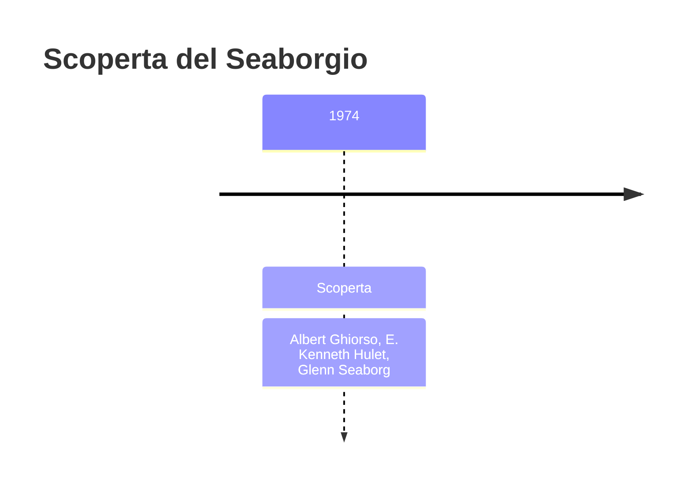
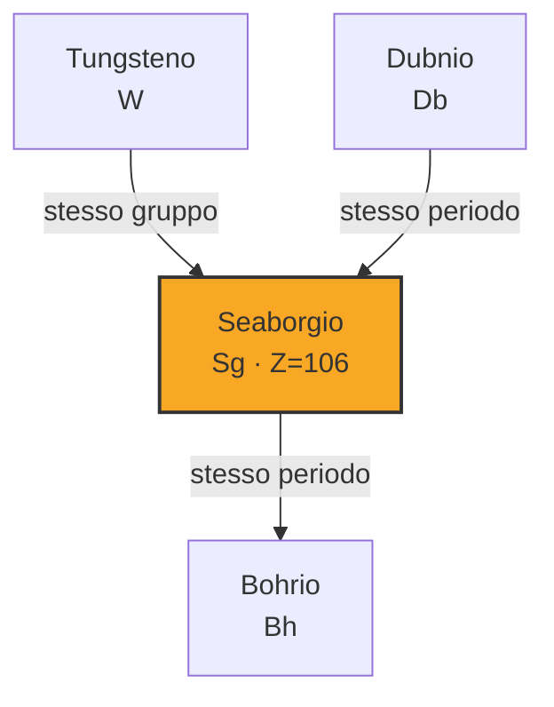
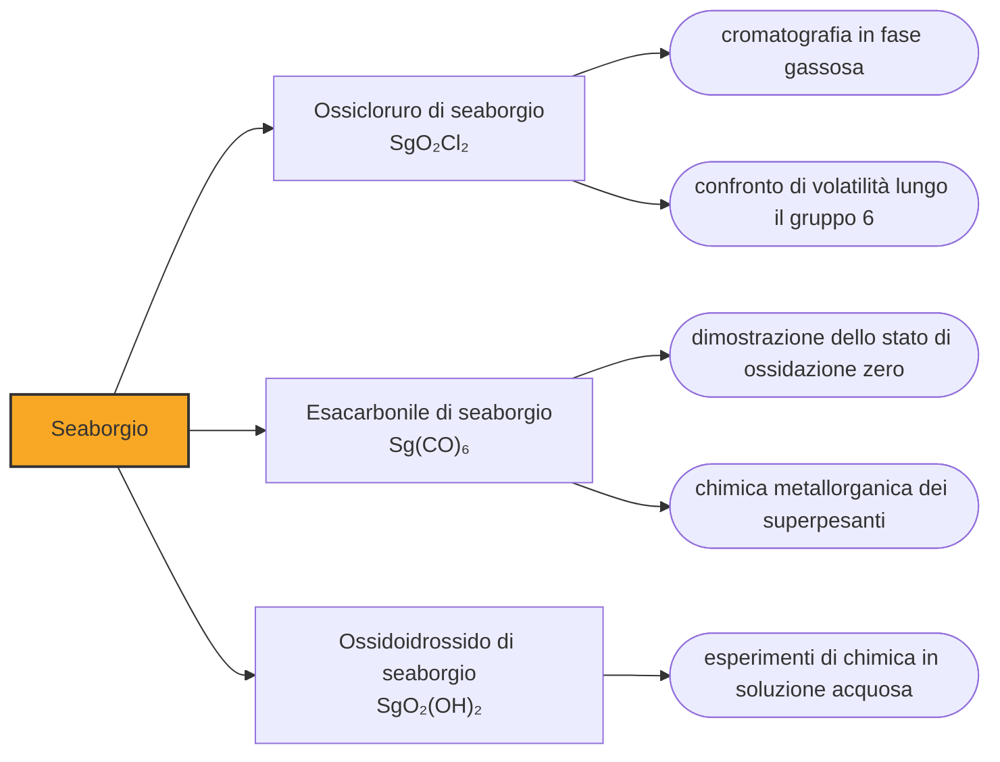

# Seaborgio (Sg)

> [!abstract] 106° elemento scoperto — 1974
> Glenn Seaborg disse che avere un elemento intitolato a sé era l'onore più grande della sua vita, meglio del premio Nobel che aveva già vinto. Per ottenerlo servì una rivolta della chimica americana contro la commissione internazionale.

Il seaborgio è il primo elemento della tavola periodica a essere stato ufficialmente intitolato a una persona ancora viva, e uno dei pochissimi il cui eponimo compare fra gli autori dell'articolo che ne annuncia la scoperta. Sono due anomalie che vanno insieme, e che hanno tenuto occupata la comunità chimica internazionale per tre anni.

## Cronologia della scoperta

> [!info] Nota sulla cronologia
> La cronologia di riferimento comprimeva gli scopritori in «Ghiorso et al.». L'articolo che annuncia l'elemento, pubblicato nel dicembre 1974, e firmato da otto autori fra il laboratorio di Berkeley e quello di Livermore: qui restano i tre nomi che le fonti secondarie isolano sempre — Ghiorso, Hulet e Seaborg — e la collaborazione fra i due laboratori e dichiarata qui. Seaborg e dunque fra i coautori dell'articolo che annuncia l'elemento poi intitolato a lui. Dubna rivendico l'elemento lo stesso anno, ma la commissione internazionale giudico i dati sovietici insufficienti e assegno il credito per intero a Berkeley. Il nome fu proposto nel marzo 1994, respinto dalla IUPAC nell'agosto successivo perche Seaborg era vivo, e confermato nel 1997.

## Storia della scoperta

Nel 1974 arrivarono due annunci. A Dubna il gruppo di Jurij Oganesjan bombardò bersagli di piombo con ioni di cromo-54 e registrò cinquantuno eventi di fissione spontanea con emivite fra i quattro e i dieci millisecondi. A Berkeley si bombardò californio-249 con ioni di ossigeno-18 e si ottennero una settantina di decadimenti alfa del seaborgio-263, un isotopo che dura meno di un secondo.

Questa volta la commissione internazionale non divise il merito. I decadimenti di Berkeley erano agganciati a nuclei figli già noti — il rutherfordio-259 e il nobelio-255 — e da quell'aggancio si risaliva senza ambiguità al numero atomico; i dati sovietici, giudicati privi delle verifiche necessarie, non permettevano la stessa conclusione. Il credito andò per intero agli americani, e su questa casella la contesa finì lì.

Trovare un nome si rivelò più difficile che trovare l'elemento. Il gruppo mise sul tavolo Isaac Newton, Thomas Edison, Leonardo da Vinci, Ferdinando Magellano, l'Ulisse dei poemi, George Washington e la Finlandia, patria di un membro della squadra, senza che nessuna proposta prevalesse. Poi Albert Ghiorso ebbe l'idea di intitolare l'elemento a Seaborg e raccolse il consenso dei colleghi uno per uno, prima di chiederlo all'interessato.

Il nome fu annunciato al congresso della American Chemical Society nel marzo del 1994 da Kenneth Hulet, uno dei coscopritori. Cinque mesi dopo la IUPAC stabilì che un elemento non poteva essere intitolato a una persona vivente, e Seaborg era vivo: nel settembre del 1994 la commissione propose di chiamare la casella 106 rutherfordium, spostandoci il nome che Berkeley aveva scelto per il 104.

Seaborg replicò che sarebbe stata la prima volta nella storia in cui a scopritori riconosciuti e incontestati veniva negato il privilegio di dare il nome al proprio elemento. La IUPAC difese la propria posizione con un argomento di principio, espresso da un membro americano della commissione: chi scopre non ha il diritto di nominare, ha il diritto di proporre un nome.

A quel punto la American Chemical Society fece una cosa insolita: approvò il nome seaborgium per le proprie riviste in aperto dissenso dalla IUPAC, e con esso tutte le altre proposte americane e tedesche per le caselle dal 104 al 109. Per un paio d'anni la chimica ebbe due nomenclature ufficiali concorrenti. La IUPAC cedette nel 1997, e nella stessa sistemazione la società americana accettò di rinunciare all'hahnio in cambio del seaborgio.

Seaborg commentò che era il più grande onore mai ricevuto, migliore, disse, del premio Nobel per la chimica che aveva vinto nel 1951 con Edwin McMillan. Aggiunse una motivazione che riguarda i lettori più che sé stesso: gli studenti di chimica che avessero incontrato quella casella si sarebbero chiesti perché portasse quel nome, e così avrebbero conosciuto il suo lavoro. Morì il 25 febbraio 1999, un anno e mezzo dopo la decisione.

## Posizione nella tavola periodica

## Caratteristiche

Chimicamente il seaborgio è un elemento del gruppo 6, sotto il molibdeno e il tungsteno, e questa volta la colonna funziona. Negli esperimenti in fase gassosa l'elemento forma un ossicloruro volatile, SgO₂Cl₂, e la sua volatilità è minore di quella dei composti corrispondenti di molibdeno e tungsteno: esattamente l'andamento che ci si aspetta scendendo lungo il gruppo, misurato invece che previsto.

Il risultato più sorprendente è del 2014, quando si è riusciti a preparare l'esacarbonile di seaborgio, Sg(CO)₆, cioè un composto in cui l'elemento lega sei molecole di monossido di carbonio e si trova nello stato di ossidazione zero. È una molecola metallorganica di un elemento superpesante, volatile come i carbonili di molibdeno e tungsteno e reattiva verso la silice come loro: la prova che quassù non funzionano solo le somiglianze grossolane, ma anche i dettagli.

Gli isotopi più stabili del seaborgio durano qualche minuto: il seaborgio-269 arriva a una decina di minuti secondo le misure più recenti, il seaborgio-271 si ferma a una trentina di secondi. Diversi di essi non si producono direttamente ma si raccolgono come prodotti di decadimento di elementi più pesanti — il seaborgio-269 discende dal flerovio-285 dopo quattro decadimenti alfa — e questa è spesso l'unica strada per ottenerne abbastanza da fare chimica.

### Dati fisico-chimici

| Proprietà | Valore |
|---|---|
| Numero atomico | 106 |
| Massa atomica | 269,0 u |
| Categoria | Metallo di transizione |
| Gruppo | 6 |
| Periodo | 7 |
| Blocco | d |
| Configurazione elettronica | [Rn] 5f¹⁴ 6d⁴ 7s² |
| Punto di fusione | dato non disponibile |
| Punto di ebollizione | dato non disponibile |
| Densità | 35,0 g/cm³ |
| Stati di ossidazione | 0, +6 |

## Struttura atomica

![[atomo-Seaborgio.svg]]

## Usi e presenza in natura

Del seaborgio non esiste alcun uso pratico: si producono singoli atomi, che scompaiono in minuti o in frazioni di secondo, e non se n'è mai vista una quantità pesabile. Tutto ciò che se ne fa è misurare come si comporta.

Quelle misure servono a stabilire fin dove la tavola periodica resta una guida affidabile. Nel gruppo 5 il dubnio si è comportato in modo inatteso, nel gruppo 6 il seaborgio segue le previsioni fin nei dettagli: è confrontando casi come questi che si capisce quali proprietà la relatività riordina e quali no, e si calibrano i modelli su cui si progetteranno gli esperimenti degli elementi ancora più pesanti.

## Curiosità

Negli ultimi anni di vita Seaborg poteva ricevere posta con l'indirizzo scritto interamente in nomi di elementi chimici: seaborgio, laurenzio — per il laboratorio Lawrence Berkeley dove lavorava — berkelio, californio, americio. Cinque caselle della tavola periodica bastavano a individuare una persona, un laboratorio, una città, uno stato e un continente.

Per una ventina d'anni il seaborgio è rimasto l'unico elemento intitolato a una persona vivente. Il secondo è arrivato nel 2016: l'oganesson, la casella 118, dedicata a Jurij Oganesjan, cioè al fisico che nel 1974 aveva guidato la squadra di Dubna nella rivendicazione dell'elemento 106 contro Berkeley — la stessa che quella volta perse.

## Nella cronologia

← Precedente: [[Dubnio]] (1970)
→ Successivo: [[Bohrio]] (1981)

Epoca: [[Era nucleare]] · Scopritori: [[Albert Ghiorso]], [[E. Kenneth Hulet]], [[Glenn Seaborg]]

## Fonti

- [Seaborgium](https://en.wikipedia.org/wiki/Seaborgium) — consultata il 10/09/2026
- [Seaborgium — Royal Society of Chemistry](https://periodic-table.rsc.org/element/106/seaborgium) — consultata il 10/09/2026
- [Glenn T. Seaborg](https://en.wikipedia.org/wiki/Glenn_T._Seaborg) — consultata il 10/09/2026
