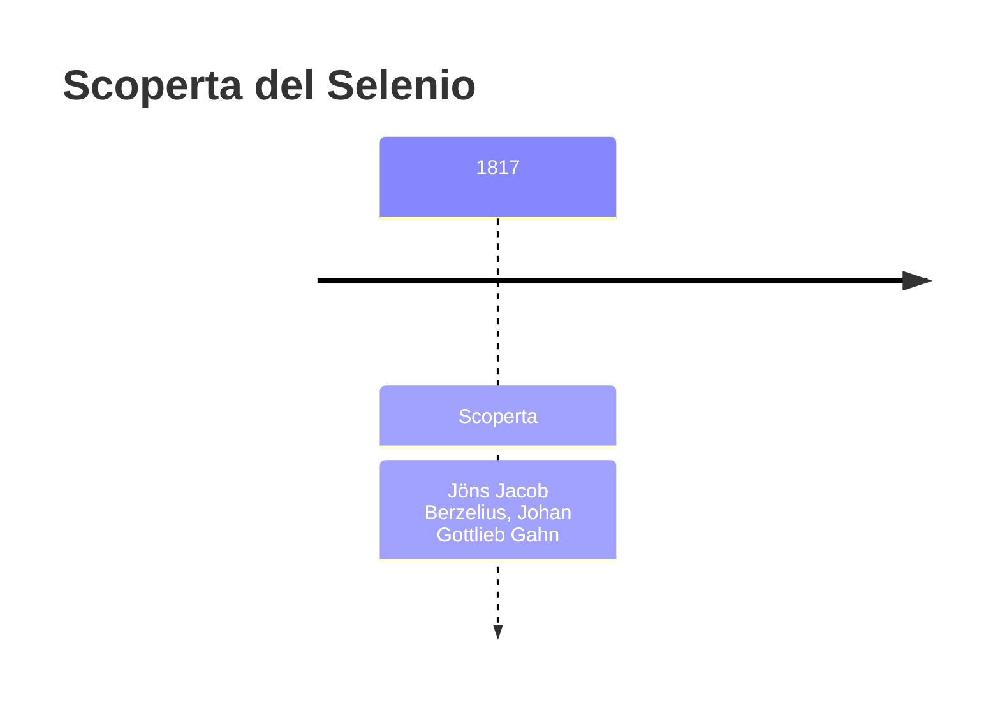
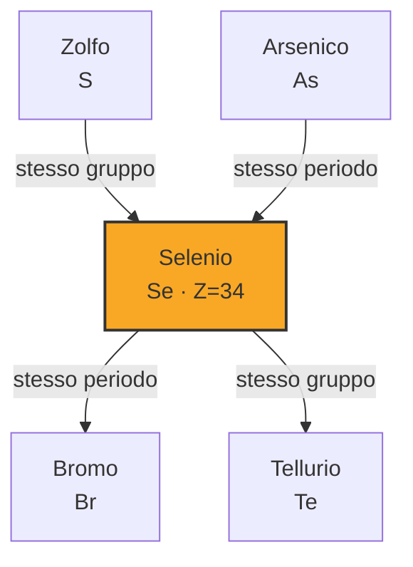
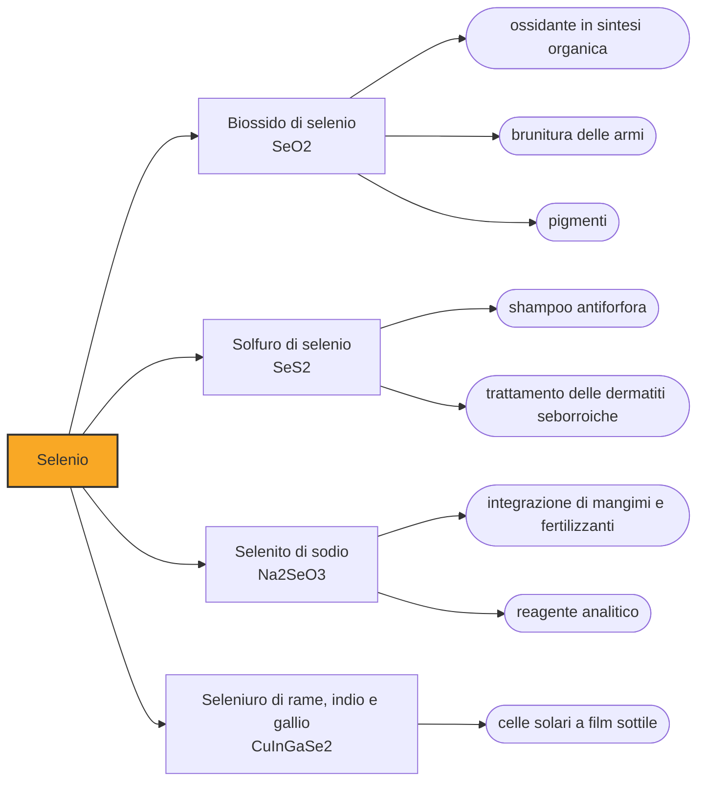

# Selenio (Se)

> [!abstract] 52° elemento scoperto — 1817
> Un fango rosso sul fondo delle camere di piombo di una fabbrica di acido solforico: il sospetto era che fosse arsenico, e a doverlo verificare fu il chimico più autorevole d'Europa, che di quella fabbrica era comproprietario.

Il selenio è un non metallo che cambia carattere a seconda della forma che assume: polvere rossa isolante in una, solido grigio semiconduttore in un'altra. È l'elemento che ha insegnato all'elettricità a rispondere alla luce, ed è insieme un nutriente indispensabile e un veleno, separati da un margine di dosi strettissimo.

## Cronologia della scoperta

## Storia della scoperta

Nel 1817 Jöns Jacob Berzelius e Johan Gottlieb Gahn erano comproprietari di un piccolo impianto chimico vicino a Gripsholm, in Svezia, che produceva acido solforico con il metodo delle camere di piombo: si bruciavano zolfo o piriti, e i fumi venivano assorbiti dall'acqua in grandi ambienti rivestiti di piombo. Le piriti arrivavano dalla miniera di Falun, e sul fondo delle camere lasciavano un precipitato rosso che nessuno si aspettava.

Il sospetto immediato fu l'arsenico, presenza comune nelle piriti e problema serio per chi vende acido solforico destinato anche alla farmacia: l'uso di quella pirite venne sospeso. Berzelius e Gahn, che avevano interesse a continuare a usarla, analizzarono il deposito e notarono che bruciandolo emanava un odore acuto di rafano — un odore che l'arsenico non dà, ma che era noto per i composti del tellurio.

Berzelius scrisse al collega Alexander Marcet, a Londra, che si trattava di un composto di tellurio. I minerali di Falun, però, di tellurio non ne contenevano, e la contraddizione lo spinse a rianalizzare il precipitato. In una seconda lettera del 1818 descriveva un elemento nuovo, simile allo zolfo e al tellurio ma distinto da entrambi.

Per il nome Berzelius scelse una simmetria. Il tellurio, isolato pochi anni prima, veniva dal latino tellus, «terra»; il nuovo elemento, che gli somigliava al punto da essere stato scambiato per esso, lo chiamò selenio dal greco selene, «luna». È una delle etimologie meglio documentate della tavola periodica, perché a spiegarne il senso fu chi la coniò: l'ho chiamato selenio, scrisse, proprio per richiamare i suoi rapporti con il tellurio.

Il selenio uscì dalla nicchia dei curiosi nel 1873, quando Willoughby Smith si accorse che la conducibilità elettrica del selenio grigio cambiava a seconda di quanta luce lo colpisse. Era la prima osservazione della fotoconduttività in un materiale, e da lì nacquero in sequenza le fotocellule, gli esposimetri fotografici, i raddrizzatori di corrente e i tamburi delle fotocopiatrici.

## Posizione nella tavola periodica

## Caratteristiche

Il selenio esiste in più forme allotropiche dalle proprietà molto diverse. La polvere rossa amorfa e il vetro nero sono isolanti; la forma grigia, fatta di lunghe catene elicoidali di atomi disposte in reticolo esagonale, è la più stabile e densa delle tre ed è un semiconduttore. Fonde a 220,9 °C e bolle a 684,9 °C, valori intermedi fra lo zolfo che gli sta sopra e il tellurio che gli sta sotto nel gruppo 16.

Il meccanismo della fotoconduttività è semplice da enunciare: la luce fornisce agli elettroni l'energia per superare il salto fra banda di valenza e banda di conduzione, e la resistenza del materiale crolla in proporzione all'illuminazione. È il principio su cui si regge ogni sensore di luce a stato solido.

Chimicamente somiglia allo zolfo abbastanza da sostituirlo nei minerali e nelle molecole biologiche. Nei composti va dal −2 dei seleniuri fino al +6 dei selenati, passando per il +4 del biossido e dei seleniti, che è la forma in cui lo si incontra più spesso; nelle rocce compare quasi sempre come seleniuro al posto di un solfuro, ed è per questo che viaggia insieme ai minerali solforati di rame, nichel e piombo.

### Dati fisico-chimici

| Proprietà | Valore |
|---|---|
| Numero atomico | 34 |
| Massa atomica | 78,9718 u |
| Categoria | Non metallo |
| Gruppo | 16 |
| Periodo | 4 |
| Blocco | p |
| Configurazione elettronica | [Ar] 3d¹⁰ 4s² 4p⁴ |
| Punto di fusione | 220,9 °C |
| Punto di ebollizione | 684,9 °C |
| Densità | 4,81 g/cm³ |
| Stati di ossidazione | -2, -1, 0, +1, +2, +3, +4, +5, +6 |

## Struttura atomica

![[atomo-Selenio.svg]]

## Usi e presenza in natura

Secondo il Servizio geologico degli Stati Uniti, nel 2025 il consumo mondiale di selenio si è ripartito fra metallurgia (40 per cento), agricoltura e salute animale (20), vetro (20), elettronica e fotovoltaico (10), chimica e pigmenti (5) e un ultimo 5 per cento di impieghi vari. Nel vetro serve a due scopi opposti: in dosi minime neutralizza il verdino che le impurità di ferro danno alle bottiglie, in dosi maggiori tinge il vetro di rosso rubino.

Non esistono miniere di selenio: oltre l'80 per cento della produzione mondiale viene dai fanghi anodici che si depositano sul fondo delle celle di raffinazione elettrolitica del rame, e il totale del 2025, che non comprende gli Stati Uniti, è stimato in circa 3.800 tonnellate. È un elemento che si ottiene soltanto perché se ne estrae un altro, e la sua disponibilità dipende dal mercato del rame più che dal proprio.

Nell'organismo il selenio entra nella selenocisteina, un amminoacido incorporato in un gruppo ristretto di proteine, fra cui gli enzimi che smaltiscono i perossidi e le deiodinasi che attivano gli ormoni tiroidei. La finestra fra carenza e intossicazione è però stretta come per pochi altri nutrienti: la carenza è associata a malattie endemiche osservate dove i suoli ne sono poveri, l'eccesso provoca caduta di capelli e unghie fragili.

## Curiosità

Il tamburo delle prime fotocopiatrici era rivestito di selenio: al buio l'elemento tratteneva la carica elettrostatica, dove la luce riflessa dal foglio lo colpiva la carica se ne andava, e sulla figura di carica rimasta si attaccava il toner. Un ufficio intero ha funzionato per decenni su una proprietà osservata per caso in un laboratorio telegrafico.

L'odore che mise Berzelius sulla pista giusta non è dell'elemento puro, che è praticamente inodore, ma di suoi composti volatili. Lo stesso meccanismo dà il segno più riconoscibile dell'avvelenamento da selenio: l'organismo cerca di eliminarlo trasformandolo in dimetilselenio, e chi ne ha assorbito troppo emana un alito d'aglio.

## Nella cronologia

← Precedente: [[Litio]] (1817)
→ Successivo: [[Cadmio]] (1817)

Epoca: [[L'età dell'elettrolisi]] · Scopritori: [[Jöns Jacob Berzelius]], [[Johan Gottlieb Gahn]]

## Fonti

- [Selenium](https://en.wikipedia.org/wiki/Selenium) — consultata il 07/09/2026
- [Willoughby Smith](https://en.wikipedia.org/wiki/Willoughby_Smith) — consultata il 08/09/2026
- [Selenium — Mineral Commodity Summaries 2026, U.S. Geological Survey](https://pubs.usgs.gov/periodicals/mcs2026/mcs2026-selenium.pdf) — consultata il 07/09/2026
- [Jan Trofast, Berzelius' Discovery of Selenium, Chemistry International 33 (2011)](http://publications.iupac.org/ci/2011/3305/5_trofast.html) — consultata il 07/09/2026
