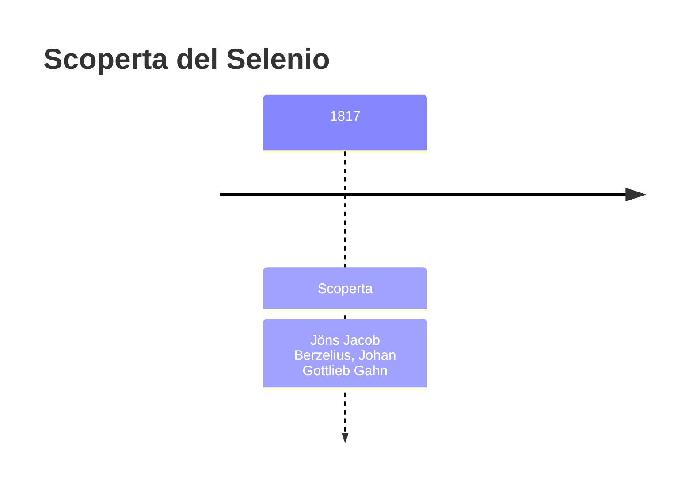
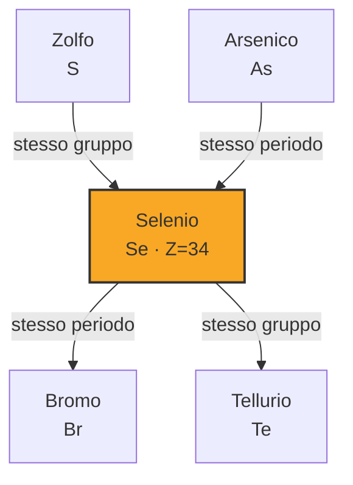

# Selenio (Se)

> [!abstract] 52° elemento scoperto — 1817
> 

## Cronologia della scoperta

## Storia della scoperta

## Posizione nella tavola periodica

## Caratteristiche

### Dati fisico-chimici

| Proprietà | Valore |
|---|---|
| Numero atomico | 34 |
| Massa atomica | 78,9718 u |
| Categoria | Non metallo |
| Gruppo | 16 |
| Periodo | 4 |
| Blocco | p |
| Configurazione elettronica | [Ar] 3d¹⁰ 4s² 4p⁴ |
| Punto di fusione | 220,9 °C |
| Punto di ebollizione | 684,9 °C |
| Densità | 4,81 g/cm³ |
| Stati di ossidazione | — |

## Struttura atomica

![[atomo-Selenio.svg]]

## Usi e presenza in natura

## Nella cronologia

← Precedente: [[Litio]] (1817)
→ Successivo: [[Cadmio]] (1817)

Epoca: [[L'età dell'elettrolisi]] · Scopritori: [[Jöns Jacob Berzelius]], [[Johan Gottlieb Gahn]]

## Fonti

