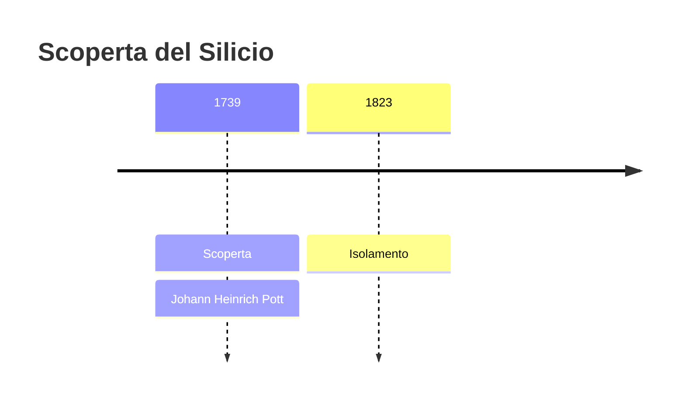
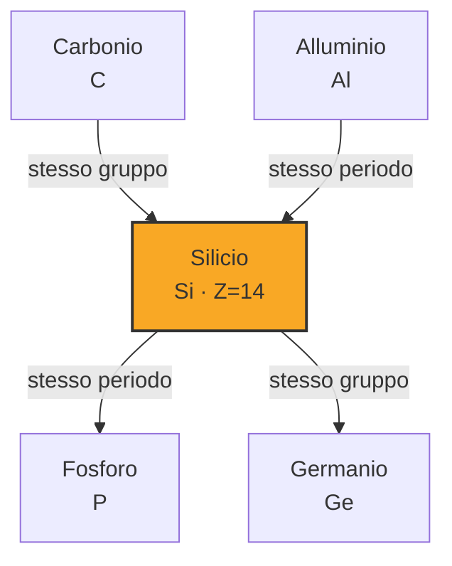
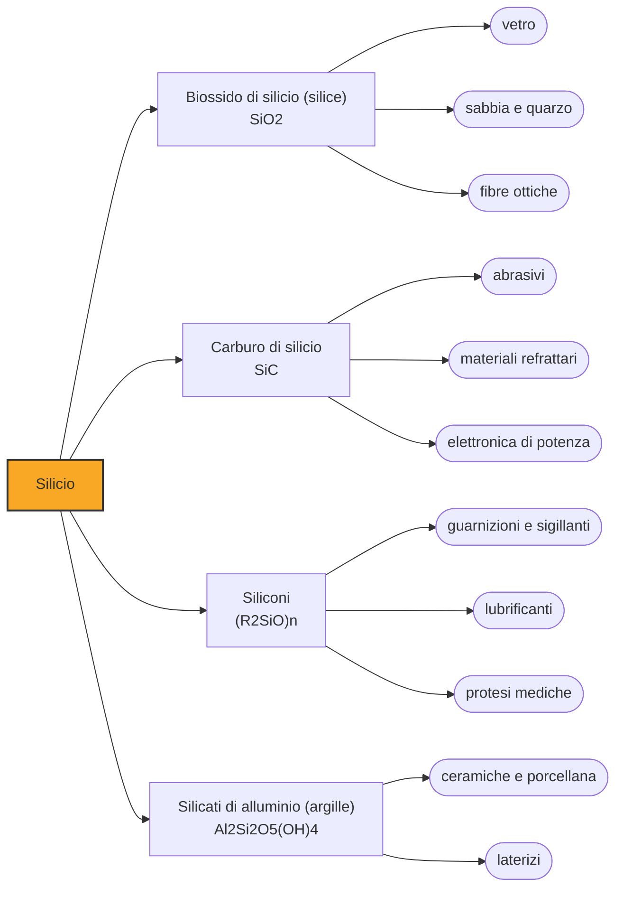

# Silicio (Si)

> [!abstract] 18° elemento scoperto — 1739
> Un chimico prussiano bruciò trentamila volte ogni pietra che riuscì a procurarsi, cercando la ricetta della porcellana. Trovò invece l'ordine nascosto delle rocce.

Il silicio è il secondo elemento più abbondante della crosta terrestre dopo l'ossigeno, con oltre un quarto della sua massa: sabbia, argilla, granito, vetro sono tutti, in fondo, silicio legato all'ossigeno. È la materia di cui il pianeta è fatto, ed è anche il materiale su cui poggia l'elettronica; ma per arrivare a vederlo puro ci sono voluti quasi cent'anni di tentativi falliti.

## Cronologia della scoperta

> [!info] Nota sulla cronologia
> Pott distingue la terra vetrificabile, cioè la silice, dalle altre terre nei lavori sulle terre a partire dal 1739. Isolato in forma amorfa pura nel 1823 da Jöns Jacob Berzelius.

## Storia della scoperta

La silice accompagna la tecnica umana dall'inizio. La selce scheggiata è silice quasi pura, e il vetro nasce fondendo sabbia con un fondente almeno dal III millennio a.C. Ma nessuna di queste pratiche richiedeva di sapere che cosa fosse la sabbia: bastava sapere che cosa ci si potesse fare. La silice era il materiale più familiare del mondo e insieme il più opaco alla comprensione, perché resisteva a ogni tentativo di scomporla.

A Berlino, negli anni Trenta del Settecento, Johann Heinrich Pott riceve dal re di Prussia un incarico preciso e commerciale: scoprire il segreto della porcellana, che a Meissen si fabbrica e altrove no, e che vale come una miniera. Pott affronta il problema per forza bruta, sottoponendo al fuoco della fornace ogni minerale e ogni miscela che riesce a mettere insieme; le fonti parlano di oltre trentamila prove.

La porcellana non la trova, e la commessa reale finirà per costargli il favore di corte. Il sottoprodotto di quel fallimento è però una cosa più grande: mettendo a confronto sistematicamente il comportamento al fuoco delle sostanze terrose, Pott arriva a separarle in famiglie distinte e riconosce come autonoma la terra vetrificabile, quella che fonde in vetro. È la silice, isolata concettualmente da calce, gesso e argilla per la prima volta.

Che dentro la silice ci fosse un elemento lo sospetta Lavoisier nel 1787, senza alcun modo di dimostrarlo. Il problema è la forza del legame fra silicio e ossigeno, fra i più tenaci della chimica: Humphry Davy ci prova con l'elettricità e non ce la fa; nel 1811 Gay-Lussac e Thénard, scaldando potassio con tetrafluoruro di silicio, ottengono davvero la sostanza, ma impura, e non si rendono conto di che cosa sia.

La chiude Jöns Jacob Berzelius nel 1823, a Stoccolma, con la stessa reazione condotta meglio: riduce il fluorosilicato di potassio con potassio metallico e poi, soprattutto, lava ripetutamente il prodotto finché non resta una polvere bruna pulita. La differenza fra lui e i predecessori sta tutta in quel lavaggio ostinato e nel riconoscere di avere davanti un elemento nuovo. Il nome silicio viene dal latino silex, la selce.

> [!warning] Questione aperta
> La paternità del silicio è distribuita fra troppe persone perché una sola data la esaurisca. Pott, dal 1739, separa la terra vetrificabile dalle altre terre, ma per lui è una terra, non un elemento. Lavoisier nel 1787 sospetta che la silice sia l'ossido di qualcosa e non riesce a ridurla; Davy fallisce a sua volta; Gay-Lussac e Thénard nel 1811 producono per primi la sostanza, in forma impura, senza riconoscere di avere in mano un elemento nuovo. Il credito va a Berzelius nel 1823 perché è il primo a ottenerla pura e a capire che cos'è. Le cronologie che, come questa, fanno partire il silicio dal lavoro sulle terre registrano il momento in cui la silice smette di essere confusa con il resto: un inizio legittimo, purché non lo si scambi per una scoperta compiuta.

## Posizione nella tavola periodica

## Caratteristiche

Il silicio è un semimetallo: lucido e grigio-azzurro come un metallo, ma fragile come il vetro e pessimo conduttore. Sta sotto il carbonio nella tavola periodica e ne condivide la capacità di formare quattro legami, ma è molto meno versatile nel legarsi a se stesso: le catene silicio-silicio sono instabili, ed è per questo che la vita è fatta di carbonio e non di silicio, nonostante quest'ultimo sia enormemente più abbondante.

La proprietà che ha cambiato il mondo è intermedia per definizione. Il silicio purissimo è quasi un isolante, perché fra la banda dei suoi elettroni legati e quella in cui possono muoversi c'è un divario di poco più di un elettronvolt; ma basta inserire nel reticolo pochi atomi estranei — un processo chiamato drogaggio — perché quel divario venga scavalcato e il materiale conduca. Un semiconduttore è un materiale di cui si decide se debba condurre o no.

In natura il silicio è sempre ossidato, quasi sempre in strutture in cui ogni atomo sta al centro di un tetraedro di quattro ossigeni. Il modo in cui questi tetraedri si collegano — isolati, in catene, in fogli, in reticoli tridimensionali — genera l'intera famiglia dei silicati e con essa quasi tutta la mineralogia della crosta terrestre: dal quarzo alle miche, dai feldspati alle argille.

### Dati fisico-chimici

| Proprietà | Valore |
|---|---|
| Numero atomico | 14 |
| Massa atomica | 28,085 u |
| Categoria | Semimetallo |
| Gruppo | 14 |
| Periodo | 3 |
| Blocco | p |
| Configurazione elettronica | [Ne] 3s² 3p² |
| Punto di fusione | 1413,9 °C |
| Punto di ebollizione | 3264,9 °C |
| Densità | 2,329 g/cm³ |
| Stati di ossidazione | -4, -3, -2, -1, +1, +2, +3, +4 |

## Struttura atomica

![[atomo-Silicio.svg]]

## Usi e presenza in natura

Gli impieghi di massa del silicio restano quelli antichi, moltiplicati per la scala industriale: sabbia silicea per il vetro, argille per ceramiche e laterizi, silicati per il cemento. A questi si aggiungono il carburo di silicio, uno dei materiali più duri che si producano, usato come abrasivo e refrattario, e i siliconi, polimeri a scheletro silicio-ossigeno che danno guarnizioni, lubrificanti e protesi.

La quota che conta di più, in valore, è minuscola in peso. Il silicio destinato all'elettronica viene purificato fino a livelli in cui gli atomi estranei si contano in poche unità per miliardo, fatto crescere in monocristalli e affettato in dischi sottili su cui si costruiscono i circuiti integrati. Le celle fotovoltaiche lavorano sullo stesso materiale, sfruttando la luce per far saltare gli elettroni nella banda di conduzione.

## Curiosità

La valle a sud di San Francisco si chiama Silicon Valley perché lì si concentrò l'industria dei semiconduttori, e il nome ha finito per indicare l'intero settore tecnologico. Vale la pena tenere ferma la distinzione che in italiano si perde spesso: silicon in inglese è il silicio, l'elemento; silicone è tutt'altra cosa, la famiglia dei polimeri delle guarnizioni.

Alcuni organismi hanno imparato a costruirsi in vetro. Le diatomee, alghe unicellulari diffuse in tutti i mari, si fabbricano un guscio di silice amorfa finemente traforato, con geometrie regolari che i microscopisti dell'Ottocento usavano come banco di prova per le loro lenti. Accumulandosi sui fondali, quei gusci formano la farina fossile, usata come filtrante e come abrasivo delicato.

## Nella cronologia

← Precedente: [[Cobalto]] (1735)
→ Successivo: [[Calcio]] (1739)

Epoca: [[Alchimia e primo moderno]] · Scopritore: [[Johann Heinrich Pott]]

## Fonti

- [Silicon](https://en.wikipedia.org/wiki/Silicon) — consultata il 07/09/2026
- [Johann Heinrich Pott](https://en.wikipedia.org/wiki/Johann_Heinrich_Pott) — consultata il 07/09/2026
- [Pott, Johann Heinrich (Dictionary of Scientific Biography)](https://www.encyclopedia.com/science/dictionaries-thesauruses-pictures-and-press-releases/pott-johann-heinrich) — consultata il 07/09/2026
- [Silicon dioxide](https://en.wikipedia.org/wiki/Silicon_dioxide) — consultata il 07/09/2026
- [Timeline of chemical element discoveries](https://en.wikipedia.org/wiki/Timeline_of_chemical_element_discoveries) — consultata il 07/09/2026

---

> [!warning] Avvertenza
> Questo progetto è stato realizzato con l'assistenza di sistemi di
> intelligenza artificiale. I contenuti sono verificati sulle fonti citate,
> ma **possono contenere errori e imprecisioni**: prima di riutilizzarli,
> controlla la fonte.
