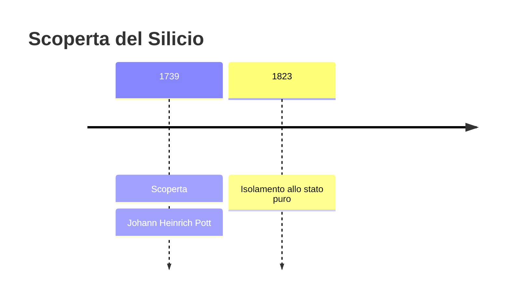
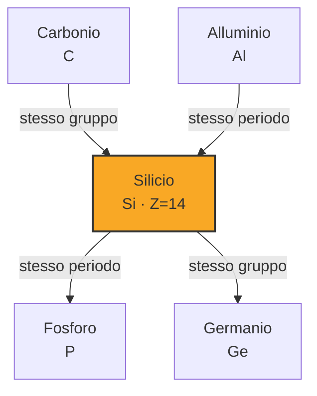

# Silicio (Si)

> [!abstract] 18° elemento scoperto — 1739
> 

## Cronologia della scoperta

## Storia della scoperta

## Posizione nella tavola periodica

## Caratteristiche

### Dati fisico-chimici

| Proprietà | Valore |
|---|---|
| Numero atomico | 14 |
| Massa atomica | 28,085 u |
| Categoria | Semimetallo |
| Gruppo | 14 |
| Periodo | 3 |
| Blocco | p |
| Configurazione elettronica | [Ne] 3s² 3p² |
| Punto di fusione | 1413,9 °C |
| Punto di ebollizione | 3264,9 °C |
| Densità | 2,329 g/cm³ |
| Stati di ossidazione | — |

## Struttura atomica

![[atomo-Silicio.svg]]

## Usi e presenza in natura

## Nella cronologia

← Precedente: [[Cobalto]] (1735)
→ Successivo: [[Calcio]] (1739)

Epoca: [[Alchimia e primo moderno]] · Scopritore: [[Johann Heinrich Pott]]

## Fonti

