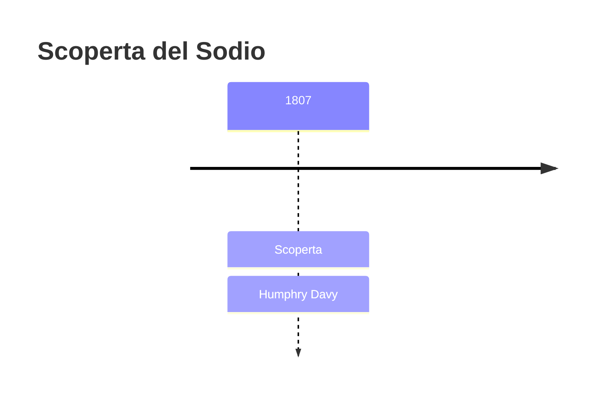
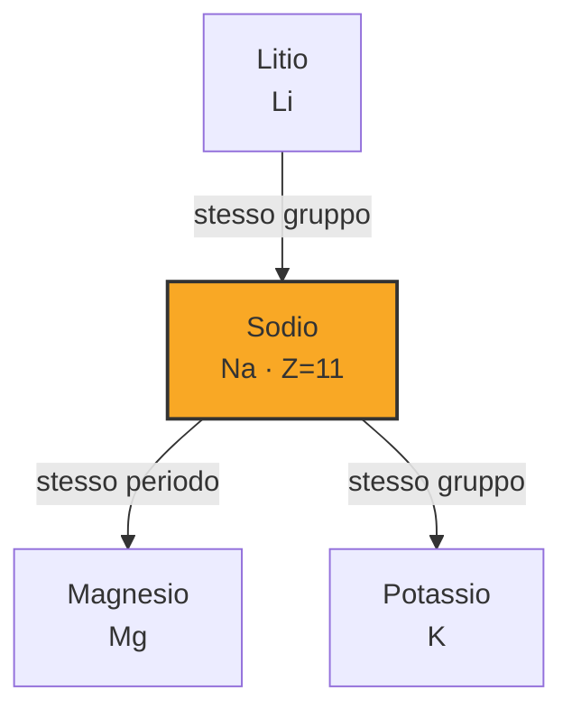
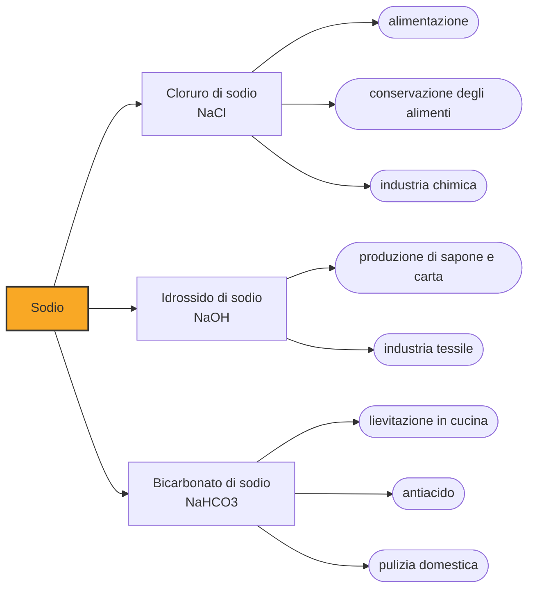

# Sodio (Na)

> [!abstract] 48° elemento scoperto — 1807
> Bastarono pochi giorni d'autunno e una pila elettrica perché un chimico isolasse, uno dopo l'altro, due metalli che nessuno aveva mai visto.

Il sodio è il metallo che reagisce con l'acqua producendo scintille e una fiamma arancione: talmente reattivo che in natura non esiste mai da solo, e per secoli i chimici non sospettarono nemmeno che dentro il comune sale da cucina si nascondesse un metallo.

## Cronologia della scoperta

> [!info] Nota sulla cronologia
> Georg Ernst Stahl distinse chimicamente il sale di sodio già nel 1702, ma non isolò l'elemento: la scoperta riconosciuta è l'elettrolisi di Davy.

## Storia della scoperta

All'inizio dell'Ottocento la chimica dispone di uno strumento nuovo, la pila voltaica, inventata da Alessandro Volta pochi anni prima. Per la prima volta è possibile far passare corrente elettrica continua attraverso una sostanza e osservare cosa succede: la corrente scinde legami che il fuoco e i reagenti chimici tradizionali non erano mai riusciti a rompere.

Alla Royal Institution di Londra lavora Humphry Davy, un chimico cornico arrivato alla scienza da autodidatta e diventato in pochi anni una delle figure più celebri della Londra scientifica, anche grazie alle sue conferenze pubbliche affollate di curiosi. Davy costruisce pile sempre più potenti e le usa per elettrolizzare, cioè scomporre con la corrente, sostanze che si credevano elementari e indivisibili.

Il bersaglio di Davy sono i due alcali fissi, la potassa e la soda caustica, fra le sostanze più comuni e più studiate dell'epoca. Fino ad allora i chimici le consideravano semplici: Davy sospetta invece che ciascuna nasconda un metallo mai osservato, tenuto insieme all'ossigeno da un legame troppo forte per essere spezzato con i mezzi chimici tradizionali.

A cedere per prima è la potassa: il 6 ottobre 1807 la corrente della pila fa comparire, sul lato negativo, globuli metallici che prendono fuoco a contatto con l'aria. Davy li chiama potassium, ed è il primo metallo della storia strappato a un composto dalla sola elettricità.

Pochi giorni dopo Davy ripete l'esperimento sulla soda caustica fusa e osserva allo stesso elettrodo globuli argentei che galleggiano sull'acqua reagendo con violenza. È il secondo metallo nuovo nel giro di una settimana: lo chiama sodium, dal nome inglese della soda da cui l'ha estratto.

Nelle settimane successive Davy presenta entrambe le scoperte alla Royal Society, in una sola memoria: è l'inizio di una serie che nel giro di due anni lo porterà a isolare da solo anche calcio, stronzio, bario e magnesio, sei elementi nuovi attribuiti a un'unica persona.

Il nome scelto da Davy, sodium, si diffonde nel mondo anglosassone, ma sul continente europeo il chimico svedese Jöns Jacob Berzelius propone in seguito il nome natrium, dal natron, il minerale a base di carbonato di sodio usato fin dall'antichità egizia. Da questa alternativa deriva il simbolo Na, che è rimasto quello ufficiale anche nei paesi che oggi chiamano l'elemento sodium o sodio.

## Posizione nella tavola periodica

## Caratteristiche

Il sodio metallico è talmente tenero da potersi tagliare con un coltello da cucina, ha un colore argenteo che si opacizza in pochi secondi a contatto con l'aria, e una densità così bassa da galleggiare sull'acqua, con cui però reagisce in modo violento producendo idrogeno e calore sufficiente a incendiarlo.

Appartiene al gruppo dei metalli alcalini, i più reattivi della tavola periodica: possiede un solo elettrone nel guscio più esterno, che cede con estrema facilità per formare lo ione Na+. Proprio questa prontezza a cedere l'elettrone spiega perché il sodio non si trovi mai libero in natura e debba essere conservato sott'olio per evitare il contatto con l'aria e l'umidità.

Bruciato o semplicemente riscaldato, il sodio colora una fiamma di un giallo intenso e caratteristico, tanto specifico da essere usato in chimica per riconoscerne la presenza in un campione: è lo stesso principio dietro il colore delle vecchie lampade stradali al sodio.

Proprio a causa della sua reattività, il sodio metallico non può essere lasciato all'aria né conservato in acqua: nei laboratori e nell'industria viene tenuto immerso in oli minerali o in cherosene, liquidi che non contengono ossigeno né umidità disciolti e che quindi non innescano la reazione che lo consumerebbe in poco tempo.

### Dati fisico-chimici

| Proprietà | Valore |
|---|---|
| Numero atomico | 11 |
| Massa atomica | 22,989769282 u |
| Categoria | Metallo alcalino |
| Gruppo | 1 |
| Periodo | 3 |
| Blocco | s |
| Configurazione elettronica | [Ne] 3s¹ |
| Punto di fusione | 97,8 °C |
| Punto di ebollizione | 882,9 °C |
| Densità | 0,968 g/cm³ |
| Stati di ossidazione | -1, +1 |

## Struttura atomica

![[atomo-Sodio.svg]]

## Usi e presenza in natura

Il composto di sodio più familiare è il cloruro di sodio, il comune sale da cucina, indispensabile all'alimentazione umana per il bilancio idrico e la trasmissione degli impulsi nervosi, oltre che usato da millenni per conservare gli alimenti.

L'idrossido di sodio, la stessa soda caustica da cui Davy isolò l'elemento, resta oggi una delle sostanze chimiche più prodotte al mondo, impiegata nella fabbricazione di sapone, carta e tessuti; il bicarbonato di sodio trova posto in cucina come lievitante e in farmacia come antiacido.

Il sodio è il sesto elemento più abbondante della crosta terrestre e il principale soluto disciolto negli oceani: non si trova mai libero, ma combinato in minerali come la salgemma (halite) e nei feldspati sodici, da cui deriva gran parte del sodio estratto commercialmente.

Nel corpo umano lo ione sodio regola il volume del sangue, la pressione arteriosa e l'equilibrio dei liquidi fra le cellule e l'ambiente esterno; insieme al potassio genera inoltre la differenza di carica elettrica attraverso le membrane nervose che rende possibile la trasmissione degli impulsi lungo i neuroni.

## Curiosità

*Per tradizione:* Davy divenne una celebrità a Londra anche grazie alle sue conferenze pubbliche alla Royal Institution, che attiravano folle enormi e persino ingorghi di carrozze in strada: la scienza, per un pubblico dell'Ottocento, era anche spettacolo.

Fra gli assistenti che Davy assunse nel suo laboratorio ci fu un giovane rilegatore di libri appassionato di scienza, Michael Faraday, che sarebbe diventato uno dei più grandi fisici della storia, superando per fama lo stesso Davy.

## Nella cronologia

← Precedente: [[Rodio]] (1804)
→ Successivo: [[Potassio]] (1807)

Epoca: [[L'età dell'elettrolisi]] · Scopritore: [[Humphry Davy]]

## Fonti

- [Sodium](https://en.wikipedia.org/wiki/Sodium) — consultata il 05/09/2026
- [Humphry Davy](https://en.wikipedia.org/wiki/Humphry_Davy) — consultata il 05/09/2026
- [Davy's Elements (1805-1824)](https://uwaterloo.ca/chemistry/community-outreach/timeline-of-elements/davys-elements-1805-1824) — consultata il 05/09/2026
- [Humphry Davy, On Some New Phenomena of Chemical Changes Produced by Electricity (Bakerian Lecture, Philosophical Transactions, 1808)](https://www.chemteam.info/Chem-History/Davy-Na&K-1808.html) — consultata il 08/09/2026
