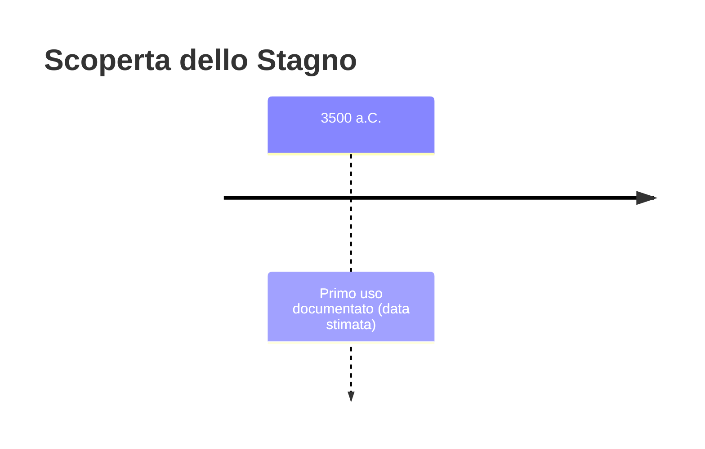
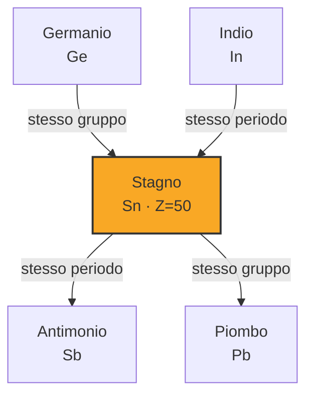
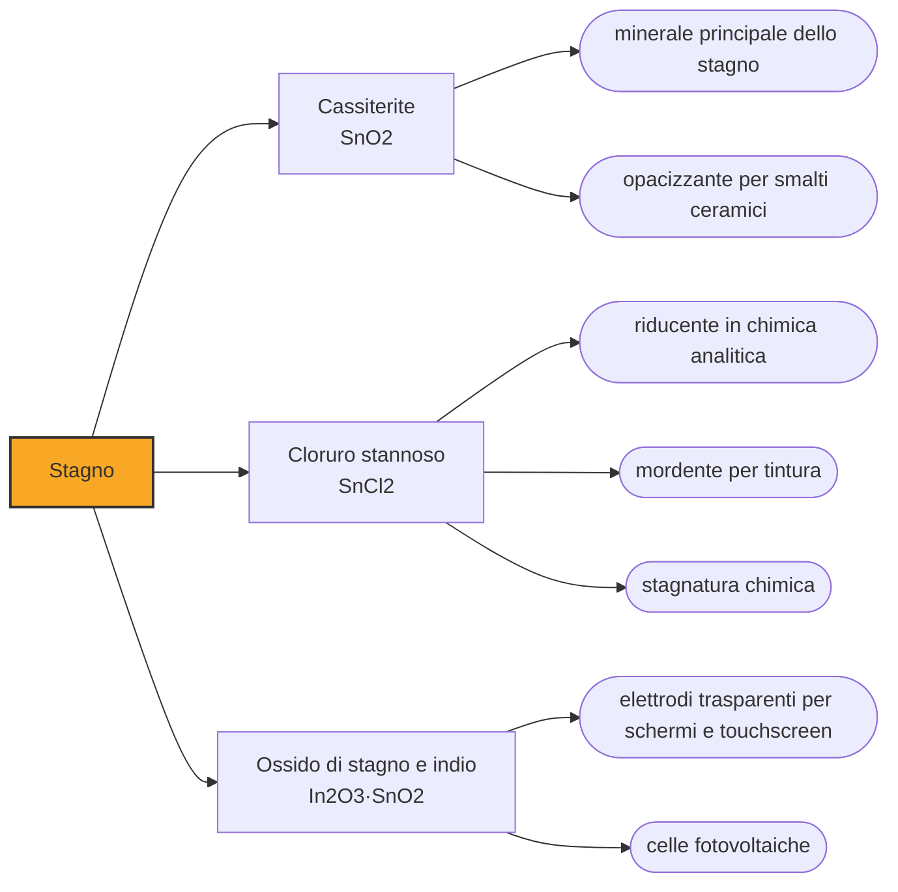

# Stagno (Sn)

> [!abstract] 7° elemento scoperto — 3500 a.C.
> Senza stagno non c'è età del bronzo. È l'elemento raro che ha costretto il mondo antico a commerciare su distanze che non aveva mai percorso, per un metallo che da solo non serve quasi a niente.

Lo stagno è un metallo modesto: tenero, di poco pregio, quasi inutile allo stato puro. La sua importanza storica è tutta relazionale, e sta in un fatto: aggiunto al rame in proporzione di circa un decimo, produce una lega più dura, più fusibile e più facile da colare. Quella lega è il bronzo, e ha dato il nome a un'epoca.

## Cronologia della scoperta

## Storia della scoperta

Il minerale da cui si ricava è la cassiterite, biossido di stagno, un materiale scuro e pesante che si concentra nelle sabbie dei fiumi e si può raccogliere lavando la ghiaia, come si fa con l'oro. Ridurla a metallo con il carbone è relativamente facile, il che spiega perché l'estrazione dello stagno prenda avvio già intorno al 3000 a.C.

I primissimi bronzi non sono il frutto di una ricetta. Gli oggetti più antichi contengono meno del due per cento di stagno o di arsenico, quantità compatibili con minerali polimetallici fusi così come si presentavano, senza che nessuno stesse dosando alcunché. La lega intenzionale, con lo stagno aggiunto di proposito e in proporzione controllata, è un passaggio successivo e concettualmente enorme: qualcuno ha capito che mescolare due metalli ne produce un terzo migliore di entrambi.

Qui nasce il problema che ha definito l'età del bronzo. Il rame è diffuso; i giacimenti di stagno sono pochi e mal distribuiti, e mancano quasi del tutto proprio nel Vicino Oriente, dove il bronzo serviva di più. Chi voleva bronzo doveva procurarsi stagno da lontano, e questo ha reso indispensabili rotte commerciali di ampiezza continentale in un'epoca che non aveva strade.

Quanto lontano lo mostra il relitto di Uluburun, una nave affondata al largo della Turchia meridionale intorno al 1320 a.C., individuata nel 1982 da un pescatore di spugne e scavata dal 1984: trasportava una tonnellata di lingotti di stagno, il più grande carico di metalli grezzi dell'età del bronzo mai ritrovato. Le analisi isotopiche indicano che parte di quel metallo veniva dai monti del Tauro e parte dall'Asia centrale, dagli attuali Uzbekistan e Tagikistan.

Anche l'estremo opposto del continente entra nel gioco. Studi isotopici recenti su lingotti recuperati in relitti al largo di Israele e della Francia hanno ricondotto quel metallo ai giacimenti della Cornovaglia, all'estremità sud-occidentale della Britannia. Significa che stagno estratto in Atlantico alimentava la produzione di bronzo del Mediterraneo orientale, lungo una catena di scambi che nessuno dei suoi partecipanti percorreva per intero.

La dipendenza da rotte lunghe è anche una fragilità. Verso il 1200 a.C. il Mediterraneo orientale attraversa una crisi che travolge in pochi decenni regni e reti di scambio, e con esse l'approvvigionamento di stagno. Che sia stata la causa o una delle conseguenze è discusso fra gli storici, ma il fatto resta: quando il bronzo diventa difficile da produrre, il ferro, il cui minerale si trova ovunque, smette di essere una curiosità e diventa la scelta obbligata.

## Posizione nella tavola periodica

## Caratteristiche

Lo stagno fonde a soli 232 gradi, la temperatura più bassa fra i metalli di uso comune, e questa è la sua qualità decisiva: si lavora con mezzi elementari e si cola in stampi senza attrezzature speciali. È tenero, duttile e resiste bene alla corrosione, perché in aria si copre di un sottile strato di ossido che protegge il metallo sottostante.

Piegando una barretta di stagno puro si sente un crepitio caratteristico, il cosiddetto grido dello stagno: non è il metallo che si rompe, ma i suoi cristalli che scorrono e si geminano l'uno sull'altro. È uno dei pochi casi in cui la riorganizzazione della struttura cristallina di un materiale si percepisce direttamente con l'orecchio, ed è servita per secoli come prova empirica di purezza del metallo.

Lo stagno esiste in due forme molto diverse. Quella metallica e argentea, stabile alle temperature ordinarie, sotto i 13,2 gradi cede lentamente il posto a una forma grigia, opaca e friabile che si sbriciola in polvere. Il fenomeno si chiama peste dello stagno, procede più in fretta col freddo intenso e ha rovinato oggetti e saldature per secoli prima che se ne capisse la causa. Chimicamente il metallo mostra gli stati di ossidazione +2 e +4.

### Dati fisico-chimici

| Proprietà | Valore |
|---|---|
| Numero atomico | 50 |
| Massa atomica | 118,7107 u |
| Categoria | Metallo post-transizione |
| Gruppo | 14 |
| Periodo | 5 |
| Blocco | p |
| Configurazione elettronica | [Kr] 4d¹⁰ 5s² 5p² |
| Punto di fusione | 231,9 °C |
| Punto di ebollizione | 2601,9 °C |
| Densità | 7,365 g/cm³ |
| Stati di ossidazione | -4, +2, +4 |

## Struttura atomica

![[atomo-Stagno.svg]]

## Usi e presenza in natura

L'impiego principale oggi è la saldatura. Le leghe per brasatura dolce contengono stagno in percentuali che vanno dal cinque al settanta per cento, e sono ciò che tiene insieme elettricamente e meccanicamente ogni scheda elettronica e buona parte degli impianti idraulici. La normativa europea ha nel frattempo eliminato il piombo da queste leghe, e le saldature attuali sono a base di stagno con argento e rame.

L'altro uso di massa è il rivestimento. La banda stagnata, cioè lamiera d'acciaio ricoperta da uno strato sottilissimo di stagno, unisce la robustezza del ferro alla resistenza alla corrosione del rivestimento: da qui la scatoletta per alimenti, brevettata a Londra nel 1810 da Peter Durand, che però non la produsse mai — il brevetto passò a Donkin e Hall, che aprirono la prima fabbrica a Bermondsey nel 1812. Lo stagno compare inoltre nel peltro, nelle canne d'organo e nei composti che stabilizzano le materie plastiche.

## Curiosità

Si racconta spesso che la ritirata di Napoleone dalla Russia nel 1812 sia stata aggravata dalla peste dello stagno, che avrebbe sbriciolato i bottoni delle uniformi lasciando i soldati esposti al gelo. È una storia bella e ricorrente, ma non è mai stata dimostrata: i bottoni recuperati dai reperti di quella campagna non sono tutti di stagno, e la trasformazione è troppo lenta per svolgersi in una sola stagione.

## Nella cronologia

← Precedente: [[Argento]] (5000 a.C.)
→ Successivo: [[Antimonio]] (3000 a.C.)

Epoca: [[Antichità]]

## Fonti

- [Tin](https://en.wikipedia.org/wiki/Tin) — consultata il 07/09/2026
- [Tin from Uluburun shipwreck shows small-scale commodity exchange fueled continental tin supply (Science Advances)](https://www.science.org/doi/10.1126/sciadv.abq3766) — consultata il 07/09/2026
- [British tin might have fueled the rise of some Bronze Age civilizations](https://www.sciencenews.org/article/british-tin-bronze-age-civilizations) — consultata il 07/09/2026
