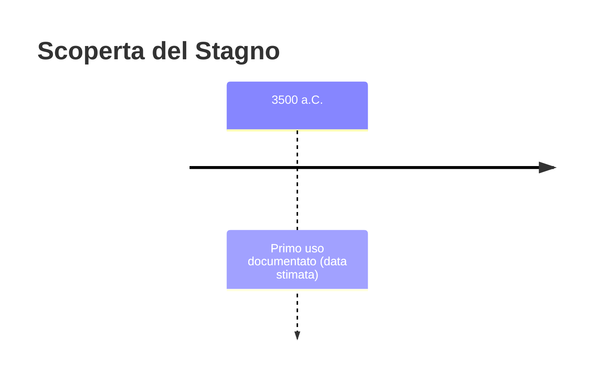
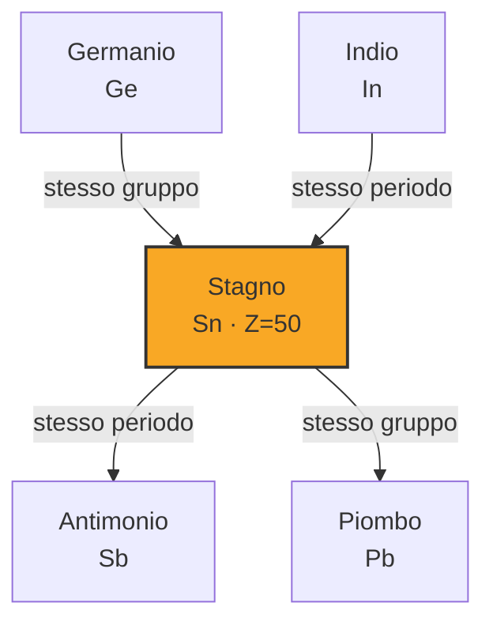

# Stagno (Sn)

> [!abstract] 7° elemento scoperto — 3500 a.C.
> 

## Cronologia della scoperta

## Storia della scoperta

## Posizione nella tavola periodica

## Caratteristiche

### Dati fisico-chimici

| Proprietà | Valore |
|---|---|
| Numero atomico | 50 |
| Massa atomica | 118,7107 u |
| Categoria | Metallo post-transizione |
| Gruppo | 14 |
| Periodo | 5 |
| Blocco | p |
| Configurazione elettronica | [Kr] 4d¹⁰ 5s² 5p² |
| Punto di fusione | 231,9 °C |
| Punto di ebollizione | 2601,9 °C |
| Densità | 7,365 g/cm³ |
| Stati di ossidazione | — |

## Struttura atomica

![[atomo-Stagno.svg]]

## Usi e presenza in natura

## Nella cronologia

← Precedente: [[Argento]] (5000 a.C.)
→ Successivo: [[Antimonio]] (3000 a.C.)

Epoca: [[Antichità]]

## Fonti

