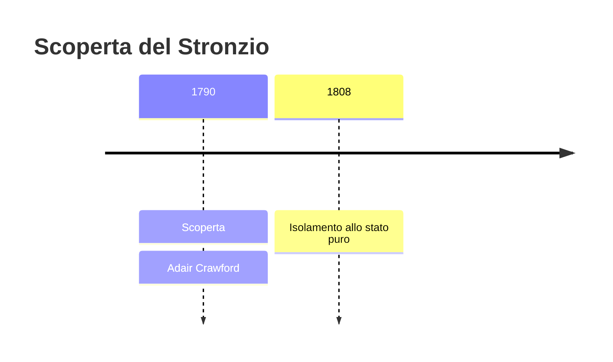
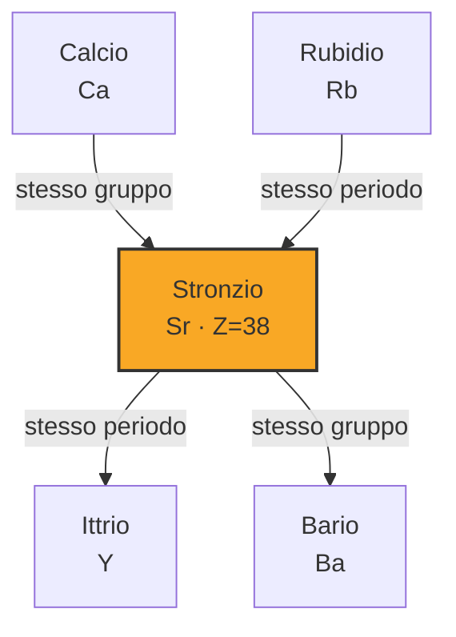

# Stronzio (Sr)

> [!abstract] 35° elemento scoperto — 1790
> 

## Cronologia della scoperta

## Storia della scoperta

## Posizione nella tavola periodica

## Caratteristiche

### Dati fisico-chimici

| Proprietà | Valore |
|---|---|
| Numero atomico | 38 |
| Massa atomica | 87,621 u |
| Categoria | Metallo alcalino terroso |
| Gruppo | 2 |
| Periodo | 5 |
| Blocco | s |
| Configurazione elettronica | [Kr] 5s² |
| Punto di fusione | 776,9 °C |
| Punto di ebollizione | 1376,9 °C |
| Densità | 2,64 g/cm³ |
| Stati di ossidazione | — |

## Struttura atomica

![[atomo-Stronzio.svg]]

## Usi e presenza in natura

## Nella cronologia

← Precedente: [[Uranio]] (1789)
→ Successivo: [[Titanio]] (1791)

Epoca: [[Chimica pneumatica]] · Scopritore: [[Adair Crawford]]

## Fonti

