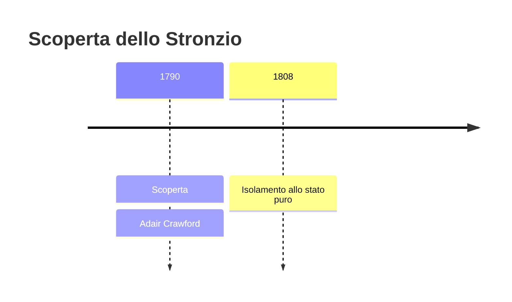
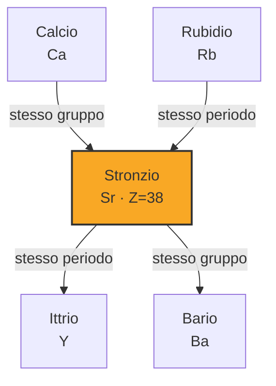
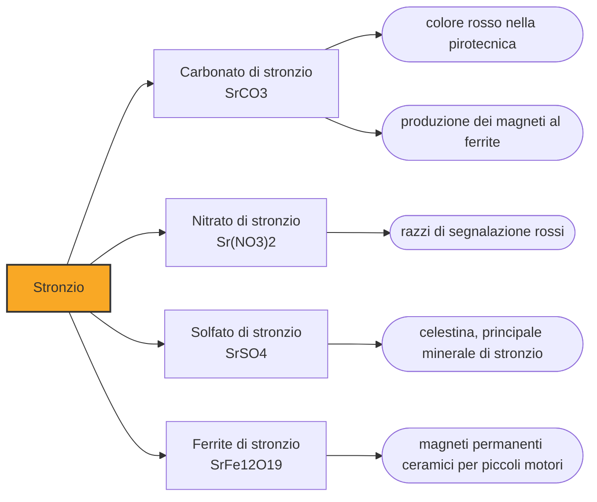

# Stronzio (Sr)

> [!abstract] 35° elemento scoperto — 1790
> Un villaggio di trecento anime sulla costa occidentale della Scozia ha dato il proprio nome a un elemento chimico. È l'unico posto delle isole britanniche ad avercela fatta.

Lo stronzio è un metallo alcalino terroso morbido e argenteo, che all'aria si ossida in fretta e in acqua reagisce con vivacità. Chi lo conosce lo conosce per due cose agli antipodi: il rosso profondo che regala ai fuochi d'artificio, e un isotopo radioattivo che negli anni Cinquanta finì nei denti dei bambini di mezzo mondo e contribuì a fermare i test nucleari atmosferici.

## Cronologia della scoperta

## Storia della scoperta

Strontian è un villaggio delle Highlands occidentali, nato attorno alle miniere di piombo aperte negli anni Venti del Settecento. Dalle sue gallerie usciva, insieme al piombo, un minerale che i minatori mettevano da parte perché non serviva a nulla: lo si vendeva ai droghieri di Edimburgo come varietà di witherite, un carbonato di bario. Nessuno aveva motivo di guardarlo da vicino, perché somigliava a qualcosa di già noto.

Nel 1790 Adair Crawford, medico irlandese che a Londra studiava il calore e le arie, esamina quel minerale insieme a William Cruickshank e si accorge che non torna: i suoi sali si comportano diversamente da quelli del bario, sciolgono e cristallizzano in un altro modo. Crawford scrive con la prudenza dell'epoca che si tratta probabilmente di una specie di terra non ancora sufficientemente esaminata. Ha ragione, ma non ha la prova.

A chiudere la questione è Thomas Charles Hope, che a Glasgow nel 1793 conduce l'analisi sistematica che a Crawford era mancata e trova la prova che cercava nella cosa più semplice: il colore della fiamma. Il bario brucia verde, lo stronzio brucia di un rosso cremisi che non si confonde con nulla. Hope propone di chiamare la terra nuova strontites, dal nome del villaggio, e la comunità chimica accetta. Nello stesso giro d'anni, in Germania, Sulzer e Blumenbach erano arrivati indipendentemente alla stessa conclusione.

Restava il salto che nessuno sapeva fare: dalla terra al metallo. Lo compie Humphry Davy nel 1808, l'anno in cui con la pila elettrica smonta una dopo l'altra le terre alcaline e ne cava fuori bario, calcio, magnesio e stronzio. Il metodo è l'elettrolisi di una miscela di cloruro di stronzio e ossido di mercurio, e il prodotto è un amalgama da cui distillare via il mercurio. In pochi mesi Davy aggiunge alla tavola periodica più elementi di chiunque altro prima di lui.

> [!warning] Questione aperta
> La paternità dello stronzio si distribuisce fra almeno tre gruppi in tre anni. Crawford e Cruickshank, nel 1790, sono i primi a scrivere che il minerale di Strontian contiene una terra nuova, ma lo fanno con prudenza e senza dimostrarlo fino in fondo: Crawford parla di una specie di terra che non è stata finora sufficientemente esaminata. Nello stesso periodo, in Germania, Friedrich Gabriel Sulzer e Johann Friedrich Blumenbach esaminano lo stesso minerale, lo battezzano strontianite e concludono anch'essi che contiene una terra nuova. È Thomas Charles Hope, nel 1793, a chiudere la questione con l'analisi sistematica e con la prova della fiamma cremisi, e a proporre il nome. Il credito del 1790 a Crawford registra la prima segnalazione, non la dimostrazione; e il nome di Cruickshank, che firmava con lui, tende a sparire dalle cronologie che riportano un solo scopritore per riga.

## Posizione nella tavola periodica

## Caratteristiche

Il rosso dello stronzio è una firma atomica. Scaldati, i suoi atomi assorbono energia e la restituiscono emettendo luce a lunghezze d'onda precise, concentrate nel rosso profondo; nessun altro elemento economico produce quel colore con quella purezza. È il motivo per cui lo stronzio è insostituibile nella pirotecnica e nei razzi di segnalazione: il rosso dei fuochi d'artificio, praticamente ovunque nel mondo, è stronzio che brucia.

Chimicamente lo stronzio è quasi sempre allo stato più due e si comporta come un calcio un po' più grande e un po' più reattivo: sta subito sotto di esso nella tavola periodica, forma gli stessi tipi di sali e, cosa decisiva, l'organismo fatica a distinguerli. Le vie metaboliche che portano il calcio nelle ossa accettano senza obiezioni anche lo stronzio, e lo depositano dove andrebbe il calcio. È una somiglianza che diventerà un problema.

### Dati fisico-chimici

| Proprietà | Valore |
|---|---|
| Numero atomico | 38 |
| Massa atomica | 87,621 u |
| Categoria | Metallo alcalino terroso |
| Gruppo | 2 |
| Periodo | 5 |
| Blocco | s |
| Configurazione elettronica | [Kr] 5s² |
| Punto di fusione | 776,9 °C |
| Punto di ebollizione | 1376,9 °C |
| Densità | 2,64 g/cm³ |
| Stati di ossidazione | +1, +2 |

## Struttura atomica

![[atomo-Stronzio.svg]]

## Usi e presenza in natura

Per decenni il grande consumatore di stronzio è stato il vetro dei tubi catodici dei televisori, dove il suo ossido serviva a fermare i raggi X generati dal cannone elettronico: assorbiva fino a tre quarti della produzione statunitense. La scomparsa dei tubi catodici ha svuotato quel mercato di colpo, e oggi la domanda si regge sui magneti ceramici al ferrite di stronzio, presenti in quasi ogni piccolo motore elettrico, sulla pirotecnica e sui ceramici tecnici.

In medicina la somiglianza con il calcio è stata sfruttata in entrambe le direzioni. Il ranelato di stronzio è stato prescritto contro l'osteoporosi perché si fissa nell'osso e ne aumenta la densità, salvo poi vedersi restringere drasticamente l'impiego per il rischio cardiovascolare emerso dagli studi successivi. Lo stronzio-89, invece, si usa proprio perché si concentra nelle metastasi ossee, portando la radiazione dove serve e attenuando il dolore.

## Curiosità

Lo stronzio-90 è uno dei prodotti più abbondanti della fissione dell'uranio, ha un tempo di dimezzamento di circa ventotto anni e, ricadendo dalle esplosioni atmosferiche, entra nell'erba, poi nel latte, poi nelle ossa e nei denti dei bambini, dove l'organismo lo scambia per calcio e lo trattiene. Da lì continua a irradiare il midollo osseo, e l'esposizione è associata a un aumento del rischio di leucemia e di tumori ossei.

Alla fine degli anni Cinquanta, a Saint Louis, un gruppo di scienziati e cittadini chiese ai genitori di spedire i denti da latte caduti ai figli, per misurare quanto stronzio-90 vi si fosse accumulato. Ne arrivarono oltre trecentoventimila, e il confronto fu impressionante: i bambini nati nel 1963 ne avevano nei denti cinquanta volte più di quelli nati nel 1950. I risultati contribuirono a convincere il presidente Kennedy a firmare il trattato che nello stesso 1963 mise fuori legge le esplosioni nucleari nell'atmosfera. Una raccolta di denti da latte aiutò a fermarle.

Lo stronzio misura anche il tempo meglio di qualunque altra cosa. Gli orologi atomici ottici che intrappolano atomi di stronzio in un reticolo di luce laser sono oggi fra i più precisi mai costruiti: sbaglierebbero meno di un secondo sull'intera età dell'universo. Sono così sensibili da rilevare il rallentamento del tempo previsto dalla relatività generale su distanze minuscole: in un esperimento del 2022 gli atomi che stavano un millimetro più in basso, dentro lo stesso campione, sono risultati ticchettare più lentamente di quelli sopra di loro.

## Nella cronologia

← Precedente: [[Uranio]] (1789)
→ Successivo: [[Titanio]] (1791)

Epoca: [[Chimica pneumatica]] · Scopritore: [[Adair Crawford]]

## Fonti

- [Strontium](https://en.wikipedia.org/wiki/Strontium) — consultata il 07/09/2026
- [Timeline of chemical element discoveries](https://en.wikipedia.org/wiki/Timeline_of_chemical_element_discoveries) — consultata il 07/09/2026
- [Thomas Charles Hope](https://en.wikipedia.org/wiki/Thomas_Charles_Hope) — consultata il 07/09/2026
- [Baby Tooth Survey](https://en.wikipedia.org/wiki/Baby_Tooth_Survey) — consultata il 07/09/2026
- [JILA Atomic Clocks Measure Einstein's General Relativity at Millimeter Scale](https://jila.colorado.edu/news-events/articles/jila-atomic-clocks-measure-einsteins-general-relativity-millimeter-scale) — consultata il 07/09/2026
