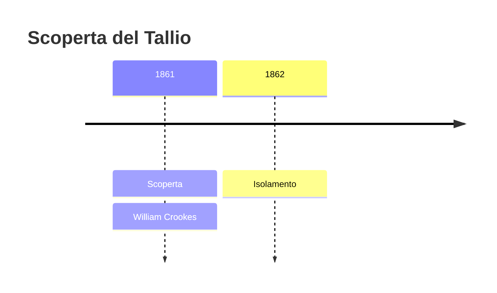
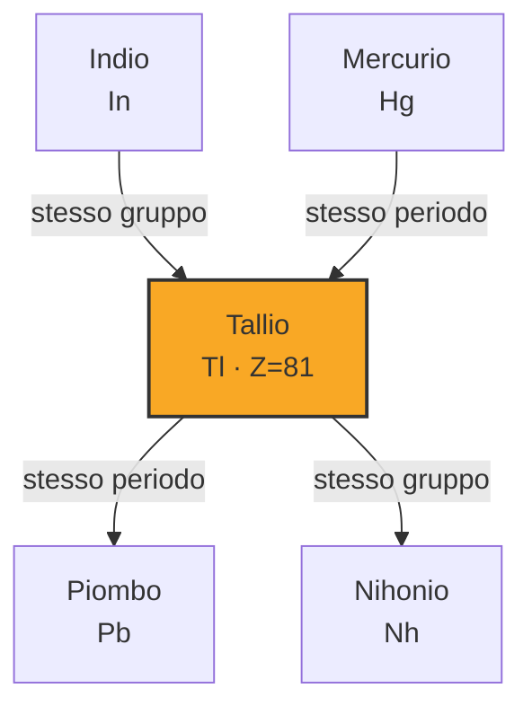
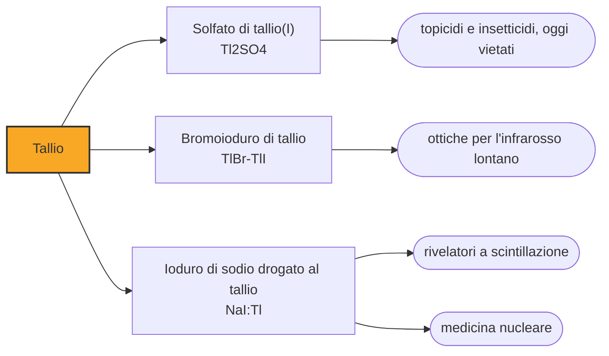

# Tallio (Tl)

> [!abstract] 63° elemento scoperto — 1861
> Una riga verde in uno spettro, e due chimici che la videro quasi insieme in due paesi diversi. Ne nacque un elemento nuovo, una disputa di priorità e il veleno preferito dai romanzi gialli.

Il tallio è un metallo tenero, grigio-azzurro, che si taglia con un coltello e che a contatto con l'aria si opacizza in fretta. È anche uno degli elementi più tossici della tavola periodica: i suoi sali sono solubili, quasi insapori, e il corpo li scambia per potassio, il che ne ha fatto per decenni lo strumento di chi avvelenava.

## Cronologia della scoperta

## Storia della scoperta

Nel 1861 William Crookes stava cercando tellurio nei residui di una fabbrica di acido solforico, la fanghiglia che si accumula nelle camere di piombo e che in quegli anni era diventata la miniera preferita dei chimici. Puntandoci lo spettroscopio trovò una riga verde brillante che non corrispondeva a nulla di noto, e ne dedusse un elemento nuovo.

Il nome lo prese dal greco thallos, «germoglio», per il verde tenero di quella riga: come il cesio, il rubidio e l'indio, anche il tallio si chiama con il colore della propria luce. Crookes pubblicò il 30 marzo 1861, con in mano soltanto lo spettro.

Quasi contemporaneamente, in Francia, Claude-Auguste Lamy lavorava sugli stessi residui e trovava la stessa riga. Lamy però andò oltre: isolò il metallo, ne misurò le proprietà e ne presentò un lingotto. Alla Mostra internazionale di Londra del 1862 furono premiati entrambi, con motivazioni diverse, e la disputa su chi avesse davvero scoperto il tallio andò avanti per anni.

Il caso mise in luce una domanda che la spettroscopia aveva reso urgente: scoprire un elemento significa vederne la traccia o tenerlo in mano? Crookes aveva visto per primo, Lamy aveva isolato per primo, e il credito che le tavole assegnano oggi a Crookes riflette una scelta — l'osservazione conta più dell'isolamento — che il progetto stesso di catalogare gli elementi ha dovuto fare decine di volte.

Per Crookes fu l'inizio di una carriera anomala. Con i tubi a vuoto che portano il suo nome studiò i raggi catodici, aprendo la strada alla fisica delle particelle, e insieme dedicò anni allo spiritismo, cercando con gli stessi strumenti di misura una prova sperimentale dei fenomeni medianici. La stessa fiducia nello strumento che gli aveva fatto trovare un elemento lo portò molto lontano dalla chimica.

## Posizione nella tavola periodica

## Caratteristiche

Il tallio ha due stati di ossidazione, +1 e +3, e a differenza dei suoi vicini di colonna preferisce nettamente il primo: gli elettroni esterni dell'orbitale s restano legati e non partecipano, un effetto che si accentua scendendo lungo il gruppo. Lo ione Tl⁺ ha carica e raggio simili a quelli del potassio, e questa somiglianza è la chiave della sua tossicità.

Le pompe che spostano il potassio dentro e fuori dalle cellule accettano il tallio senza distinguerlo, e una volta dentro l'elemento blocca i processi che dipendono dal potassio, dai nervi ai follicoli dei capelli. I sali sono solubili, quasi insapori e privi di odore: sono le tre proprietà che, sommate, hanno guadagnato al tallio il soprannome di «veleno degli avvelenatori». L'antidoto esiste ed è il blu di Prussia, che lo lega nell'intestino e ne impedisce il riassorbimento.

È un metallo pesante, tenero e malleabile, che fonde a 304 gradi e all'aria si ricopre di un ossido scuro; per questo si conserva sotto olio o in atmosfera inerte. In natura non si trova libero: sta in tracce nelle piriti e nei solfuri di zinco e piombo, e si ricava dai fumi e dai residui della loro tostatura.

### Dati fisico-chimici

| Proprietà | Valore |
|---|---|
| Numero atomico | 81 |
| Massa atomica | 204,38 u |
| Categoria | Metallo post-transizione |
| Gruppo | 13 |
| Periodo | 6 |
| Blocco | p |
| Configurazione elettronica | [Xe] 4f¹⁴ 5d¹⁰ 6s² 6p¹ |
| Punto di fusione | 303,9 °C |
| Punto di ebollizione | 1472,9 °C |
| Densità | 11,85 g/cm³ |
| Stati di ossidazione | +1, +3 |

## Struttura atomica

![[atomo-Tallio.svg]]

## Usi e presenza in natura

L'impiego principale sfrutta una proprietà elettronica: aggiungere una piccola quantità di tallio ai cristalli di ioduro di sodio o di cesio li rende molto più efficienti nel convertire i raggi gamma in lampi di luce. Su questo si reggono i rivelatori a scintillazione usati in medicina nucleare, nei controlli di sicurezza e nella ricerca di sorgenti radioattive.

I cristalli di bromuro e ioduro di tallio, venduti con la sigla KRS-5, sono fra i pochi materiali trasparenti all'infrarosso lontano, e servono da finestre e lenti negli strumenti che lavorano a quelle lunghezze d'onda. In medicina il tallio-201 è stato per anni il tracciante della scintigrafia cardiaca: entra nelle cellule del muscolo cardiaco al posto del potassio e mostra quali zone ricevono sangue e quali no.

Gli impieghi che ne consumavano di più sono stati vietati quasi ovunque: il solfato di tallio, insapore e inodore, era il topicida e l'insetticida domestico del Novecento, e proprio la sua diffusione nelle case ha alimentato la casistica degli avvelenamenti accidentali e non.

## Curiosità

Agatha Christie, che durante la guerra aveva lavorato in farmacia, fece morire di tallio un personaggio di Un cavallo per la strega, del 1961, descrivendone i sintomi con precisione clinica: il malessere gastrico, il formicolio ai piedi e, settimane dopo, la caduta dei capelli.

A quel romanzo si attribuiscono almeno due vite salvate: nel 1977 un'infermiera, Marsha Maitland, riconobbe l'avvelenamento di una bambina di diciannove mesi proprio dai sintomi che aveva letto in quelle pagine, e un secondo caso emerse quando una copia del libro fu trovata fra gli oggetti di un condannato per avvelenamento.

Il tallio ha dato anche un contributo silenzioso alla superconduttività ad alta temperatura: alcuni degli ossidi cuprati che negli anni Ottanta hanno alzato la temperatura critica sopra i cento kelvin contengono tallio, e sono stati fra i primi materiali a diventare superconduttori sopra il punto di ebollizione dell'azoto liquido, cioè con un refrigerante che costa poco.

## Nella cronologia

← Precedente: [[Rubidio]] (1861)
→ Successivo: [[Indio]] (1863)

Epoca: [[Spettroscopia e radioattività]] · Scopritore: [[William Crookes]]

## Fonti

- [Thallium](https://en.wikipedia.org/wiki/Thallium) — consultata il 09/09/2026
- [Thallium — Royal Society of Chemistry](https://periodic-table.rsc.org/element/81/thallium) — consultata il 09/09/2026
- [William Crookes](https://en.wikipedia.org/wiki/William_Crookes) — consultata il 09/09/2026
- [Thallium poisoning](https://en.wikipedia.org/wiki/Thallium_poisoning) — consultata il 09/09/2026
