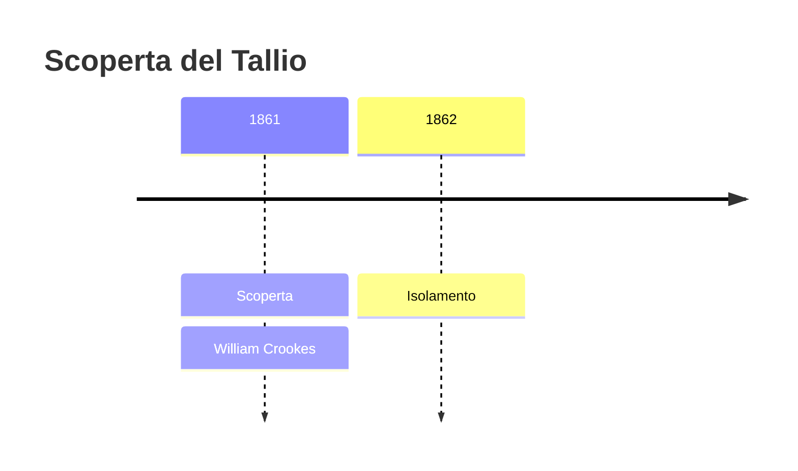
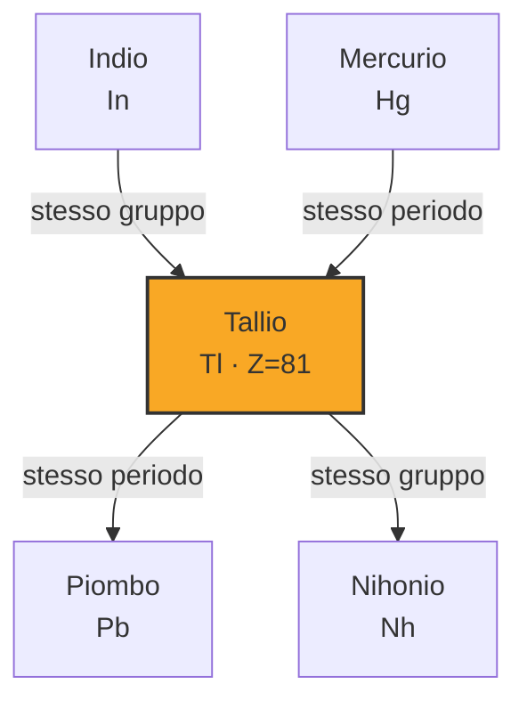

# Tallio (Tl)

> [!abstract] 63° elemento scoperto — 1861
> 

## Cronologia della scoperta

## Storia della scoperta

## Posizione nella tavola periodica

## Caratteristiche

### Dati fisico-chimici

| Proprietà | Valore |
|---|---|
| Numero atomico | 81 |
| Massa atomica | 204,38 u |
| Categoria | Metallo post-transizione |
| Gruppo | 13 |
| Periodo | 6 |
| Blocco | p |
| Configurazione elettronica | [Xe] 4f¹⁴ 5d¹⁰ 6s² 6p¹ |
| Punto di fusione | 303,9 °C |
| Punto di ebollizione | 1472,9 °C |
| Densità | 11,85 g/cm³ |
| Stati di ossidazione | — |

## Struttura atomica

![[atomo-Tallio.svg]]

## Usi e presenza in natura

## Nella cronologia

← Precedente: [[Rubidio]] (1861)
→ Successivo: [[Indio]] (1863)

Epoca: [[Spettroscopia e radioattività]] · Scopritore: [[William Crookes]]

## Fonti

