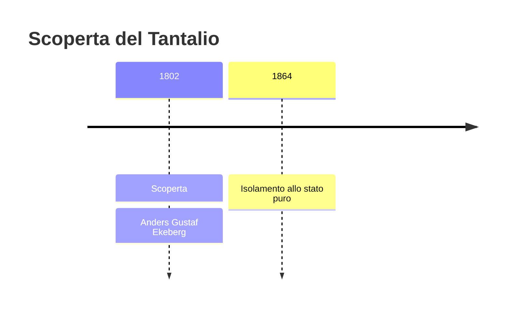
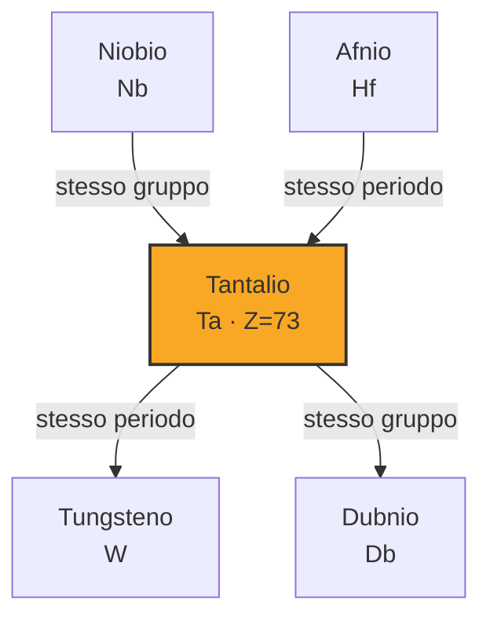

# Tantalio (Ta)

> [!abstract] 43° elemento scoperto — 1802
> 

## Cronologia della scoperta

## Storia della scoperta

## Posizione nella tavola periodica

## Caratteristiche

### Dati fisico-chimici

| Proprietà | Valore |
|---|---|
| Numero atomico | 73 |
| Massa atomica | 180,947882 u |
| Categoria | Metallo di transizione |
| Gruppo | 5 |
| Periodo | 6 |
| Blocco | d |
| Configurazione elettronica | [Xe] 4f¹⁴ 5d³ 6s² |
| Punto di fusione | 3016,9 °C |
| Punto di ebollizione | 5457,9 °C |
| Densità | 16,69 g/cm³ |
| Stati di ossidazione | — |

## Struttura atomica

![[atomo-Tantalio.svg]]

## Usi e presenza in natura

## Nella cronologia

← Precedente: [[Palladio]] (1802)
→ Successivo: [[Cerio]] (1803)

Epoca: [[L'età dell'elettrolisi]] · Scopritore: [[Anders Gustaf Ekeberg]]

## Fonti

