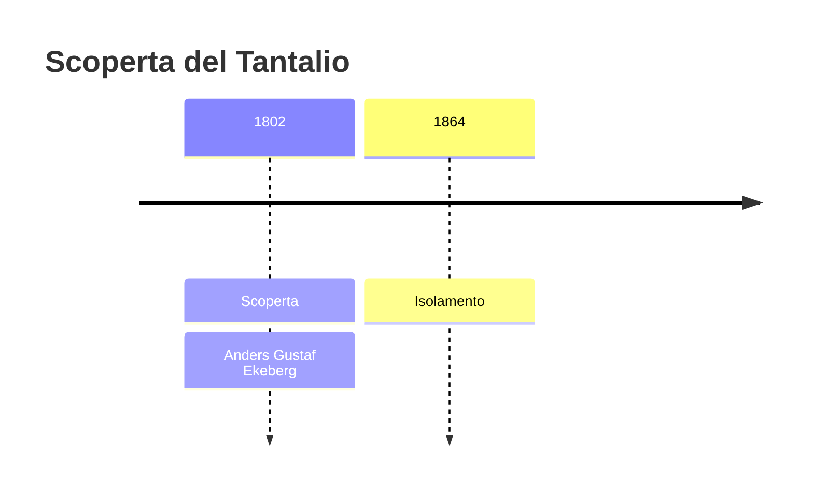
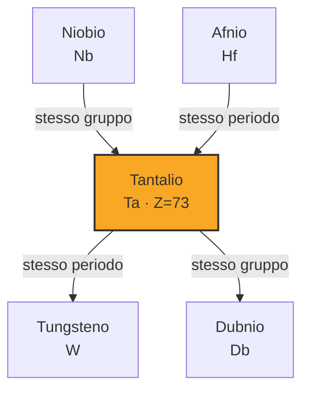
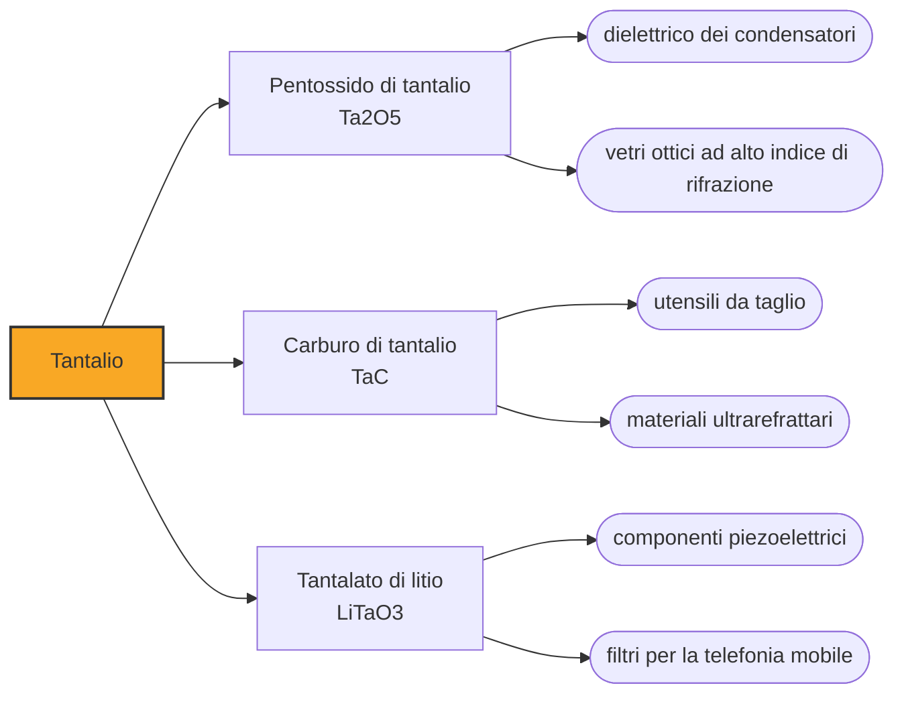

# Tantalio (Ta)

> [!abstract] 43° elemento scoperto — 1802
> Un chimico svedese lo trovò in due pietre e lo chiamò come il re condannato a stare immerso nell'acqua senza poterne bere: il suo ossido, immerso negli acidi, non ne assorbiva nulla.

Il tantalio è un metallo blu-grigio, pesante e durissimo, con un punto di fusione fra i più alti della tavola periodica e un'indifferenza quasi completa agli acidi. In forma di polvere pressata sta dentro i condensatori di quasi ogni telefono.

## Cronologia della scoperta

> [!info] Nota sulla cronologia
> Ekeberg individuò l'elemento nel 1802 in due minerali, la tantalite di Kimito e l'ittrotantalite di Ytterby. Dal 1809 al 1846 il tantalio e il columbium di Hatchett furono ritenuti la stessa sostanza, e la cronologia registra le due scoperte separatamente perché separate le ha ristabilite Heinrich Rose. Il primo tantalio puro e duttile è del 1903, di Werner von Bolton.

## Storia della scoperta

Nel 1802 Anders Gustaf Ekeberg, che insegnava a Uppsala, analizzò due minerali: una tantalite arrivata da Kimito, in Finlandia, e un'ittrotantalite della cava di Ytterby, in Svezia. In entrambi trovò un ossido nuovo, che resisteva a tutti i reagenti con cui provò ad attaccarlo.

Quella seconda pietra veniva da un giacimento vicino a Stoccolma, un giacimento che ha lasciato molte tracce nella nomenclatura chimica. Quattro elementi portano nel nome pezzi della parola Ytterby — ittrio, itterbio, terbio ed erbio — e altri cinque — scandio, olmio, tulio, gadolinio e tantalio — furono individuati per la prima volta in minerali di quel giacimento.

Il nome Ekeberg lo prese dal mito: Tantalo, punito a restare immerso nell'acqua che si ritirava appena si chinava a bere, sotto rami di frutta che si scostavano dalla sua mano. «Chiamo questo metallo tantalio», scrisse, «anche in allusione alla sua incapacità, immerso nell'acido, di assorbirne e di saturarsi».

L'anno prima, a Londra, Charles Hatchett aveva annunciato il columbium. Nel 1809 William Hyde Wollaston confrontò gli ossidi dei due e li dichiarò identici, e Wöhler confermò: delle due sostanze sopravvisse quella di Ekeberg, con il suo nome. Per il tantalio l'esito fu paradossale: il suo nome restò nei manuali, ma a indicare un elemento solo là dove ce n'erano due.

La separazione vera arrivò a metà secolo. Nel 1846 Heinrich Rose dimostrò che nella tantalite c'erano due metalli distinti; nel 1864 Jean Charles Galissard de Marignac ottenne il tantalio metallico riducendone il cloruro in idrogeno, e due anni dopo mise a punto la cristallizzazione frazionata dei fluoruri doppi di potassio, che per un secolo è rimasta il metodo industriale per dividere i due elementi.

Il metallo di quegli anni restava però impuro e fragile. Il primo tantalio davvero puro e duttile lo produsse Werner von Bolton a Charlottenburg nel 1903, e il primo impiego commerciale furono i filamenti delle lampadine, che il tungsteno spodestò nel giro di pochi anni.

## Posizione nella tavola periodica

## Caratteristiche

Il tantalio fonde a 3017 gradi: fra i metalli lo superano soltanto il tungsteno, il renio e l'osmio. È una volta e mezzo più denso del piombo, con 16,7 grammi per centimetro cubo, e nonostante la durezza si lavora bene e si trafila in fili sottilissimi.

La proprietà per cui è stato battezzato è la resistenza agli acidi: sotto i 150 gradi l'acqua regia non lo intacca. Lo sciolgono soltanto l'acido fluoridrico, le soluzioni acide che contengono ioni fluoruro, il triossido di zolfo e gli alcali fusi; per questo con il tantalio si fabbricano reattori, serpentine e valvole destinati a liquidi che corroderebbero qualunque altra cosa.

In natura non si presenta mai da solo né senza niobio: i due condividono la columbite-tantalite, il coltan, e si somigliano al punto che separarli resta una delle operazioni più difficili della metallurgia industriale, paragonabile a quella fra zirconio e afnio. Oggi il concentrato si scioglie in acido fluoridrico e il tantalio si estrae selettivamente con solventi.

### Dati fisico-chimici

| Proprietà | Valore |
|---|---|
| Numero atomico | 73 |
| Massa atomica | 180,947882 u |
| Categoria | Metallo di transizione |
| Gruppo | 5 |
| Periodo | 6 |
| Blocco | d |
| Configurazione elettronica | [Xe] 4f¹⁴ 5d³ 6s² |
| Punto di fusione | 3016,9 °C |
| Punto di ebollizione | 5457,9 °C |
| Densità | 16,69 g/cm³ |
| Stati di ossidazione | -3, -1, 0, +1, +2, +3, +4, +5 |

## Struttura atomica

![[atomo-Tantalio.svg]]

## Usi e presenza in natura

L'impiego principale è la polvere metallica dei condensatori. Pressata in pastiglie e ossidata in superficie, forma un dielettrico così sottile da concentrare una capacità elevata in pochissimo volume: è il motivo per cui i condensatori al tantalio stanno nei telefoni, nei portatili e nell'elettronica di bordo delle automobili.

Il corpo umano non lo riconosce come estraneo, e questo ne ha fatto un materiale chirurgico: placche craniche, protesi e rivestimenti che si legano stabilmente all'osso, fili per ricucire i nervi. Non essendo magnetico, chi porta un impianto in tantalio può sottoporsi a una risonanza magnetica.

La materia prima, però, viene in gran parte da una regione sola. Nel 2025, secondo lo USGS, la Repubblica Democratica del Congo ha prodotto 1.300 tonnellate di tantalio sulle 2.500 mondiali e il Ruanda altre 400: insieme sfiorano il settanta per cento. Il tantalio è uno dei quattro minerali di conflitto — con stagno, tungsteno e oro — per i quali Stati Uniti, Unione Europea e OCSE impongono obblighi di dichiarazione sulle forniture.

Il legame fra i telefoni e la guerra in Congo si racconta spesso come se le proporzioni fossero sempre state queste, e non è così: negli annuari USGS quella regione valeva meno dell'uno per cento della produzione mondiale fra il 2002 e il 2006, con punte del dieci per cento nel 2000 e nel 2008. Il peso di quelle miniere sul mercato è cresciuto dopo, mentre il conflitto durava già da un decennio.

## Curiosità

Ekeberg era sordo per una malattia dell'infanzia e cieco da un occhio per l'esplosione di un gas in laboratorio; morì a quarantasei anni, molto prima che il suo elemento fosse riconosciuto come distinto dal niobio. Dal 2018 l'associazione internazionale dell'industria del tantalio e del niobio gli intitola un premio annuale per la ricerca.

Il tantalio naturale è quasi tutto tantalio-181, ma lo 0,012 per cento è tantalio-180m, un nucleo in stato eccitato che dovrebbe decadere e non lo fa: nessuno lo ha mai osservato farlo, e il limite inferiore misurato per la sua emivita supera i cento milioni di miliardi di anni. È l'unico isomero nucleare fra i nuclidi primordiali, e il più raro di tutti.

## Nella cronologia

← Precedente: [[Palladio]] (1802)
→ Successivo: [[Cerio]] (1803)

Epoca: [[L'età dell'elettrolisi]] · Scopritore: [[Anders Gustaf Ekeberg]]

## Fonti

- [Tantalum](https://en.wikipedia.org/wiki/Tantalum) — consultata il 08/09/2026
- [Tantalum — Royal Society of Chemistry](https://periodic-table.rsc.org/element/73/tantalum) — consultata il 08/09/2026
- [USGS Mineral Commodity Summaries 2026 — Tantalum](https://pubs.usgs.gov/periodicals/mcs2026/mcs2026-tantalum.pdf) — consultata il 08/09/2026
- [Anders Gustaf Ekeberg](https://en.wikipedia.org/wiki/Anders_Gustaf_Ekeberg) — consultata il 08/09/2026
- [Conflict resource](https://en.wikipedia.org/wiki/Conflict_resource) — consultata il 08/09/2026

---

> [!warning] Avvertenza
> Questo progetto è stato realizzato con l'assistenza di sistemi di
> intelligenza artificiale. I contenuti sono verificati sulle fonti citate,
> ma **possono contenere errori e imprecisioni**: prima di riutilizzarli,
> controlla la fonte.
