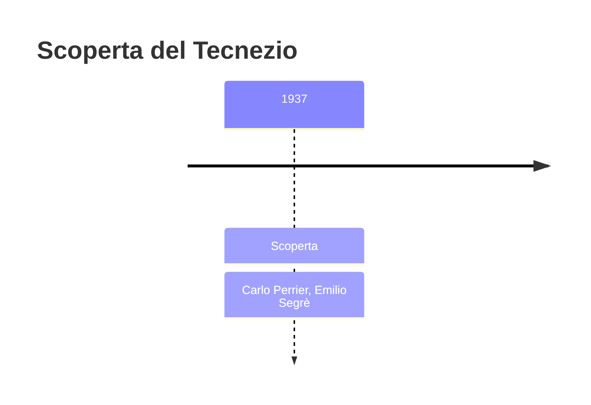
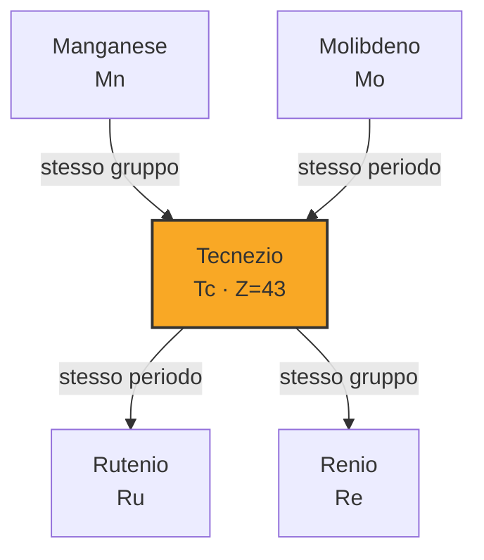

# Tecnezio (Tc)

> [!abstract] 89° elemento scoperto — 1937
> 

## Cronologia della scoperta

## Storia della scoperta

## Posizione nella tavola periodica

## Caratteristiche

### Dati fisico-chimici

| Proprietà | Valore |
|---|---|
| Numero atomico | 43 |
| Massa atomica | 98,0 u |
| Categoria | Metallo di transizione |
| Gruppo | 7 |
| Periodo | 5 |
| Blocco | d |
| Configurazione elettronica | [Kr] 4d⁵ 5s² |
| Punto di fusione | 2156,9 °C |
| Punto di ebollizione | 4264,9 °C |
| Densità | 11,0 g/cm³ |
| Stati di ossidazione | — |

## Struttura atomica

![[atomo-Tecnezio.svg]]

## Usi e presenza in natura

## Nella cronologia

← Precedente: [[Renio]] (1925)
→ Successivo: [[Francio]] (1939)

Epoca: [[Spettroscopia e radioattività]] · Scopritore: [[Carlo Perrier]], [[Emilio Segrè]]

## Fonti

