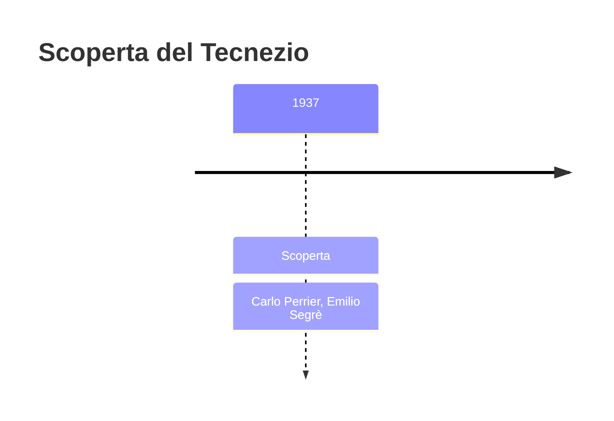
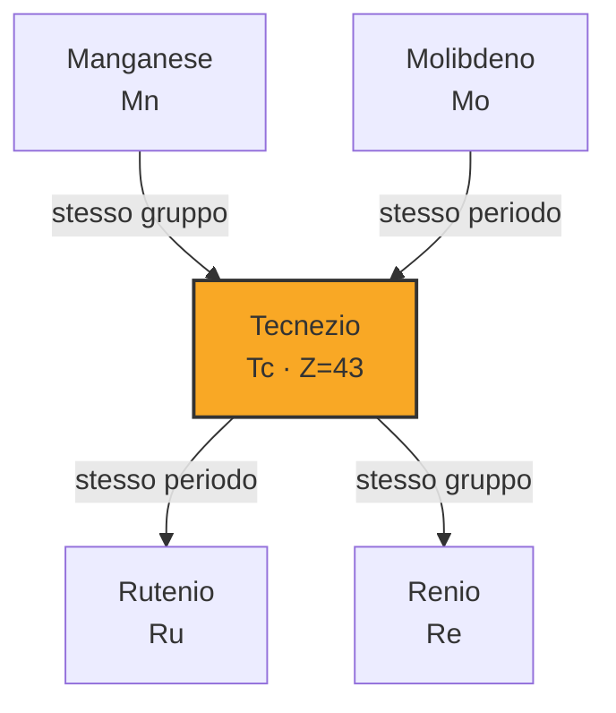
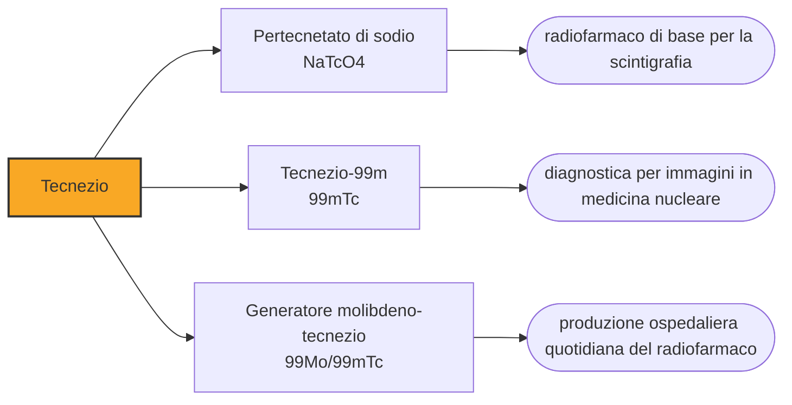

# Tecnezio (Tc)

> [!abstract] 89° elemento scoperto — 1937
> Arrivò a Palermo dentro una busta: una lamina di molibdeno smontata da un ciclotrone californiano e spedita perché nessuno la voleva più. Dentro c'era l'elemento che riempiva la casella 43.

Il tecnezio è il primo elemento prodotto artificialmente dall'uomo, e il più leggero fra quelli che non hanno alcun isotopo stabile: tutti i suoi nuclei decadono, e per questo in natura è praticamente scomparso. Oggi è l'atomo più usato della medicina nucleare: qualche decina di milioni di esami all'anno nel mondo passano da lui.

## Cronologia della scoperta

> [!info] Nota sulla cronologia
> Primo elemento prodotto artificialmente: Perrier e Segrè lo identificarono nel 1937 in una lamina di molibdeno irraggiata nel ciclotrone di Berkeley e spedita loro da Ernest Lawrence. La casella 43 era stata rivendicata più volte — davyum, lucium, nipponium, masurium — senza che nessun annuncio reggesse. Il nome fu scelto nel 1947.

## Storia della scoperta

La casella 43 era rimasta vuota più a lungo di quasi ogni altra. Mendeleev ne aveva previsto l'occupante con il nome di eka-manganese; nel corso di cinquant'anni fu annunciato più volte con nomi diversi — davyum, lucium, nipponium, masurium — e ogni volta l'annuncio non resse.

Il motivo era fisico, non sperimentale, e fu capito solo dopo: il numero atomico 43 è dispari, e le regole di stabilità dei nuclei fanno sì che nessuna combinazione di protoni e neutroni dia, per quell'elemento, un nucleo stabile. Qualunque tecnezio si fosse formato con la Terra è decaduto molto tempo fa: cercarlo nei minerali era una caccia senza preda.

Nel 1936 Emilio Segrè visitò Berkeley e convinse Ernest Lawrence, l'inventore del ciclotrone, a lasciargli portare in Italia qualche pezzo di scarto della macchina. Lawrence gli spedì poi a Palermo una lamina di molibdeno che era stata parte del deflettore ed era diventata radioattiva: materiale da buttare, che a Segrè serviva proprio per quello.

A Palermo, nel 1937, Segrè e il mineralogista Carlo Perrier analizzarono la lamina con metodi di chimica comparativa: dimostrarono che parte dell'attività non apparteneva al molibdeno né a nessun elemento vicino, e che il suo comportamento chimico era quello previsto per l'elemento 43. La casella era piena, e il suo contenuto non veniva da una miniera ma da una macchina.

Il nome arrivò solo nel 1947: tecnezio, dal greco technetos, «artificiale», perché era il primo elemento prodotto dall'uomo invece che trovato. È un nome che segna una soglia: da quel momento la tavola periodica smette di essere un inventario di ciò che esiste e diventa anche un elenco di ciò che si può fabbricare.

Nel 1952 l'astronomo Paul Merrill trovò le righe del tecnezio negli spettri di alcune giganti rosse. Poiché l'elemento decade in tempi brevi rispetto alla vita di una stella, la sua presenza dimostrava che veniva prodotto lì, in quel momento: era una prova diretta che gli elementi pesanti si formano dentro le stelle, e non erano tutti già presenti alla nascita dell'universo.

## Posizione nella tavola periodica

## Caratteristiche

Nessuno dei suoi isotopi è stabile. Il più longevo, il tecnezio-98, ha un'emivita di poco più di quattro milioni di anni: tantissimo per un laboratorio, pochissimo rispetto ai quattro miliardi e mezzo di anni della Terra. Tracce minime di tecnezio esistono in natura, prodotte dalla fissione spontanea dell'uranio nei minerali.

Chimicamente somiglia al manganese e al renio, i suoi vicini di colonna: forma l'anione pertecnetato, in cui sta allo stato +7, ed è in quella forma che si maneggia in medicina. Il metallo è argenteo e si opacizza lentamente all'aria; in soluzione il pertecnetato è un ottimo inibitore della corrosione dell'acciaio, una proprietà che nessuno usa per ovvie ragioni.

L'isotopo che conta è il tecnezio-99m, uno stato eccitato del tecnezio-99 che decade emettendo un raggio gamma di energia ideale per essere rivelato dall'esterno, con un'emivita di sei ore: abbastanza lunga per fare l'esame, abbastanza breve perché il paziente non resti radioattivo a lungo. È una combinazione di proprietà che nessun altro isotopo offre altrettanto bene.

### Dati fisico-chimici

| Proprietà | Valore |
|---|---|
| Numero atomico | 43 |
| Massa atomica | 98,0 u |
| Categoria | Metallo di transizione |
| Gruppo | 7 |
| Periodo | 5 |
| Blocco | d |
| Configurazione elettronica | [Kr] 4d⁵ 5s² |
| Punto di fusione | 2156,9 °C |
| Punto di ebollizione | 4264,9 °C |
| Densità | 11,0 g/cm³ |
| Stati di ossidazione | -3, -1, +1, +2, +3, +4, +5, +6, +7 |

## Struttura atomica

![[atomo-Tecnezio.svg]]

## Usi e presenza in natura

Legato a molecole diverse, il tecnezio-99m va dove serve: attaccato ai difosfonati si fissa sulle ossa, ad altre molecole raggiunge il cuore, la tiroide, i reni, i linfonodi. Si inietta, si aspetta che si distribuisca, e una gamma camera fotografa da fuori dove si è accumulato: dove il metabolismo è più attivo il segnale è più forte, ed è così che una metastasi ossea o un'ischemia cardiaca diventano visibili. Nel mondo se ne fanno una decina di milioni di esami l'anno.

Il modo in cui arriva negli ospedali è ingegnoso: il tecnezio-99m ha sei ore di vita e non si può spedire. Si spedisce invece il suo genitore, il molibdeno-99, fissato su una colonnina di allumina dentro un contenitore schermato; il tecnezio che vi si forma per decadimento viene staccato lavando la colonna con soluzione fisiologica, ogni giorno, per una settimana. Il dispositivo si chiama generatore, e in gergo si dice «mungerlo».

## Curiosità

Il molibdeno-99 si produce irraggiando uranio in pochi reattori di ricerca, quasi tutti vecchi di decenni: quando due o tre di essi si fermano insieme per manutenzione, gli ospedali di mezzo mondo rinviano gli esami. È uno dei casi in cui la medicina di massa dipende da una filiera fatta di pochissimi impianti.

Il tecnezio-99, il figlio a vita lunga del tecnezio-99m, è anche uno dei prodotti di fissione più abbondanti nelle scorie nucleari: essendo solubile in acqua nella forma di pertecnetato, è fra i radionuclidi che si muovono più facilmente nell'ambiente, ed è uno dei problemi principali nella progettazione dei depositi geologici.

## Nella cronologia

← Precedente: [[Renio]] (1925)
→ Successivo: [[Francio]] (1939)

Epoca: [[Spettroscopia e radioattività]] · Scopritori: [[Carlo Perrier]], [[Emilio Segrè]]

## Fonti

- [Technetium](https://en.wikipedia.org/wiki/Technetium) — consultata il 09/09/2026
- [Technetium — Royal Society of Chemistry](https://periodic-table.rsc.org/element/43/technetium) — consultata il 09/09/2026
- [Technetium-99m](https://en.wikipedia.org/wiki/Technetium-99m) — consultata il 09/09/2026

---

> [!warning] Avvertenza
> Questo progetto è stato realizzato con l'assistenza di sistemi di
> intelligenza artificiale. I contenuti sono verificati sulle fonti citate,
> ma **possono contenere errori e imprecisioni**: prima di riutilizzarli,
> controlla la fonte.
