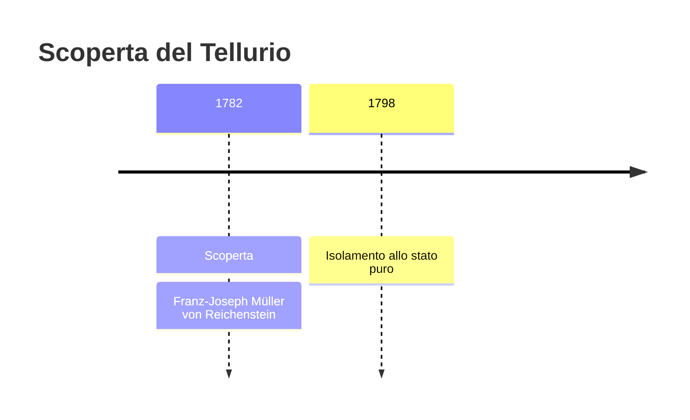
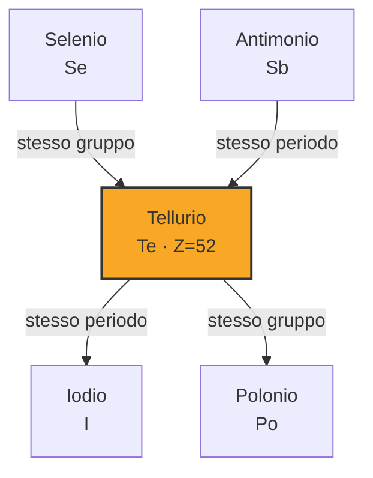

# Tellurio (Te)

> [!abstract] 31° elemento scoperto — 1782
> 

## Cronologia della scoperta

## Storia della scoperta

## Posizione nella tavola periodica

## Caratteristiche

### Dati fisico-chimici

| Proprietà | Valore |
|---|---|
| Numero atomico | 52 |
| Massa atomica | 127,603 u |
| Categoria | Semimetallo |
| Gruppo | 16 |
| Periodo | 5 |
| Blocco | p |
| Configurazione elettronica | [Kr] 4d¹⁰ 5s² 5p⁴ |
| Punto di fusione | 449,5 °C |
| Punto di ebollizione | 987,9 °C |
| Densità | 6,24 g/cm³ |
| Stati di ossidazione | — |

## Struttura atomica

![[atomo-Tellurio.svg]]

## Usi e presenza in natura

## Nella cronologia

← Precedente: [[Tungsteno]] (1781)
→ Successivo: [[Boro]] (1787)

Epoca: [[Chimica pneumatica]] · Scopritore: [[Franz-Joseph Müller von Reichenstein]]

## Fonti

