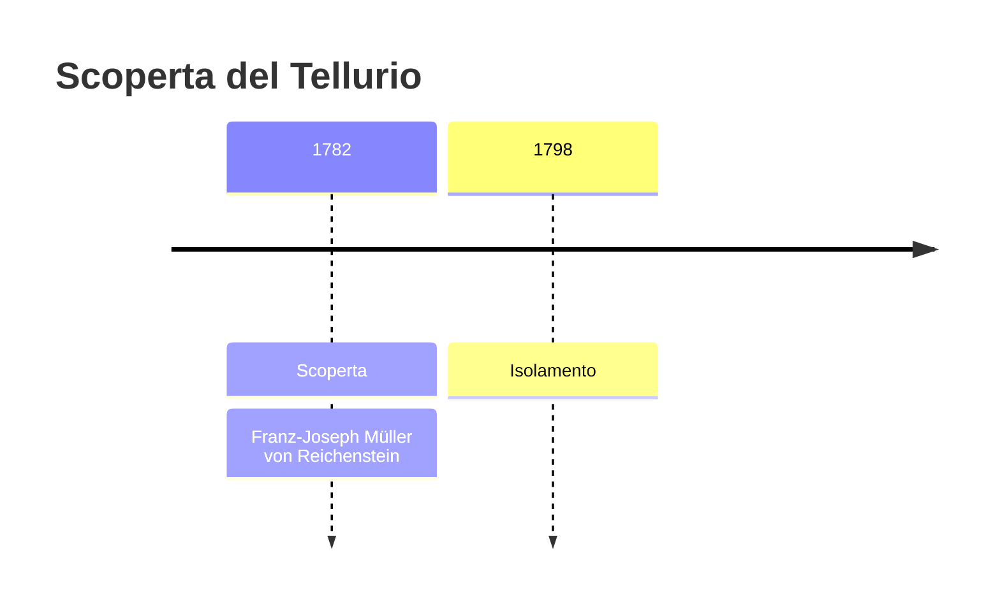
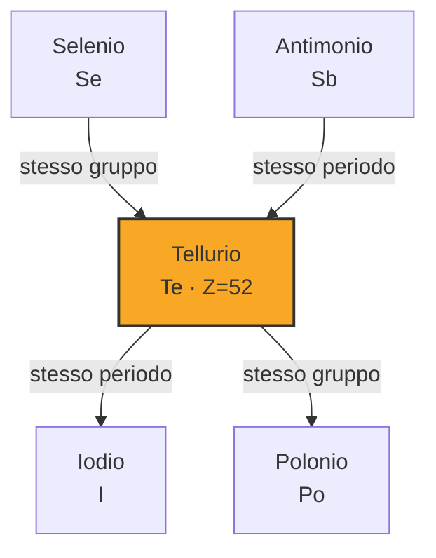
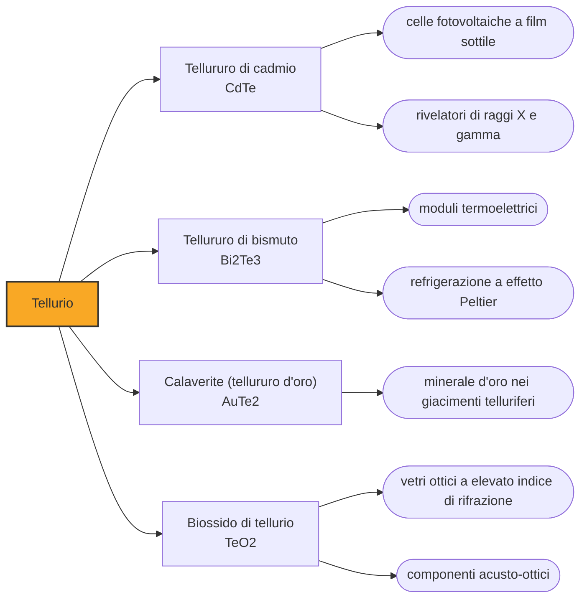

# Tellurio (Te)

> [!abstract] 31° elemento scoperto — 1782
> Un ispettore delle miniere trovò un metallo che si comportava come oro senza esserlo, e non seppe che nome dargli. Sedici anni dopo un altro chimico lo battezzò e, cosa più rara, disse pubblicamente di chi era il merito.

Il tellurio è uno dei solidi più rari della crosta terrestre, tanto raro quanto il platino, e uno dei pochi elementi il cui nome viene dalla Terra e non da un mito o da un colore. È un semimetallo fragile, bianco argenteo, che oggi sta dentro i pannelli solari a film sottile e che ha alle spalle la vicenda di attribuzione più corretta e più insolita del Settecento chimico.

## Cronologia della scoperta

> [!info] Nota sulla cronologia
> Müller von Reichenstein individua l'elemento nel 1782 in un minerale aurifero della Transilvania e lo chiama aurum paradoxum; Martin Heinrich Klaproth ne conferma la natura e lo battezza tellurio nella conferenza tenuta all'Accademia delle scienze di Berlino il 25 gennaio 1798, attribuendo pubblicamente la scoperta a Müller. Pál Kitaibel vi era arrivato indipendentemente nel 1789.

## Storia della scoperta

La storia comincia nelle miniere d'oro della Transilvania, che nel Settecento appartengono agli Asburgo e sono fra le più ricche d'Europa. In quei giacimenti si trovava un minerale biancastro e metallico che i minatori chiamavano oro bianco: si accompagnava all'oro, aveva il peso e l'aspetto giusti, ma alla lavorazione si comportava in modo che nessuno riusciva a prevedere.

A occuparsene è Franz-Joseph Müller von Reichenstein, ispettore capo delle miniere di Transilvania per conto dell'imperatore. Nel 1782 sottopone il minerale a un esame che dura tre anni e più di cinquanta prove distinte, e ne cava una sostanza che non riesce a far coincidere con nulla: assomiglia all'antimonio, si comporta in parte come l'oro, e non è né l'uno né l'altro. È un lavoro paziente e onesto che si conclude con un punto interrogativo.

I nomi che gli dà sono la confessione della sua incertezza, ed è per questo che restano memorabili: aurum paradoxum, oro paradossale, e metallum problematicum, metallo problematico. Nessuno dei due è un battesimo: sono etichette provvisorie che dicono al lettore quel che l'autore non sa. Müller pubblica i risultati in una rivista locale, chiede lumi ai chimici più autorevoli che conosce, e il suo lavoro passa quasi inosservato.

Nel frattempo qualcun altro ci arriva per conto proprio. Nel 1789 il naturalista ungherese Pál Kitaibel individua lo stesso elemento in un minerale proveniente da un'altra località, senza sapere nulla del lavoro transilvano; quando lo verrà a sapere, riconoscerà a Müller la precedenza. È il genere di sovrapposizione che in quegli anni finisce quasi sempre in una disputa di priorità, e che questa volta non ci finisce.

La questione si sblocca quando Müller manda un campione del minerale a Berlino, all'uomo più attrezzato d'Europa per rispondergli. Martin Heinrich Klaproth aveva fatto della farmacia di cui era titolare il laboratorio analitico più produttivo del continente, e aveva una regola che lo distingueva dai contemporanei: riportare i risultati esattamente come venivano, discordanze comprese, invece di aggiustarli sull'attesa. Rifà l'analisi e conferma che il metallo è nuovo.

Il 25 gennaio 1798, davanti all'Accademia delle scienze di Berlino, Klaproth presenta il metallo, gli dà finalmente un nome — tellurio, dal latino tellus, la Terra — e dichiara che la scoperta appartiene a Müller von Reichenstein. Poteva tenersi tutto: aveva il campione, il laboratorio, il pubblico e il diritto di battesimo, e l'altro era un funzionario minerario di una provincia periferica. In un secolo di dispute di priorità velenose, il tellurio è l'elemento che qualcuno ha regalato a qualcun altro.

## Posizione nella tavola periodica

## Caratteristiche

Il tellurio sta nella colonna dell'ossigeno e dello zolfo, ma scendendo lungo quel gruppo il carattere non metallico si consuma: è un semimetallo fragile e cristallino, di lucentezza argentea, che conduce l'elettricità poco e meglio quando lo si illumina. In natura si trova quasi solo combinato, e a differenza dei suoi parenti leggeri forma con l'oro e con l'argento composti veri e propri, i tellururi, che sono l'unico modo in cui l'oro accetta di legarsi in un minerale.

La sua rarità terrestre è un'anomalia che si spiega guardando altrove. Nel cosmo il tellurio non è affatto scarso, ed è più abbondante di elementi che sulla Terra si trovano con facilità; la spiegazione accreditata è che, durante la formazione del pianeta, abbia formato composti con l'idrogeno abbastanza volatili da andarsene con i gas. Quel che ne resta si recupera quasi tutto dai fanghi che si depositano sul fondo delle celle di raffinazione elettrolitica del rame.

Ha inoltre una proprietà che chiunque lo maneggi impara a temere. L'organismo trasforma anche quantità minime di tellurio in dimetiltellururo, un composto volatile che si elimina con il respiro e con la pelle e che ha un odore aggressivo di aglio: bastano concentrazioni bassissime nell'aria per acquisirlo, e chi lo acquisisce se lo porta addosso per settimane o per mesi. Non è un veleno particolarmente potente, ma è socialmente devastante.

### Dati fisico-chimici

| Proprietà | Valore |
|---|---|
| Numero atomico | 52 |
| Massa atomica | 127,603 u |
| Categoria | Semimetallo |
| Gruppo | 16 |
| Periodo | 5 |
| Blocco | p |
| Configurazione elettronica | [Kr] 4d¹⁰ 5s² 5p⁴ |
| Punto di fusione | 449,5 °C |
| Punto di ebollizione | 987,9 °C |
| Densità | 6,24 g/cm³ |
| Stati di ossidazione | -2, -1, +1, +2, +3, +4, +5, +6 |

## Struttura atomica

![[atomo-Tellurio.svg]]

## Usi e presenza in natura

L'impiego oggi prevalente è fotovoltaico. Il tellururo di cadmio è il materiale su cui si basa la principale tecnologia solare a film sottile, alternativa al silicio cristallino: assorbe la luce in uno strato di pochi micrometri, costa poco da depositare su grandi superfici e raggiunge rendimenti competitivi. Una frazione altrettanto importante va ai materiali termoelettrici, che convertono direttamente una differenza di temperatura in corrente.

Il resto si divide fra metallurgia e gomma. Aggiunto in piccola dose al rame e all'acciaio inossidabile il tellurio li rende molto più facili da lavorare al tornio, perché frammenta il truciolo, e nel caso del rame lo fa senza sacrificarne la conducibilità elettrica; nella vulcanizzazione sostituisce in parte lo zolfo dando gomme più resistenti al calore.

## Curiosità

Il tellurio ha causato uno dei grattacapi più istruttivi della tavola periodica. Pesa più dello iodio, che pure lo segue nell'ordine, e quando Mendeleev costruì la sua tavola sulle masse atomiche dovette invertire i due per non separarli dalle rispettive famiglie chimiche, sospettando che la massa del tellurio fosse stata misurata male. Non lo era: l'ordine giusto è quello del numero atomico, cioè della carica del nucleo, che sarebbe stato compreso solo mezzo secolo dopo.

Negli anni Venti il tellurio fu a un passo dal finire nei serbatoi di tutto il mondo. Thomas Midgley, cercando un additivo che eliminasse la detonazione nei motori a benzina, trovò che i composti di tellurio funzionavano bene; li abbandonò perché chi li maneggiava puzzava d'aglio in modo insopportabile, e scelse invece il piombo tetraetile. Fu la peggiore alternativa possibile, e il mondo respirò piombo per mezzo secolo.

## Nella cronologia

← Precedente: [[Tungsteno]] (1781)
→ Successivo: [[Boro]] (1787)

Epoca: [[Chimica pneumatica]] · Scopritore: [[Franz-Joseph Müller von Reichenstein]]

## Fonti

- [Tellurium](https://en.wikipedia.org/wiki/Tellurium) — consultata il 07/09/2026
- [Franz Joseph Müller von Reichenstein (Encyclopedia.com)](https://www.encyclopedia.com/science/encyclopedias-almanacs-transcripts-and-maps/franz-joseph-muller-von-reichenstein) — consultata il 07/09/2026
- [Franz Joseph Müller von Reichenstein — Discoverer of Tellurium (ChemistryViews)](https://www.chemistryviews.org/franz-joseph-muller-von-reichenstein-discoverer-of-tellurium/) — consultata il 07/09/2026
- [Martin Heinrich Klaproth](https://en.wikipedia.org/wiki/Martin_Heinrich_Klaproth) — consultata il 07/09/2026

---

> [!warning] Avvertenza
> Questo progetto è stato realizzato con l'assistenza di sistemi di
> intelligenza artificiale. I contenuti sono verificati sulle fonti citate,
> ma **possono contenere errori e imprecisioni**: prima di riutilizzarli,
> controlla la fonte.
