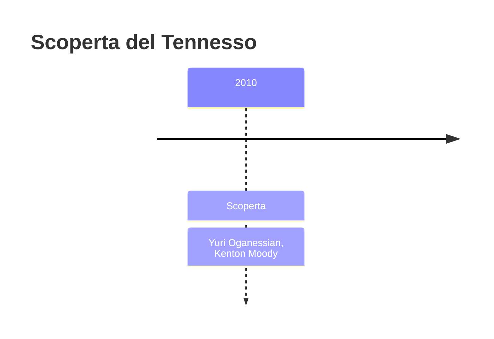
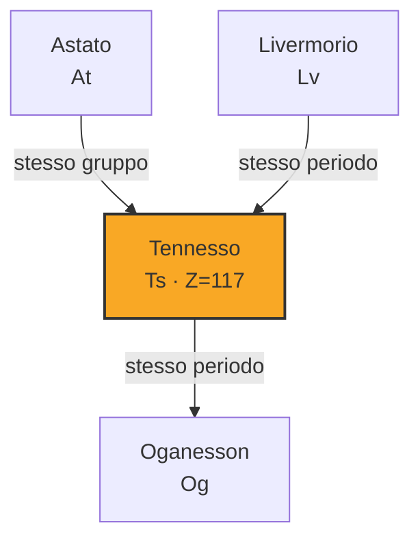
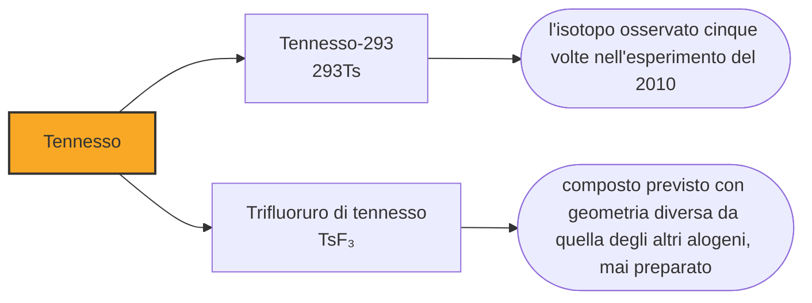

# Tennesso (Ts)

> [!abstract] 118° elemento scoperto — 2010
> Ventidue milligrammi di berkelio, prodotti in duecentocinquanta giorni di reattore, con trecentotrenta giorni di vita davanti. Prima di arrivare in Russia attraversarono l'Atlantico cinque volte, perché la dogana continuava a rimandarli indietro.

Il tennesso è l'ultima casella della tavola periodica a essere stata riempita, e con lui la settima riga si chiude. La sua storia non è fatta di intuizioni teoriche né di dispute di priorità: è fatta di un bersaglio difficilissimo da produrre, di un calendario e di un pacco che non riusciva ad arrivare a destinazione.

## Cronologia della scoperta

> [!info] Nota sulla cronologia
> La data adottata è quella dell'esperimento del 2010, l'ultimo che abbia riempito una casella della tavola periodica; il riconoscimento IUPAC è del dicembre 2015 e il nome è ufficiale dal 28 novembre 2016. La scoperta è attribuita a una collaborazione fra quattro istituzioni — Dubna, Oak Ridge, la Vanderbilt e Livermore — che la cronologia di riferimento comprime nei due nomi di Oganesjan e Moody.

## Storia della scoperta

Per fare l'elemento 117 con un fascio di calcio-48, che ha venti protoni, serve un bersaglio con novantasette protoni: berkelio. Non è un materiale che si compri: al mondo lo sanno produrre in quantità utili pochissimi impianti, e quello a cui ci si rivolse è il reattore ad alto flusso di Oak Ridge, nel Tennessee; e occorre bombardare curio per mesi per ricavarne qualche milligrammo.

La produzione richiese duecentocinquanta giorni di irraggiamento e si concluse alla fine del 2008, con ventidue milligrammi di berkelio-249 e un costo attorno ai seicentomila dollari. Ventidue milligrammi sono un granello: la quantità che sta sulla punta di uno spillo, ottenuta da un reattore nazionale in otto mesi di lavoro.

Il berkelio-249 ha un'emivita di circa trecentotrenta giorni: da quando esce dal reattore comincia a scomparire, e in poco meno di un anno ne resta metà. L'esperimento andava quindi progettato all'indietro a partire da quella data, con il trasporto, la preparazione del bersaglio e i mesi di fascio incastrati in una finestra che si stringeva da sola. Ogni settimana persa era materiale perso.

Il materiale doveva andare da Oak Ridge a Dubna, e qui la fisica nucleare incontrò la burocrazia. I funzionari doganali russi respinsero il pacco due volte per documentazione incompleta, e nel giro di pochi giorni il berkelio attraversò l'Oceano Atlantico cinque volte. Arrivò in Russia nel giugno del 2009 e fu trasferito subito a Dimitrovgrad, dove venne trasformato in un bersaglio.

Il bombardamento cominciò poi a Dubna, e nel 2010 la collaborazione — l'istituto russo, Oak Ridge, l'università Vanderbilt e il laboratorio di Livermore — annunciò sei eventi, in due isotopi: un atomo di tennesso-294 e cinque di tennesso-293. La IUPAC riconobbe la scoperta nel dicembre del 2015, insieme alle altre tre caselle rimaste.

Il nome fu proposto nel 2016 e ufficializzato il 28 novembre, e riconosce lo stato in cui si trovano Oak Ridge, l'università Vanderbilt e l'università del Tennessee. La desinenza in -ine, che in italiano diventa -o, segue la regola fissata dalla IUPAC per gli elementi del gruppo 17, quello degli alogeni: fluoro, cloro, bromo, iodio, astato e tennesso.

## Posizione nella tavola periodica

## Caratteristiche

Del tennesso non è stata misurata alcuna proprietà, e i valori di questa nota sono calcoli. Sta nel gruppo 17 e dovrebbe quindi essere un alogeno, cioè un elemento che strappa un elettrone a chi gli capita a tiro e forma sali: è il comportamento che definisce la famiglia, dal fluoro in giù.

I calcoli dicono che non lo farà. Lo stato meno uno, quello che rende il fluoro il fluoro, dovrebbe essere per il tennesso il meno comune, e il potenziale con cui acquisterebbe l'elettrone risulta di segno opposto a quello di tutti gli alogeni più leggeri; gli stati previsti come stabili sono invece il +1 e il +3. Perfino la geometria dovrebbe cambiare: il trifluoruro di tennesso sarebbe un triangolo piatto, mentre quelli degli altri alogeni hanno forma di T.

I due isotopi noti durano ventidue e cinquantuno millesimi di secondo. Sono cifre minuscole, ma più grandi di quanto le previsioni indicassero prima dell'esperimento, ed è un indizio nella stessa direzione già vista sul flerovio: in questa regione qualcosa tiene insieme i nuclei un po' meglio di quanto i modelli si aspettino.

### Dati fisico-chimici

| Proprietà | Valore |
|---|---|
| Numero atomico | 117 |
| Massa atomica | 294,0 u |
| Categoria | Alogeno |
| Gruppo | 17 |
| Periodo | 7 |
| Blocco | p |
| Configurazione elettronica | [Rn] 5f¹⁴ 6d¹⁰ 7s² 7p⁵ |
| Punto di fusione | 449,9 °C |
| Punto di ebollizione | 609,9 °C |
| Densità | 7,17 g/cm³ |
| Stati di ossidazione | -1, +1, +3, +5 |

## Struttura atomica

![[atomo-Tennesso.svg]]

## Usi e presenza in natura

Il tennesso non ha usi e non ne avrà: ne esistono in tutto pochi atomi mai prodotti, e ciascuno è durato pochi centesimi di secondo. Il bersaglio da cui sono nati costava più di mezzo milione di dollari e ha prodotto sei eventi.

Gli alogeni sono una delle famiglie più coerenti della tavola periodica: cinque elementi che si somigliano abbastanza da rendere prevedibile il sesto. Scoprire che il sesto non obbedisce è esattamente il tipo di risultato per cui vale la pena spendere un reattore e otto mesi di irraggiamento, perché dice dove la periodicità smette di essere una legge e comincia a essere una posizione in una griglia.

## Curiosità

Fra chi lavorò alla produzione del berkelio a Oak Ridge c'era Clarice Phelps, che la IUPAC riconosce come la prima donna afroamericana ad aver partecipato alla scoperta di un elemento chimico. È un primato che arriva nel 2010, alla centodiciassettesima casella su centodiciotto.

Con il tennesso la settima riga è completa, e la successiva non è ancora cominciata. Per fare l'elemento 119 con il calcio-48 servirebbe un bersaglio di einsteinio, che nessun reattore sa produrre in quantità utili: bisogna quindi cambiare proiettile, e si tenta con titanio-50 e cromo-54, che rendono la reazione molto meno probabile. Ci provano Dubna, il RIKEN e altri laboratori, finora senza risultato.

L'ultimo elemento scoperto chiude una storia che, in questo racconto, era cominciata con l'oro raccolto nei fiumi decine di migliaia di anni fa. Fra le due cose c'è tutta la distanza fra il trovare e il fabbricare: l'oro esisteva e qualcuno lo vide, il tennesso non esisteva e qualcuno lo fece esistere per cinquanta millesimi di secondo, sei volte.

## Nella cronologia

← Precedente: [[Oganesson]] (2006)
→ *Ultimo elemento della cronologia*

Epoca: [[Era nucleare]] · Scopritori: [[Yuri Oganessian]], [[Kenton Moody]]

## Fonti

- [Tennessine](https://en.wikipedia.org/wiki/Tennessine) — consultata il 10/09/2026
- [Tennessine — Royal Society of Chemistry](https://periodic-table.rsc.org/element/117/tennessine) — consultata il 10/09/2026
- [Extended periodic table](https://en.wikipedia.org/wiki/Extended_periodic_table) — consultata il 10/09/2026
