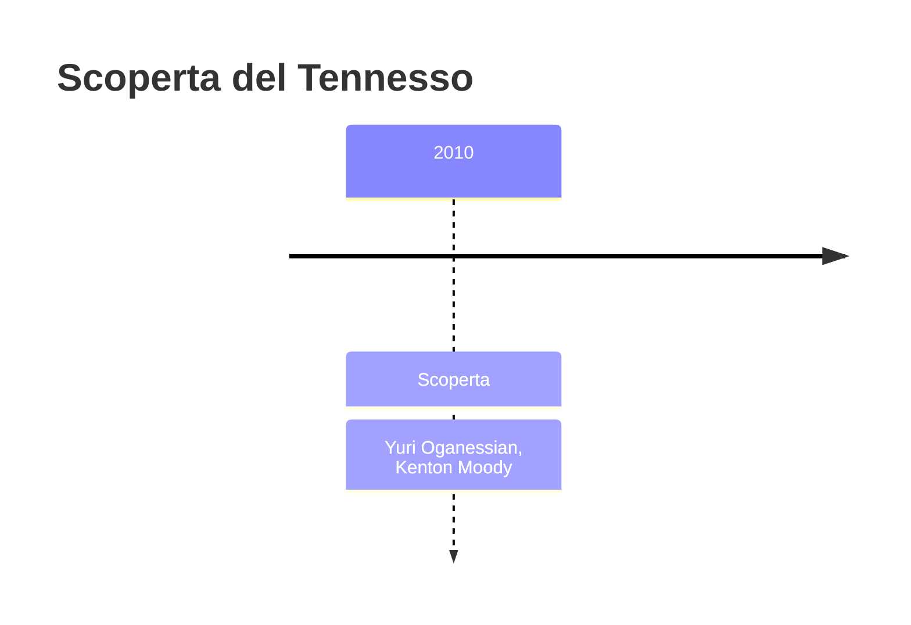
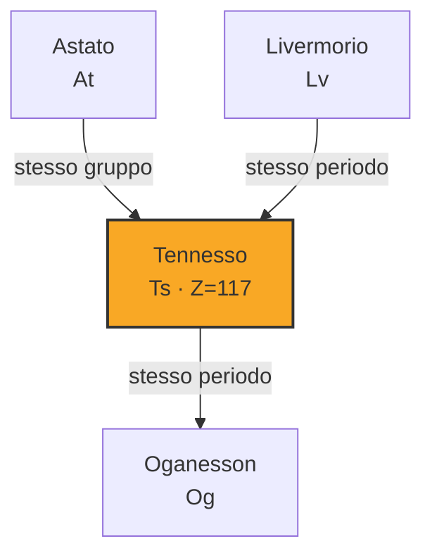

# Tennesso (Ts)

> [!abstract] 118° elemento scoperto — 2010
> 

## Cronologia della scoperta

## Storia della scoperta

## Posizione nella tavola periodica

## Caratteristiche

### Dati fisico-chimici

| Proprietà | Valore |
|---|---|
| Numero atomico | 117 |
| Massa atomica | 294,0 u |
| Categoria | Alogeno |
| Gruppo | 17 |
| Periodo | 7 |
| Blocco | p |
| Configurazione elettronica | *[Rn] 5f¹⁴ 6d¹⁰ 7s² 7p⁵ |
| Punto di fusione | 449,9 °C |
| Punto di ebollizione | 609,9 °C |
| Densità | 7,17 g/cm³ |
| Stati di ossidazione | — |

## Struttura atomica

![[atomo-Tennesso.svg]]

## Usi e presenza in natura

## Nella cronologia

← Precedente: [[Oganesson]] (2006)
→ *Ultimo elemento della cronologia*

Epoca: [[Era nucleare]] · Scopritore: [[Yuri Oganessian]], [[Kenton Moody]]

## Fonti

